<!-- COURSE_NAV_START -->
[Anterior](<5. Pods y objetos básicos.md>) | [Indice](README.md) | [Siguiente](<7. Networking.md>)
<!-- COURSE_NAV_END -->

# 6. Workloads

## Objetivo del módulo

En el módulo 5 entendiste el Pod como unidad mínima de ejecución.

Ahora toca dar el siguiente paso:

> En Kubernetes casi nunca quieres operar Pods sueltos directamente. Quieres usar objetos de workload que creen, mantengan, reemplacen, escalen o ejecuten Pods por ti.

Kubernetes define un workload como una aplicación que se ejecuta en Kubernetes, y explica que, aunque tu aplicación sea un único componente o varios que trabajan juntos, en Kubernetes se ejecuta dentro de un conjunto de Pods. También indica que los workloads de nivel superior ayudan a ejecutar y gestionar esos Pods. ([Kubernetes](https://kubernetes.io/docs/concepts/workloads/ "Workloads"))

La idea central del módulo es esta:

> Un Pod ejecuta. Un workload controller opera Pods según una intención.

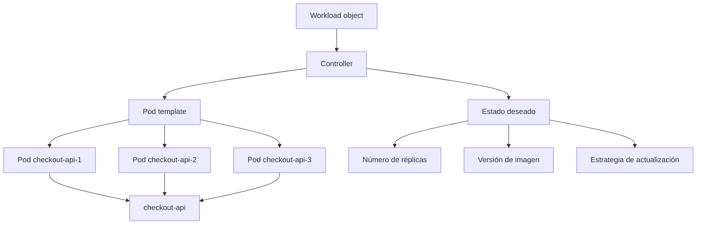

En este módulo aprenderás cuándo usar:

- `ReplicaSet`
- `Deployment`
- `Job`
- `CronJob`
- `DaemonSet`
- `StatefulSet`
- `PodDisruptionBudget`
- `HorizontalPodAutoscaler`
- `VerticalPodAutoscaler`
- `LimitRange`
- `ResourceQuota`
- Reglas básicas de scheduling
Y, sobre todo, aprenderás a elegir.

---

## 6.1. Qué vas a aprender y qué no vas a aprender todavía

Vas a aprender:

- Por qué no se suelen operar Pods sueltos
- Qué es un workload controller
- Qué problema resuelve cada tipo de workload
- Cuándo usar Deployment
- Qué papel tiene ReplicaSet
- Cómo funcionan rollouts y rollbacks
- Cuándo usar Job
- Cuándo usar CronJob
- Cuándo usar DaemonSet
- Cuándo usar StatefulSet
- Qué son requests, limits y QoS
- Qué son LimitRange y ResourceQuota
- Qué es un PodDisruptionBudget
- Qué es HPA
- Qué es VPA
- Qué conceptos básicos de scheduling debes conocer
- Cómo practicar todo esto con `checkout-api` sin crear un laboratorio demasiado frágil
- Cómo mejorar la DevEx con Taskfile
No vamos a profundizar todavía en:

- Services
- DNS interno
- Ingress o Gateway API
- ConfigMaps y Secrets en detalle
- PersistentVolumes y StorageClasses en detalle
- NetworkPolicy
- RBAC avanzado
- Observabilidad completa
- GitOps
- Operators
Esos temas aparecerán después.

La regla pedagógica del módulo será esta:

```text
Primero problema
Luego contrato mental
Luego objeto Kubernetes
Luego manifest
Luego inspección
Luego failure lab
Luego automatización con Taskfile
```

---

## 6.2. El salto: de Pod directo a workload

En el módulo 5 aplicaste un Pod directamente.

Eso sirve para aprender.

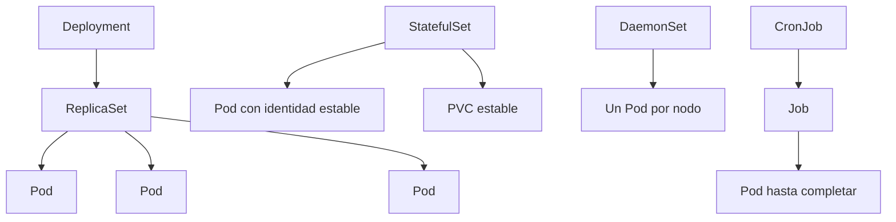

Pero tiene un límite importante:

> Si borras un Pod directo, no vuelve.

Un Pod directo no expresa cosas como:

- Quiero tres réplicas
- Quiero rollout gradual
- Quiero rollback
- Quiero ejecutar una tarea hasta completar
- Quiero ejecutar algo en cada nodo
- Quiero identidad estable para cada réplica
- Quiero una tarea periódica
- Quiero controlar cuántas interrupciones simultáneas tolero
Para eso usas workloads.

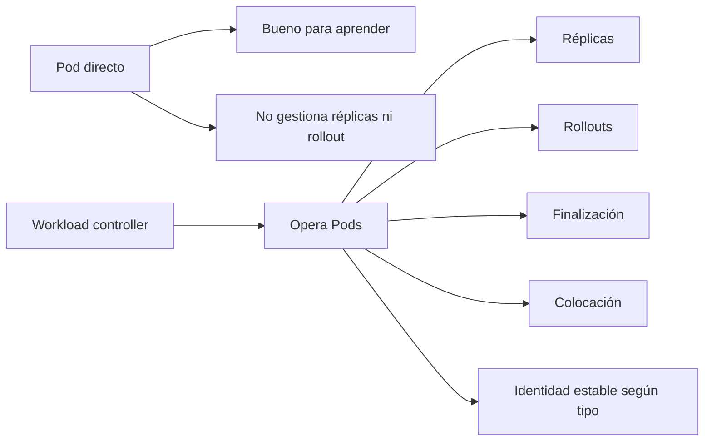

### Contrato mental

|Necesidad|Objeto probable|
|---|---|
|API stateless con varias réplicas|Deployment|
|Mantener réplicas de Pods|ReplicaSet, normalmente gestionado por Deployment|
|Tarea finita|Job|
|Tarea periódica|CronJob|
|Agente por nodo|DaemonSet|
|Workload con identidad estable|StatefulSet|
|Limitar interrupciones voluntarias|PodDisruptionBudget|
|Escalar por métricas|HorizontalPodAutoscaler|
|Ajustar requests verticalmente|VerticalPodAutoscaler|
|Poner límites por namespace|LimitRange y ResourceQuota|

### DevEx del bloque

En el laboratorio no queremos copiar manifests sueltos sin entenderlos.

La estructura debe separar tipos de workload:

```text
kubernetes/
  02-deployment/
  03-job/
  04-cronjob/
  05-daemonset/
  06-statefulset/
  07-policy/
  08-autoscaling/
```

Así el alumno ve que cada objeto responde a un problema distinto.

### Criterio de comprensión

Debes poder explicar:

> Un Pod directo enseña ejecución. Un workload enseña operación.

---

## 6.3. Mapa de decisión de workloads

Antes de escribir YAML, necesitas una forma de elegir.

No preguntes primero:

> ¿Qué YAML copio?

Pregunta:

> ¿Qué comportamiento necesito?

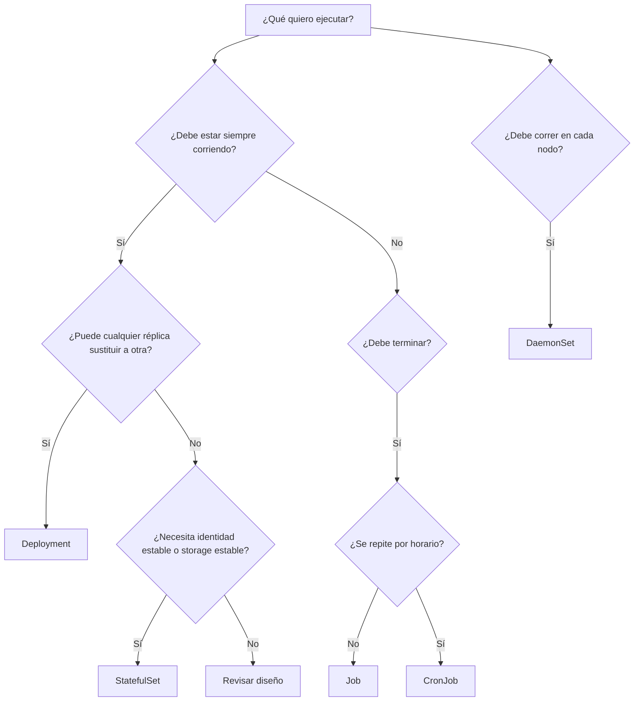

### Ejemplos reales del sistema `shop`

|Componente|Tipo recomendado|Motivo|
|---|---|---|
|`checkout-api`|Deployment|API stateless que puede tener varias réplicas|
|`payment-api`|Deployment|Servicio HTTP stateless|
|`inventory-api`|Deployment o StatefulSet, según diseño|Si solo expone API stateless, Deployment|
|`notification-worker`|Deployment o Job, según comportamiento|Worker continuo, Deployment. Trabajo finito, Job|
|Migración de base de datos|Job|Debe ejecutarse hasta completar|
|Limpieza diaria de carritos expirados|CronJob|Tarea periódica|
|Agente de logs por nodo|DaemonSet|Debe haber uno por nodo|
|PostgreSQL dentro del cluster|StatefulSet, con mucho cuidado|Necesita identidad y storage estable|
|Redis de laboratorio|StatefulSet o Deployment según objetivo|Para producción, revisar requisitos reales|

### Criterio de comprensión

Debes poder explicar:

> El tipo de workload se elige por comportamiento operacional, no por preferencia de YAML.

---

## 6.4. ReplicaSet

### Qué problema resuelve

Un ReplicaSet mantiene un número deseado de Pods.

Si quieres tres réplicas de una misma plantilla, un ReplicaSet intenta mantener tres.

Pero en la práctica, normalmente no creas ReplicaSets a mano.

Los crea y gestiona un Deployment.

La documentación de Deployments explica que un Deployment crea un ReplicaSet, y ese ReplicaSet crea Pods en segundo plano. También explica que, al actualizar la plantilla del Pod, el Deployment crea un nuevo ReplicaSet y escala gradualmente el nuevo mientras reduce el anterior. ([Kubernetes](https://kubernetes.io/docs/concepts/workloads/controllers/deployment/ "Deployments"))

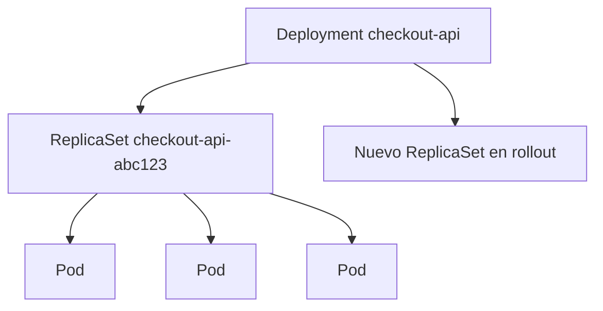

### Contrato mental

|Concepto|Significado|
|---|---|
|ReplicaSet|Mantiene número de Pods|
|Selector|Decide qué Pods pertenecen al ReplicaSet|
|Pod template|Plantilla para crear Pods|
|Deployment|Gestiona ReplicaSets y rollouts|

### Qué debes saber ahora

No necesitas crear un ReplicaSet manual en el laboratorio.

Sí necesitas saber leerlo:

```bash
kubectl get rs -n shop
kubectl describe rs -n shop
```

### DevEx del bloque

Añade una tarea de inspección:

```yaml
k8s:rs:
  desc: Show ReplicaSets
  cmds:
    - kubectl get rs -n {{.NAMESPACE}}
```

### Criterio de comprensión

Debes poder explicar:

> ReplicaSet mantiene réplicas, pero normalmente lo opero mediante Deployment.

---

## 6.5. Deployment

### Qué problema resuelve

Un Deployment es el workload principal para aplicaciones stateless de larga duración.

Sirve para:

- Mantener réplicas
- Declarar una plantilla de Pod
- Hacer rollouts
- Hacer rollbacks
- Escalar réplicas
- Sustituir Pods de forma controlada
La documentación oficial describe Deployment como el recurso para crear un rollout de un ReplicaSet, comprobar el estado del rollout y actualizar el estado de los Pods declarando una nueva plantilla. ([Kubernetes](https://kubernetes.io/docs/concepts/workloads/controllers/deployment/ "Deployments"))

### Por qué `checkout-api` debe ser un Deployment

`checkout-api` es una API HTTP stateless de laboratorio.

Eso significa:

- Cualquier réplica puede responder
- No necesita identidad estable propia
- No escribe estado local persistente
- Puede reemplazarse por otra réplica
- Puede escalar horizontalmente
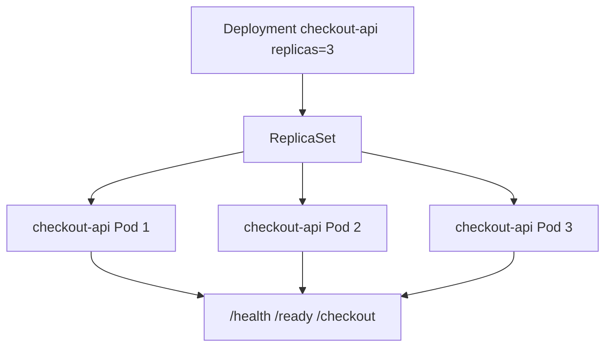

### Contrato del Deployment

Queremos que `checkout-api`:

- Viva en namespace `shop`
- Tenga tres réplicas
- Use labels consistentes
- Use la imagen `checkout-api:1.0.0`
- Mantenga probes
- Mantenga requests y limits
- Mantenga securityContext
- Mantenga Downward API
- Tenga estrategia RollingUpdate
- Se pueda inspeccionar con `kubectl rollout`
### Manifest

Crea:

```text
kubernetes/02-deployment/deployment.yaml
```

Contenido:

```yaml
apiVersion: apps/v1
kind: Deployment
metadata:
  name: checkout-api
  namespace: shop
  labels:
    app.kubernetes.io/name: checkout-api
    app.kubernetes.io/component: api
    app.kubernetes.io/part-of: shop
spec:
  replicas: 3
  revisionHistoryLimit: 5
  strategy:
    type: RollingUpdate
    rollingUpdate:
      maxUnavailable: 1
      maxSurge: 1
  selector:
    matchLabels:
      app.kubernetes.io/name: checkout-api
      app.kubernetes.io/component: api
  template:
    metadata:
      labels:
        app.kubernetes.io/name: checkout-api
        app.kubernetes.io/component: api
        app.kubernetes.io/part-of: shop
        app.kubernetes.io/version: "1.0.0"
      annotations:
        course.emmanuel.dev/module: "6"
        course.emmanuel.dev/purpose: "deployment-lab"
    spec:
      securityContext:
        seccompProfile:
          type: RuntimeDefault

      containers:
        - name: checkout-api
          image: checkout-api:1.0.0
          imagePullPolicy: IfNotPresent

          ports:
            - name: http
              containerPort: 8080

          env:
            - name: SERVICE_NAME
              value: checkout-api
            - name: PORT
              value: "8080"
            - name: LOG_LEVEL
              value: debug
            - name: POD_NAME
              valueFrom:
                fieldRef:
                  fieldPath: metadata.name
            - name: POD_NAMESPACE
              valueFrom:
                fieldRef:
                  fieldPath: metadata.namespace
            - name: POD_IP
              valueFrom:
                fieldRef:
                  fieldPath: status.podIP

          startupProbe:
            httpGet:
              path: /health
              port: http
            failureThreshold: 30
            periodSeconds: 2

          readinessProbe:
            httpGet:
              path: /ready
              port: http
            initialDelaySeconds: 2
            periodSeconds: 5
            failureThreshold: 3

          livenessProbe:
            httpGet:
              path: /health
              port: http
            initialDelaySeconds: 5
            periodSeconds: 10
            failureThreshold: 3

          resources:
            requests:
              cpu: 100m
              memory: 128Mi
            limits:
              cpu: 500m
              memory: 256Mi

          securityContext:
            allowPrivilegeEscalation: false
            readOnlyRootFilesystem: true
            runAsNonRoot: true
            runAsUser: 1000
            capabilities:
              drop:
                - ALL
```

### Aplicar

```bash
kubectl apply -f kubernetes/02-deployment/deployment.yaml
```

### Observar

```bash
kubectl get deploy -n shop
kubectl get rs -n shop
kubectl get pods -n shop -l app.kubernetes.io/name=checkout-api
kubectl rollout status deployment/checkout-api -n shop
```

### DevEx del bloque

Añade tareas:

```yaml
k8s:deployment:apply:
  desc: Apply checkout-api Deployment
  cmds:
    - kubectl apply -f kubernetes/02-deployment/deployment.yaml

k8s:deployment:status:
  desc: Show checkout-api Deployment status
  cmds:
    - kubectl get deploy checkout-api -n {{.NAMESPACE}}
    - kubectl get rs -n {{.NAMESPACE}}
    - kubectl get pods -n {{.NAMESPACE}} -l app.kubernetes.io/name=checkout-api -o wide
    - kubectl rollout status deployment/checkout-api -n {{.NAMESPACE}}
```

### Criterio de comprensión

Debes poder explicar:

> Para una API stateless como `checkout-api`, Deployment es el objeto principal porque mantiene réplicas y permite rollouts controlados.

---

## 6.6. Rollouts y rollbacks

### Qué problema resuelven

Una aplicación no solo se despliega una vez.

Cambia.

Necesitas pasar de:

```text
checkout-api:1.0.0
```

a:

```text
checkout-api:1.0.1
```

sin perder control.

Un rollout no es solo cambiar una imagen. Es cambiar comportamiento en un sistema vivo.

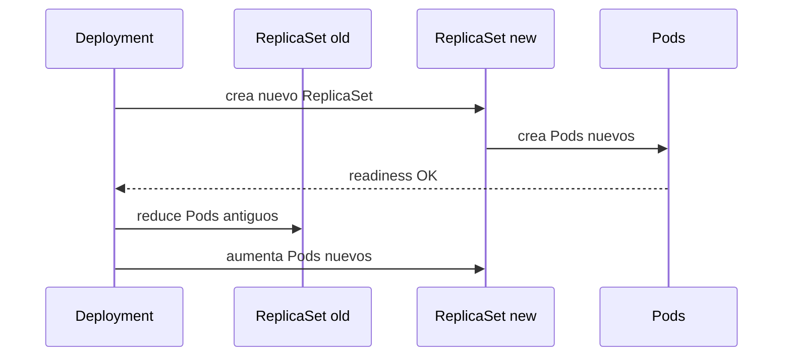

### Comandos principales

Ver historial:

```bash
kubectl rollout history deployment/checkout-api -n shop
```

Ver estado:

```bash
kubectl rollout status deployment/checkout-api -n shop
```

Cambiar imagen:

```bash
kubectl set image deployment/checkout-api checkout-api=checkout-api:1.0.1 -n shop
```

Rollback:

```bash
kubectl rollout undo deployment/checkout-api -n shop
```

### Práctica segura

Como en kind solo tienes cargada `checkout-api:1.0.0`, primero genera una imagen `1.0.1` cambiando algo pequeño, por ejemplo `LOG_LEVEL` no, porque eso es runtime. Para una práctica simple, puedes reconstruir la misma app con otro tag:

```bash
docker build -t checkout-api:1.0.1 ./apps/checkout-api
kind load docker-image checkout-api:1.0.1 --name shop-learning
kubectl set image deployment/checkout-api checkout-api=checkout-api:1.0.1 -n shop
kubectl rollout status deployment/checkout-api -n shop
```

### Failure lab: rollout con imagen inexistente

Este fallo enseña mucho.

```bash
kubectl set image deployment/checkout-api checkout-api=checkout-api:does-not-exist -n shop
kubectl rollout status deployment/checkout-api -n shop --timeout=60s
kubectl get pods -n shop
kubectl describe deployment checkout-api -n shop
kubectl get events -n shop --sort-by=.metadata.creationTimestamp
```

Después:

```bash
kubectl rollout undo deployment/checkout-api -n shop
kubectl rollout status deployment/checkout-api -n shop
```

### DevEx del bloque

Añade:

```yaml
k8s:deployment:rollout:history:
  desc: Show checkout-api rollout history
  cmds:
    - kubectl rollout history deployment/checkout-api -n {{.NAMESPACE}}

k8s:deployment:rollout:status:
  desc: Show checkout-api rollout status
  cmds:
    - kubectl rollout status deployment/checkout-api -n {{.NAMESPACE}}

k8s:deployment:rollback:
  desc: Rollback checkout-api Deployment
  cmds:
    - kubectl rollout undo deployment/checkout-api -n {{.NAMESPACE}}
    - kubectl rollout status deployment/checkout-api -n {{.NAMESPACE}}

k8s:failure:rollout:bad-image:
  desc: Trigger a rollout with a bad image
  cmds:
    - kubectl set image deployment/checkout-api checkout-api=checkout-api:does-not-exist -n {{.NAMESPACE}}
    - kubectl rollout status deployment/checkout-api -n {{.NAMESPACE}} --timeout=60s || true
    - kubectl get pods -n {{.NAMESPACE}}
    - kubectl get events -n {{.NAMESPACE}} --sort-by=.metadata.creationTimestamp
```

### Criterio de comprensión

Debes poder explicar:

> Un rollout fallido no es solo un Pod roto. Es una transición de versión que no ha podido completarse de forma sana.

---

## 6.7. Scaling manual

### Qué problema resuelve

Antes de autoscaling, necesitas entender scaling manual.

Escalar manualmente significa cambiar el número deseado de réplicas.

Ejemplo:

```bash
kubectl scale deployment/checkout-api --replicas=5 -n shop
```

Ver:

```bash
kubectl get deploy checkout-api -n shop
kubectl get pods -n shop -l app.kubernetes.io/name=checkout-api
```

Volver a tres:

```bash
kubectl scale deployment/checkout-api --replicas=3 -n shop
```

### Qué ocurre

El Deployment actualiza el número deseado.

El ReplicaSet ajusta Pods.

Kubernetes intenta acercar estado real a estado deseado.

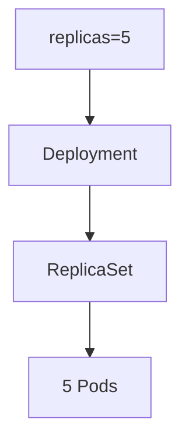

### DevEx del bloque

Añade:

```yaml
k8s:deployment:scale:
  desc: Scale checkout-api Deployment. Usage: task k8s:deployment:scale REPLICAS=5
  cmds:
    - kubectl scale deployment/checkout-api --replicas={{.REPLICAS}} -n {{.NAMESPACE}}
    - kubectl get deploy checkout-api -n {{.NAMESPACE}}
```

### Criterio de comprensión

Debes poder explicar:

> Escalar un Deployment es cambiar el número deseado de réplicas. Kubernetes ajusta los Pods para aproximarse a esa intención.

---

## 6.8. Job

### Qué problema resuelve

Un Job ejecuta una tarea finita hasta completarla.

No quieres un Deployment para algo que debe terminar.

Ejemplos:

- Migración puntual
- Importación de datos
- Generación de reporte
- Reprocesado puntual
- Validación batch

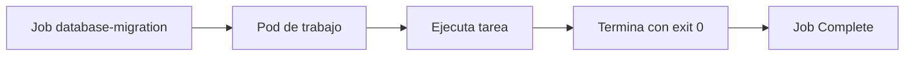

### Contrato mental

|Pregunta|Job|
|---|---|
|¿Debe estar siempre corriendo?|No|
|¿Debe terminar?|Sí|
|¿Debe reintentarse si falla?|Puede configurarse|
|¿Debe crear Pods hasta completar?|Sí|

### Manifest

Crea:

```text
kubernetes/03-job/job.yaml
```

Contenido:

```yaml
apiVersion: batch/v1
kind: Job
metadata:
  name: checkout-db-migration
  namespace: shop
  labels:
    app.kubernetes.io/name: checkout-db-migration
    app.kubernetes.io/component: migration
    app.kubernetes.io/part-of: shop
spec:
  backoffLimit: 2
  template:
    metadata:
      labels:
        app.kubernetes.io/name: checkout-db-migration
        app.kubernetes.io/component: migration
        app.kubernetes.io/part-of: shop
    spec:
      restartPolicy: Never
      containers:
        - name: migration
          image: busybox:1.36
          command:
            - sh
            - -c
            - echo "running checkout database migration" && sleep 2 && echo "migration completed"
          resources:
            requests:
              cpu: 50m
              memory: 64Mi
            limits:
              cpu: 100m
              memory: 128Mi
```

### Aplicar y observar

```bash
kubectl apply -f kubernetes/03-job/job.yaml
kubectl get jobs -n shop
kubectl get pods -n shop -l app.kubernetes.io/name=checkout-db-migration
kubectl logs -n shop job/checkout-db-migration
```

### Failure lab: Job fallido

Copia y rompe:

```bash
cp kubernetes/03-job/job.yaml kubernetes/03-job/job-failing.yaml
yq -i '.metadata.name = "checkout-db-migration-failing"' kubernetes/03-job/job-failing.yaml
yq -i '.spec.template.metadata.labels."app.kubernetes.io/name" = "checkout-db-migration-failing"' kubernetes/03-job/job-failing.yaml
yq -i '.spec.template.spec.containers[0].command = ["sh", "-c", "echo failing migration && exit 1"]' kubernetes/03-job/job-failing.yaml
kubectl apply -f kubernetes/03-job/job-failing.yaml
```

Observar:

```bash
kubectl get jobs -n shop
kubectl describe job checkout-db-migration-failing -n shop
kubectl get pods -n shop -l app.kubernetes.io/name=checkout-db-migration-failing
kubectl logs -n shop -l app.kubernetes.io/name=checkout-db-migration-failing
```

### DevEx del bloque

Añade:

```yaml
k8s:job:apply:
  desc: Apply checkout migration Job
  cmds:
    - kubectl apply -f kubernetes/03-job/job.yaml

k8s:job:status:
  desc: Show checkout migration Job status
  cmds:
    - kubectl get jobs -n {{.NAMESPACE}}
    - kubectl get pods -n {{.NAMESPACE}} -l app.kubernetes.io/component=migration
    - kubectl logs -n {{.NAMESPACE}} job/checkout-db-migration || true

k8s:job:delete:
  desc: Delete checkout migration Job
  cmds:
    - kubectl delete -f kubernetes/03-job/job.yaml --ignore-not-found
```

### Criterio de comprensión

Debes poder explicar:

> Un Job no mantiene un servicio vivo. Ejecuta trabajo finito hasta completar o agotar reintentos.

---

## 6.9. CronJob

### Qué problema resuelve

Un CronJob crea Jobs siguiendo un horario.

Sirve para tareas periódicas:

- Limpieza diaria
- Reportes
- Backups sencillos de laboratorio
- Sincronizaciones
- Reintentos programados
La documentación oficial de CronJob lo describe como un recurso para crear Jobs siguiendo una programación repetitiva. ([Kubernetes](https://kubernetes.io/docs/concepts/workloads/controllers/cron-jobs/ "CronJob"))

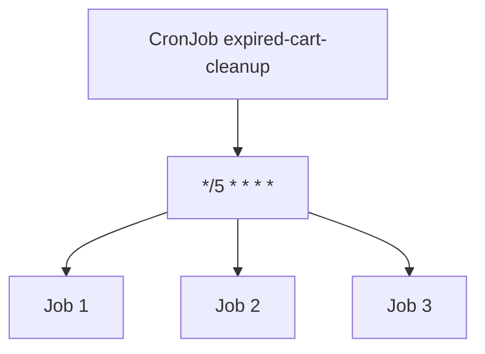

### Contrato mental

|Pregunta|CronJob|
|---|---|
|¿Es tarea finita?|Sí|
|¿Se repite por horario?|Sí|
|¿Crea Jobs?|Sí|
|¿Debe sustituir un worker continuo?|No|

### Manifest

Crea:

```text
kubernetes/04-cronjob/cronjob.yaml
```

Contenido:

```yaml
apiVersion: batch/v1
kind: CronJob
metadata:
  name: expired-cart-cleanup
  namespace: shop
  labels:
    app.kubernetes.io/name: expired-cart-cleanup
    app.kubernetes.io/component: cleanup
    app.kubernetes.io/part-of: shop
spec:
  schedule: "*/5 * * * *"
  concurrencyPolicy: Forbid
  successfulJobsHistoryLimit: 3
  failedJobsHistoryLimit: 3
  jobTemplate:
    spec:
      backoffLimit: 1
      template:
        metadata:
          labels:
            app.kubernetes.io/name: expired-cart-cleanup
            app.kubernetes.io/component: cleanup
            app.kubernetes.io/part-of: shop
        spec:
          restartPolicy: Never
          containers:
            - name: cleanup
              image: busybox:1.36
              command:
                - sh
                - -c
                - echo "cleaning expired carts" && date
              resources:
                requests:
                  cpu: 50m
                  memory: 64Mi
                limits:
                  cpu: 100m
                  memory: 128Mi
```

### Aplicar y observar

```bash
kubectl apply -f kubernetes/04-cronjob/cronjob.yaml
kubectl get cronjobs -n shop
kubectl get jobs -n shop
```

Puedes crear un Job manual desde el CronJob:

```bash
kubectl create job manual-expired-cart-cleanup \
  --from=cronjob/expired-cart-cleanup \
  -n shop
```

Ver logs:

```bash
kubectl logs -n shop job/manual-expired-cart-cleanup
```

### DevEx del bloque

Añade:

```yaml
k8s:cronjob:apply:
  desc: Apply expired cart cleanup CronJob
  cmds:
    - kubectl apply -f kubernetes/04-cronjob/cronjob.yaml

k8s:cronjob:status:
  desc: Show CronJobs and Jobs
  cmds:
    - kubectl get cronjobs -n {{.NAMESPACE}}
    - kubectl get jobs -n {{.NAMESPACE}}

k8s:cronjob:run-now:
  desc: Create a manual Job from the CronJob
  cmds:
    - kubectl create job manual-expired-cart-cleanup-$(date +%s) --from=cronjob/expired-cart-cleanup -n {{.NAMESPACE}}

k8s:cronjob:delete:
  desc: Delete expired cart cleanup CronJob
  cmds:
    - kubectl delete -f kubernetes/04-cronjob/cronjob.yaml --ignore-not-found
```

### Criterio de comprensión

Debes poder explicar:

> CronJob no ejecuta trabajo directamente de forma continua. Crea Jobs en momentos definidos por una expresión cron.

---

## 6.10. DaemonSet

### Qué problema resuelve

Un DaemonSet ejecuta una copia de un Pod en todos o algunos nodos.

Kubernetes describe DaemonSet como un recurso para Pods que ofrecen capacidades locales a los nodos; cuando añades un nodo que encaja con la especificación, el control plane programa un Pod del DaemonSet en ese nodo. ([Kubernetes](https://kubernetes.io/docs/concepts/workloads/ "Workloads"))

Ejemplos reales:

- Agente de logs por nodo
- Agente de métricas por nodo
- Agente de seguridad por nodo
- Plugin de red
- Agente de almacenamiento
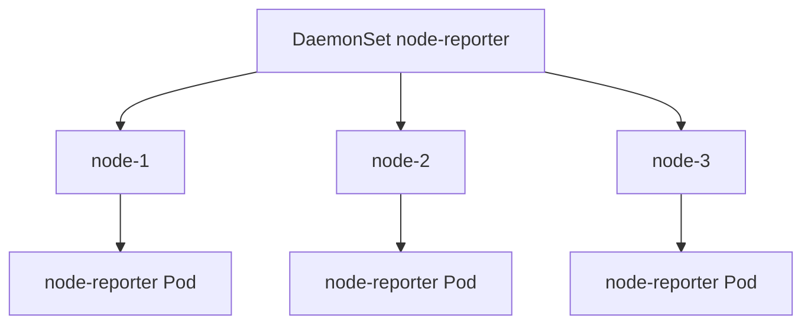

### Contrato mental

|Pregunta|DaemonSet|
|---|---|
|¿Quiero N réplicas arbitrarias?|No|
|¿Quiero una por nodo?|Sí|
|¿Depende del nodo donde vive?|Normalmente sí|
|¿Es buena opción para una API de negocio?|Normalmente no|

### Manifest de laboratorio

Crea:

```text
kubernetes/05-daemonset/daemonset.yaml
```

Contenido:

```yaml
apiVersion: apps/v1
kind: DaemonSet
metadata:
  name: node-reporter
  namespace: shop
  labels:
    app.kubernetes.io/name: node-reporter
    app.kubernetes.io/component: node-agent
    app.kubernetes.io/part-of: shop
spec:
  selector:
    matchLabels:
      app.kubernetes.io/name: node-reporter
      app.kubernetes.io/component: node-agent
  template:
    metadata:
      labels:
        app.kubernetes.io/name: node-reporter
        app.kubernetes.io/component: node-agent
        app.kubernetes.io/part-of: shop
    spec:
      containers:
        - name: node-reporter
          image: busybox:1.36
          command:
            - sh
            - -c
            - while true; do echo "running on node ${NODE_NAME}"; sleep 30; done
          env:
            - name: NODE_NAME
              valueFrom:
                fieldRef:
                  fieldPath: spec.nodeName
          resources:
            requests:
              cpu: 20m
              memory: 32Mi
            limits:
              cpu: 50m
              memory: 64Mi
```

### Aplicar y observar

```bash
kubectl apply -f kubernetes/05-daemonset/daemonset.yaml
kubectl get daemonsets -n shop
kubectl get pods -n shop -l app.kubernetes.io/name=node-reporter -o wide
kubectl logs -n shop -l app.kubernetes.io/name=node-reporter
```

En un cluster kind de un nodo, verás una réplica. En un cluster con varios nodos, deberías ver una por nodo elegible.

### DevEx del bloque

Añade:

```yaml
k8s:daemonset:apply:
  desc: Apply node-reporter DaemonSet
  cmds:
    - kubectl apply -f kubernetes/05-daemonset/daemonset.yaml

k8s:daemonset:status:
  desc: Show node-reporter DaemonSet status
  cmds:
    - kubectl get daemonsets -n {{.NAMESPACE}}
    - kubectl get pods -n {{.NAMESPACE}} -l app.kubernetes.io/name=node-reporter -o wide

k8s:daemonset:logs:
  desc: Show node-reporter logs
  cmds:
    - kubectl logs -n {{.NAMESPACE}} -l app.kubernetes.io/name=node-reporter --tail=20

k8s:daemonset:delete:
  desc: Delete node-reporter DaemonSet
  cmds:
    - kubectl delete -f kubernetes/05-daemonset/daemonset.yaml --ignore-not-found
```

### Criterio de comprensión

Debes poder explicar:

> DaemonSet no sirve para “tener varias réplicas”. Sirve para tener Pods ligados a nodos.

---

## 6.11. StatefulSet

### Qué problema resuelve

StatefulSet gestiona aplicaciones stateful.

La documentación oficial explica que StatefulSet gestiona el despliegue y escalado de un conjunto de Pods, y ofrece garantías sobre orden e identidad única. También indica que es útil para aplicaciones que necesitan almacenamiento persistente o identidad de red estable. ([Kubernetes](https://kubernetes.io/docs/concepts/workloads/controllers/statefulset/ "StatefulSets"))

### Qué diferencia a StatefulSet

Un StatefulSet proporciona:

- Identidad estable por Pod
- Nombres estables como `redis-0`, `redis-1`
- Orden de creación y eliminación
- Asociación estable con almacenamiento, cuando se usa `volumeClaimTemplates`
- Semántica diferente a Deployment
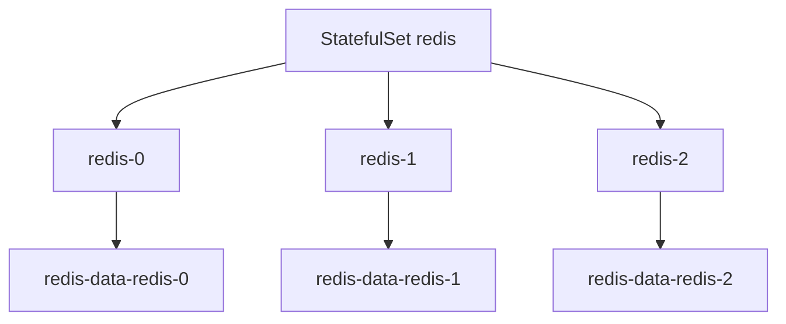

### Cuándo usarlo

Usa StatefulSet si necesitas:

- Identidad estable
- Storage estable por réplica
- Orden de arranque o apagado
- Clustering stateful
- Nombres predecibles por réplica
### Cuándo no usarlo

No lo uses si:

- La app es stateless
- Cualquier réplica puede sustituir a otra
- No necesitas storage estable
- Solo quieres “algo más serio que Deployment”
### Nota didáctica

Este módulo explica StatefulSet, pero no lo convertirá en la práctica principal porque el storage se estudia en profundidad en el módulo 8.

Aquí basta con entender la decisión.

### Manifest ilustrativo, no práctica principal

Crea opcionalmente:

```text
kubernetes/06-statefulset/statefulset.redis.example.yaml
```

Contenido:

```yaml
apiVersion: apps/v1
kind: StatefulSet
metadata:
  name: redis
  namespace: shop
spec:
  serviceName: redis
  replicas: 1
  selector:
    matchLabels:
      app.kubernetes.io/name: redis
  template:
    metadata:
      labels:
        app.kubernetes.io/name: redis
        app.kubernetes.io/component: cache
        app.kubernetes.io/part-of: shop
    spec:
      containers:
        - name: redis
          image: redis:7-alpine
          ports:
            - name: redis
              containerPort: 6379
```

Este manifest está incompleto para un Redis productivo. No define Service headless ni storage persistente. Se usa solo para discutir estructura.

### Criterio de comprensión

Debes poder explicar:

> StatefulSet no es “Deployment para bases de datos”. Es un workload para Pods con identidad estable y, normalmente, almacenamiento estable.

---

## 6.12. Requests, limits y QoS

### Qué problema resuelven

Los workloads compiten por CPU y memoria.

Kubernetes necesita información para colocar Pods y gestionar presión de recursos.

La documentación oficial indica que, al especificar un Pod, puedes definir cuántos recursos necesita un contenedor, siendo CPU y memoria los más comunes. ([Kubernetes](https://kubernetes.io/docs/concepts/configuration/manage-resources-containers/ "Resource Management for Pods and Containers"))

### Requests

Requests informan al scheduler:

> Para colocar este Pod, considera que necesita al menos esto.

### Limits

Limits informan al runtime y kubelet:

> Este contenedor no debería consumir más de esto.

### QoS

Kubernetes asigna clases de Quality of Service a Pods: `Guaranteed`, `Burstable` y `BestEffort`. La documentación oficial explica que Kubernetes usa estas clases para decidir sobre evictions cuando los recursos del nodo se exceden. ([Kubernetes](https://kubernetes.io/docs/tasks/configure-pod-container/quality-service-pod/ "Configure Quality of Service for Pods"))

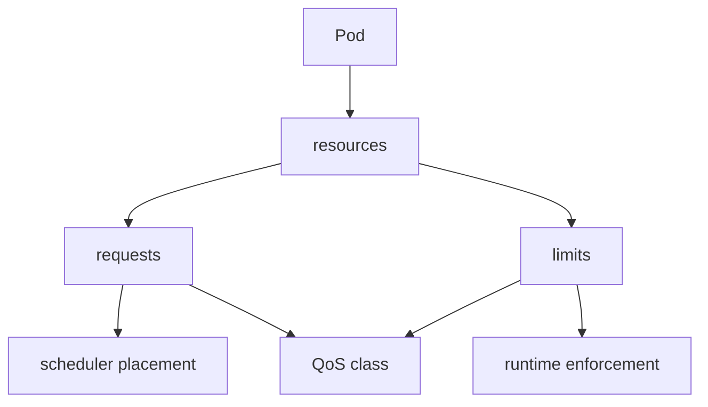

### Contrato para `checkout-api`

Ya usamos:

```yaml
resources:
  requests:
    cpu: 100m
    memory: 128Mi
  limits:
    cpu: 500m
    memory: 256Mi
```

Eso normalmente genera QoS `Burstable`, porque requests y limits no son iguales.

### Comandos

```bash
kubectl get pod -n shop -l app.kubernetes.io/name=checkout-api -o json \
  | jq '.items[] | {name: .metadata.name, qosClass: .status.qosClass, resources: .spec.containers[0].resources}'
```

### DevEx del bloque

Añade:

```yaml
k8s:resources:summary:
  desc: Show Pod resources and QoS
  cmds:
    - kubectl get pods -n {{.NAMESPACE}} -o json | jq -r '.items[] | [.metadata.name, .status.qosClass, (.spec.containers[0].resources | tostring)] | @tsv'
```

### Criterio de comprensión

Debes poder explicar:

> Requests ayudan a decidir placement. Limits reducen consumo máximo. QoS influye en decisiones de eviction bajo presión.

---

## 6.13. LimitRange y ResourceQuota

### Qué problema resuelven

No basta con que cada manifest individual sea correcto.

Un namespace puede necesitar reglas.

`LimitRange` permite poner restricciones o defaults de recursos dentro de un namespace. La documentación oficial explica que un LimitRange es una política que limita asignaciones de recursos, como requests y limits, para tipos de objeto aplicables dentro de un namespace. ([Kubernetes](https://kubernetes.io/docs/concepts/policy/limit-range/ "Limit Ranges"))

`ResourceQuota` limita el consumo agregado de recursos dentro de un namespace. La documentación oficial explica que ResourceQuota puede limitar consumo agregado y también cantidad de objetos por tipo dentro del namespace. ([Kubernetes](https://kubernetes.io/docs/concepts/policy/resource-quotas/ "Resource Quotas"))

### Contrato mental

|Objeto|Pregunta|
|---|---|
|LimitRange|¿Qué límites o defaults aplican a cada Pod o contenedor?|
|ResourceQuota|¿Cuánto puede consumir o crear en total este namespace?|

### Manifest LimitRange

Crea:

```text
kubernetes/07-policy/limitrange.yaml
```

Contenido:

```yaml
apiVersion: v1
kind: LimitRange
metadata:
  name: shop-default-limits
  namespace: shop
spec:
  limits:
    - type: Container
      defaultRequest:
        cpu: 50m
        memory: 64Mi
      default:
        cpu: 500m
        memory: 256Mi
```

### Manifest ResourceQuota

Crea:

```text
kubernetes/07-policy/resourcequota.yaml
```

Contenido:

```yaml
apiVersion: v1
kind: ResourceQuota
metadata:
  name: shop-quota
  namespace: shop
spec:
  hard:
    requests.cpu: "2"
    requests.memory: 2Gi
    limits.cpu: "4"
    limits.memory: 4Gi
    pods: "20"
```

### Aplicar

```bash
kubectl apply -f kubernetes/07-policy/limitrange.yaml
kubectl apply -f kubernetes/07-policy/resourcequota.yaml
```

### Ver

```bash
kubectl describe limitrange shop-default-limits -n shop
kubectl describe resourcequota shop-quota -n shop
```

### DevEx del bloque

Añade:

```yaml
k8s:policy:apply:
  desc: Apply LimitRange and ResourceQuota
  cmds:
    - kubectl apply -f kubernetes/07-policy/limitrange.yaml
    - kubectl apply -f kubernetes/07-policy/resourcequota.yaml

k8s:policy:status:
  desc: Show namespace resource policies
  cmds:
    - kubectl describe limitrange shop-default-limits -n {{.NAMESPACE}}
    - kubectl describe resourcequota shop-quota -n {{.NAMESPACE}}

k8s:policy:delete:
  desc: Delete namespace resource policies
  cmds:
    - kubectl delete -f kubernetes/07-policy/resourcequota.yaml --ignore-not-found
    - kubectl delete -f kubernetes/07-policy/limitrange.yaml --ignore-not-found
```

### Criterio de comprensión

Debes poder explicar:

> LimitRange actúa sobre defaults y límites por objeto. ResourceQuota limita el consumo agregado del namespace.

---

## 6.14. Scheduling básico: nodeSelector, affinity, taints y tolerations

### Qué problema resuelve

No todos los Pods deberían poder correr en cualquier nodo.

A veces necesitas controlar placement.

Ejemplos:

- Workloads GPU en nodos GPU
- Agentes en nodos concretos
- Separar workloads críticos
- Evitar colocar dos réplicas juntas
- Reservar nodos para ciertos equipos
### nodeSelector

`nodeSelector` es una forma simple de pedir nodos con ciertas labels.

Ejemplo conceptual:

```yaml
nodeSelector:
  node-type: general
```

### Affinity y anti-affinity

Affinity permite expresar reglas más ricas de colocación.

Anti-affinity permite decir que ciertos Pods no deberían colocarse juntos.

### Taints y tolerations

Los taints se aplican a nodos y permiten repeler Pods. Las tolerations se aplican a Pods y permiten que el scheduler pueda colocarlos en nodos con taints compatibles. La documentación oficial explica que las tolerations permiten scheduling, pero no lo garantizan, porque el scheduler evalúa otros parámetros. ([Kubernetes](https://kubernetes.io/docs/concepts/scheduling-eviction/taint-and-toleration/ "Taints and Tolerations"))

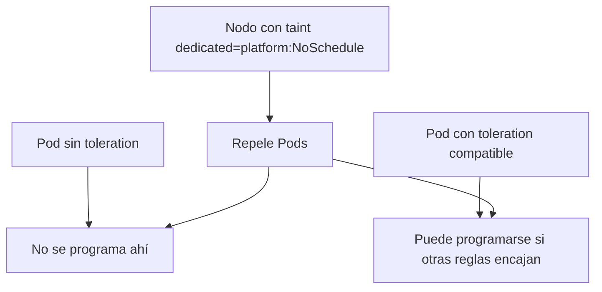

### Contrato mental

|Mecanismo|Pregunta|
|---|---|
|nodeSelector|¿Quiero nodos con labels concretas?|
|node affinity|¿Quiero reglas de nodo más expresivas?|
|pod affinity|¿Quiero acercar Pods a otros Pods?|
|pod anti-affinity|¿Quiero separar Pods entre sí?|
|taints|¿Quiero que el nodo rechace Pods por defecto?|
|tolerations|¿Este Pod puede tolerar ese taint?|

### Práctica recomendada

En kind de un nodo, no hagas prácticas agresivas de taints porque puedes bloquear tus propios Pods.

Para este módulo, estudia el manifest conceptual y practica inspección:

```bash
kubectl get nodes --show-labels
kubectl describe nodes
```

### Criterio de comprensión

Debes poder explicar:

> Scheduling no es solo “Kubernetes decide”. Yo puedo declarar restricciones y preferencias, pero debo entender su impacto.

---

## 6.15. PodDisruptionBudget

### Qué problema resuelve

Un PodDisruptionBudget, o PDB, limita cuántas interrupciones voluntarias puede sufrir una aplicación al mismo tiempo.

La documentación oficial explica que un PDB permite limitar disrupciones concurrentes para una aplicación y permite mayor disponibilidad mientras los administradores gestionan nodos del cluster. ([Kubernetes](https://kubernetes.io/docs/tasks/run-application/configure-pdb/ "Specifying a Disruption Budget for your Application"))

### Qué es una interrupción voluntaria

Ejemplos:

- Drain de nodo
- Mantenimiento
- Evictions iniciadas por administración
- Actualizaciones controladas
No todo fallo respeta un PDB.

Si un nodo se muere, el PDB no puede impedirlo.

### Contrato para `checkout-api`

Si tienes tres réplicas, puedes decir:

```text
Debe haber al menos 2 disponibles.
```

Manifest:

```text
kubernetes/07-policy/pdb.yaml
```

```yaml
apiVersion: policy/v1
kind: PodDisruptionBudget
metadata:
  name: checkout-api-pdb
  namespace: shop
spec:
  minAvailable: 2
  selector:
    matchLabels:
      app.kubernetes.io/name: checkout-api
      app.kubernetes.io/component: api
```

Aplicar:

```bash
kubectl apply -f kubernetes/07-policy/pdb.yaml
kubectl get pdb -n shop
kubectl describe pdb checkout-api-pdb -n shop
```

### DevEx del bloque

Añade:

```yaml
k8s:pdb:apply:
  desc: Apply checkout-api PodDisruptionBudget
  cmds:
    - kubectl apply -f kubernetes/07-policy/pdb.yaml

k8s:pdb:status:
  desc: Show checkout-api PodDisruptionBudget
  cmds:
    - kubectl get pdb -n {{.NAMESPACE}}
    - kubectl describe pdb checkout-api-pdb -n {{.NAMESPACE}}

k8s:pdb:delete:
  desc: Delete checkout-api PodDisruptionBudget
  cmds:
    - kubectl delete -f kubernetes/07-policy/pdb.yaml --ignore-not-found
```

### Criterio de comprensión

Debes poder explicar:

> PDB no hace que una app sea inmortal. Declara cuántas interrupciones voluntarias simultáneas puede tolerar.

---

## 6.16. HorizontalPodAutoscaler

### Qué problema resuelve

HPA escala horizontalmente un workload ajustando el número de réplicas.

La documentación oficial explica que HorizontalPodAutoscaler actualiza automáticamente un recurso como Deployment o StatefulSet para ajustar capacidad según demanda observada, por ejemplo CPU o memoria. ([Kubernetes](https://kubernetes.io/docs/concepts/workloads/autoscaling/horizontal-pod-autoscale/ "Horizontal Pod Autoscaling"))

### Qué necesita

HPA necesita métricas.

En un cluster kind básico, puede que no tengas `metrics-server`.

Por eso en este módulo HPA se explica y se deja como práctica opcional si instalas metrics-server.

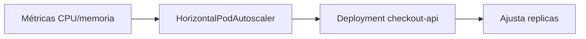

### Manifest opcional

Crea:

```text
kubernetes/08-autoscaling/hpa.yaml
```

Contenido:

```yaml
apiVersion: autoscaling/v2
kind: HorizontalPodAutoscaler
metadata:
  name: checkout-api
  namespace: shop
spec:
  scaleTargetRef:
    apiVersion: apps/v1
    kind: Deployment
    name: checkout-api
  minReplicas: 2
  maxReplicas: 5
  metrics:
    - type: Resource
      resource:
        name: cpu
        target:
          type: Utilization
          averageUtilization: 70
```

Aplicar:

```bash
kubectl apply -f kubernetes/08-autoscaling/hpa.yaml
kubectl get hpa -n shop
```

Si ves métricas como `<unknown>`, normalmente falta metrics-server o métricas disponibles.

### DevEx del bloque

Añade:

```yaml
k8s:hpa:apply:
  desc: Apply checkout-api HPA
  cmds:
    - kubectl apply -f kubernetes/08-autoscaling/hpa.yaml

k8s:hpa:status:
  desc: Show checkout-api HPA
  cmds:
    - kubectl get hpa -n {{.NAMESPACE}}
    - kubectl describe hpa checkout-api -n {{.NAMESPACE}} || true

k8s:hpa:delete:
  desc: Delete checkout-api HPA
  cmds:
    - kubectl delete -f kubernetes/08-autoscaling/hpa.yaml --ignore-not-found
```

### Criterio de comprensión

Debes poder explicar:

> HPA no escala porque sí. Escala un workload usando métricas observadas y límites declarados.

---

## 6.17. VerticalPodAutoscaler

### Qué problema resuelve

VPA ajusta recursos verticalmente, es decir, requests de CPU y memoria.

La documentación oficial actual explica que VerticalPodAutoscaler se define como un CRD, que a diferencia de HPA no forma parte de la API core de Kubernetes y debe instalarse por separado en el cluster. También indica que la API estable actual es `autoscaling.k8s.io/v1`. ([Kubernetes](https://kubernetes.io/docs/concepts/workloads/autoscaling/vertical-pod-autoscale/ "Vertical Pod Autoscaling"))

### Qué significa esto para el curso

No vamos a instalar VPA en este módulo.

Lo importante ahora es entender la diferencia:

|Tipo|Qué ajusta|
|---|---|
|HPA|Número de Pods|
|VPA|Requests de CPU y memoria|
|Cluster Autoscaler|Número de nodos|

### Criterio de comprensión

Debes poder explicar:

> HPA escala horizontalmente réplicas. VPA ajusta recursos por Pod y requiere componentes adicionales instalados en el cluster.

---

## 6.18. Práctica principal del módulo

### Objetivo

Convertir `checkout-api` de Pod directo a Deployment, añadir workloads auxiliares y practicar operación básica.

### Resultado esperado

```text
kubernetes-learning-lab/
  kubernetes/
    02-deployment/
      deployment.yaml
    03-job/
      job.yaml
      job-failing.yaml
    04-cronjob/
      cronjob.yaml
    05-daemonset/
      daemonset.yaml
    06-statefulset/
      statefulset.redis.example.yaml
    07-policy/
      limitrange.yaml
      resourcequota.yaml
      pdb.yaml
    08-autoscaling/
      hpa.yaml
```

### Paso 1. Preparar entorno

```bash
task k8s:kind:create
task k8s:image:prepare
task k8s:namespace:apply
```

### Paso 2. Aplicar políticas de recursos

```bash
task k8s:policy:apply
task k8s:policy:status
```

### Paso 3. Aplicar Deployment

```bash
task k8s:deployment:apply
task k8s:deployment:status
```

### Paso 4. Escalar manualmente

```bash
task k8s:deployment:scale REPLICAS=5
task k8s:deployment:status
task k8s:deployment:scale REPLICAS=3
```

### Paso 5. Probar rollout fallido y rollback

```bash
task k8s:failure:rollout:bad-image
task k8s:deployment:rollback
task k8s:deployment:status
```

### Paso 6. Aplicar Job

```bash
task k8s:job:apply
task k8s:job:status
```

### Paso 7. Aplicar CronJob

```bash
task k8s:cronjob:apply
task k8s:cronjob:status
task k8s:cronjob:run-now
task k8s:cronjob:status
```

### Paso 8. Aplicar DaemonSet

```bash
task k8s:daemonset:apply
task k8s:daemonset:status
task k8s:daemonset:logs
```

### Paso 9. Aplicar PDB

```bash
task k8s:pdb:apply
task k8s:pdb:status
```

### Paso 10. HPA opcional

```bash
task k8s:hpa:apply
task k8s:hpa:status
```

### Paso 11. Limpiar

```bash
task k8s:hpa:delete
task k8s:pdb:delete
task k8s:daemonset:delete
task k8s:cronjob:delete
task k8s:job:delete
task k8s:policy:delete
kubectl delete -f kubernetes/02-deployment/deployment.yaml --ignore-not-found
task k8s:namespace:delete
task k8s:kind:delete
```

### Criterio de finalización

La práctica está completa cuando puedes explicar:

- Por qué `checkout-api` pasa de Pod a Deployment
- Qué ReplicaSet aparece detrás
- Qué ocurre al escalar
- Qué ocurre en un rollout fallido
- Qué hace rollback
- Qué diferencia hay entre Job y CronJob
- Por qué DaemonSet está ligado a nodos
- Por qué StatefulSet no es la práctica principal todavía
- Qué hacen LimitRange, ResourceQuota y PDB
- Por qué HPA puede necesitar metrics-server
---

## 6.19. Taskfile del módulo 6

Añade estas tareas al `Taskfile.yml`.

```yaml
  k8s:rs:
    desc: Show ReplicaSets
    cmds:
      - kubectl get rs -n {{.NAMESPACE}}

  k8s:deployment:apply:
    desc: Apply checkout-api Deployment
    cmds:
      - kubectl apply -f kubernetes/02-deployment/deployment.yaml

  k8s:deployment:status:
    desc: Show checkout-api Deployment status
    cmds:
      - kubectl get deploy checkout-api -n {{.NAMESPACE}}
      - kubectl get rs -n {{.NAMESPACE}}
      - kubectl get pods -n {{.NAMESPACE}} -l app.kubernetes.io/name=checkout-api -o wide
      - kubectl rollout status deployment/checkout-api -n {{.NAMESPACE}}

  k8s:deployment:scale:
    desc: Scale checkout-api Deployment. Usage: task k8s:deployment:scale REPLICAS=5
    cmds:
      - kubectl scale deployment/checkout-api --replicas={{.REPLICAS}} -n {{.NAMESPACE}}
      - kubectl get deploy checkout-api -n {{.NAMESPACE}}

  k8s:deployment:rollout:history:
    desc: Show checkout-api rollout history
    cmds:
      - kubectl rollout history deployment/checkout-api -n {{.NAMESPACE}}

  k8s:deployment:rollout:status:
    desc: Show checkout-api rollout status
    cmds:
      - kubectl rollout status deployment/checkout-api -n {{.NAMESPACE}}

  k8s:deployment:rollback:
    desc: Rollback checkout-api Deployment
    cmds:
      - kubectl rollout undo deployment/checkout-api -n {{.NAMESPACE}}
      - kubectl rollout status deployment/checkout-api -n {{.NAMESPACE}}

  k8s:failure:rollout:bad-image:
    desc: Trigger a rollout with a bad image
    cmds:
      - kubectl set image deployment/checkout-api checkout-api=checkout-api:does-not-exist -n {{.NAMESPACE}}
      - kubectl rollout status deployment/checkout-api -n {{.NAMESPACE}} --timeout=60s || true
      - kubectl get pods -n {{.NAMESPACE}}
      - kubectl get events -n {{.NAMESPACE}} --sort-by=.metadata.creationTimestamp

  k8s:job:apply:
    desc: Apply checkout migration Job
    cmds:
      - kubectl apply -f kubernetes/03-job/job.yaml

  k8s:job:status:
    desc: Show checkout migration Job status
    cmds:
      - kubectl get jobs -n {{.NAMESPACE}}
      - kubectl get pods -n {{.NAMESPACE}} -l app.kubernetes.io/component=migration
      - kubectl logs -n {{.NAMESPACE}} job/checkout-db-migration || true

  k8s:job:delete:
    desc: Delete checkout migration Job
    cmds:
      - kubectl delete -f kubernetes/03-job/job.yaml --ignore-not-found

  k8s:cronjob:apply:
    desc: Apply expired cart cleanup CronJob
    cmds:
      - kubectl apply -f kubernetes/04-cronjob/cronjob.yaml

  k8s:cronjob:status:
    desc: Show CronJobs and Jobs
    cmds:
      - kubectl get cronjobs -n {{.NAMESPACE}}
      - kubectl get jobs -n {{.NAMESPACE}}

  k8s:cronjob:run-now:
    desc: Create a manual Job from the CronJob
    cmds:
      - kubectl create job manual-expired-cart-cleanup-$(date +%s) --from=cronjob/expired-cart-cleanup -n {{.NAMESPACE}}

  k8s:cronjob:delete:
    desc: Delete expired cart cleanup CronJob
    cmds:
      - kubectl delete -f kubernetes/04-cronjob/cronjob.yaml --ignore-not-found

  k8s:daemonset:apply:
    desc: Apply node-reporter DaemonSet
    cmds:
      - kubectl apply -f kubernetes/05-daemonset/daemonset.yaml

  k8s:daemonset:status:
    desc: Show node-reporter DaemonSet status
    cmds:
      - kubectl get daemonsets -n {{.NAMESPACE}}
      - kubectl get pods -n {{.NAMESPACE}} -l app.kubernetes.io/name=node-reporter -o wide

  k8s:daemonset:logs:
    desc: Show node-reporter logs
    cmds:
      - kubectl logs -n {{.NAMESPACE}} -l app.kubernetes.io/name=node-reporter --tail=20

  k8s:daemonset:delete:
    desc: Delete node-reporter DaemonSet
    cmds:
      - kubectl delete -f kubernetes/05-daemonset/daemonset.yaml --ignore-not-found

  k8s:policy:apply:
    desc: Apply LimitRange and ResourceQuota
    cmds:
      - kubectl apply -f kubernetes/07-policy/limitrange.yaml
      - kubectl apply -f kubernetes/07-policy/resourcequota.yaml

  k8s:policy:status:
    desc: Show namespace resource policies
    cmds:
      - kubectl describe limitrange shop-default-limits -n {{.NAMESPACE}}
      - kubectl describe resourcequota shop-quota -n {{.NAMESPACE}}

  k8s:policy:delete:
    desc: Delete namespace resource policies
    cmds:
      - kubectl delete -f kubernetes/07-policy/resourcequota.yaml --ignore-not-found
      - kubectl delete -f kubernetes/07-policy/limitrange.yaml --ignore-not-found

  k8s:pdb:apply:
    desc: Apply checkout-api PodDisruptionBudget
    cmds:
      - kubectl apply -f kubernetes/07-policy/pdb.yaml

  k8s:pdb:status:
    desc: Show checkout-api PodDisruptionBudget
    cmds:
      - kubectl get pdb -n {{.NAMESPACE}}
      - kubectl describe pdb checkout-api-pdb -n {{.NAMESPACE}}

  k8s:pdb:delete:
    desc: Delete checkout-api PodDisruptionBudget
    cmds:
      - kubectl delete -f kubernetes/07-policy/pdb.yaml --ignore-not-found

  k8s:hpa:apply:
    desc: Apply checkout-api HPA
    cmds:
      - kubectl apply -f kubernetes/08-autoscaling/hpa.yaml

  k8s:hpa:status:
    desc: Show checkout-api HPA
    cmds:
      - kubectl get hpa -n {{.NAMESPACE}}
      - kubectl describe hpa checkout-api -n {{.NAMESPACE}} || true

  k8s:hpa:delete:
    desc: Delete checkout-api HPA
    cmds:
      - kubectl delete -f kubernetes/08-autoscaling/hpa.yaml --ignore-not-found

  k8s:resources:summary:
    desc: Show Pod resources and QoS
    cmds:
      - kubectl get pods -n {{.NAMESPACE}} -o json | jq -r '.items[] | [.metadata.name, .status.qosClass, (.spec.containers[0].resources | tostring)] | @tsv'
```

---

## 6.20. Ejercicios cortos

### Ejercicio 1. Elegir workload

Para cada caso, elige el workload:

|Caso|Workload|
|---|---|
|API HTTP stateless||
|Migración puntual||
|Limpieza cada noche||
|Agente por nodo||
|Base de datos con identidad estable||
|Worker continuo||
|Reporte mensual||

Después justifica cada elección en una frase.

---

### Ejercicio 2. Deployment y ReplicaSet

Ejecuta:

```bash
kubectl get deploy checkout-api -n shop
kubectl get rs -n shop
kubectl get pods -n shop -l app.kubernetes.io/name=checkout-api
```

Responde:

- ¿Qué creó el Deployment?
- ¿Qué creó el ReplicaSet?
- ¿Cuántas réplicas hay?
- ¿Qué labels conectan todo?
---

### Ejercicio 3. Rollout fallido

Ejecuta:

```bash
task k8s:failure:rollout:bad-image
```

Responde:

- ¿Qué Pods antiguos siguen funcionando?
- ¿Qué Pods nuevos fallan?
- ¿Qué dice `kubectl rollout status`?
- ¿Qué events explican el fallo?
- ¿Cómo vuelves atrás?
---

### Ejercicio 4. Job

Ejecuta:

```bash
task k8s:job:apply
task k8s:job:status
```

Responde:

- ¿El Job sigue corriendo para siempre?
- ¿Qué Pod creó?
- ¿Qué logs emitió?
- ¿Qué significa Complete?
---

### Ejercicio 5. CronJob

Ejecuta:

```bash
task k8s:cronjob:apply
task k8s:cronjob:run-now
task k8s:cronjob:status
```

Responde:

- ¿Qué diferencia hay entre CronJob y Job?
- ¿Qué crea el CronJob?
- ¿Para qué sirve `concurrencyPolicy: Forbid`?
---

### Ejercicio 6. DaemonSet

Ejecuta:

```bash
task k8s:daemonset:apply
task k8s:daemonset:status
```

Responde:

- ¿Cuántos nodos tiene tu kind?
- ¿Cuántos Pods creó el DaemonSet?
- ¿Por qué ese número tiene sentido?
---

### Ejercicio 7. Recursos y QoS

Ejecuta:

```bash
task k8s:resources:summary
```

Responde:

- ¿Qué QoS tienen los Pods?
- ¿Qué requests tienen?
- ¿Qué limits tienen?
- ¿Por qué eso importa para scheduling?
---

## 6.21. Errores habituales

### Error 1. Usar Deployment para todo

Deployment es excelente para APIs stateless, pero no para todo.

Una tarea finita debe ser Job.

Una tarea periódica debe ser CronJob.

Un agente por nodo debe ser DaemonSet.

Un workload con identidad estable puede necesitar StatefulSet.

---

### Error 2. Crear ReplicaSets a mano sin motivo

Normalmente usa Deployment.

ReplicaSet aparece como parte del mecanismo interno del Deployment.

---

### Error 3. Confundir escala con resiliencia real

Tener tres réplicas ayuda, pero no arregla:

- Contratos rotos
- Base de datos caída
- Configuración mala
- Mala observabilidad
- Errores compartidos entre réplicas
---

### Error 4. Hacer liveness agresiva durante rollouts

Una liveness mal definida puede reiniciar Pods sanos.

Readiness controla entrada de tráfico.

Liveness controla reinicio.

No son intercambiables.

---

### Error 5. Usar CronJob para procesos continuos

Si algo debe estar siempre escuchando una cola, probablemente sea Deployment.

Si algo debe ejecutarse cada cierto tiempo y terminar, CronJob encaja mejor.

---

### Error 6. Usar StatefulSet solo porque “parece más serio”

StatefulSet tiene coste conceptual.

Úsalo cuando necesites identidad estable, orden o storage estable.

---

### Error 7. Activar HPA sin entender métricas

HPA necesita métricas.

Si tu cluster no tiene metrics-server o métricas adecuadas, el HPA no puede tomar buenas decisiones.

---

### Error 8. No definir requests

Sin requests, el scheduler tiene menos información para tomar decisiones.

---

### Error 9. Creer que PDB cubre todos los fallos

PDB ayuda con interrupciones voluntarias.

No evita que un nodo muera, que una app falle o que una imagen esté rota.

---

## 6.22. Criterio de salida del módulo

Puedes pasar al módulo 7 cuando puedas hacer todo esto sin seguir una receta ciegamente.

### Conceptos

Debes poder explicar:

- Qué es un workload
- Por qué no operar Pods directos en escenarios normales
- Qué es ReplicaSet
- Qué es Deployment
- Qué es rollout
- Qué es rollback
- Qué es Job
- Qué es CronJob
- Qué es DaemonSet
- Qué es StatefulSet
- Qué son requests y limits
- Qué es QoS
- Qué es LimitRange
- Qué es ResourceQuota
- Qué es PDB
- Qué es HPA
- Qué es VPA
- Qué son taints y tolerations
- Qué diferencia hay entre nodeSelector, affinity y anti-affinity
### Práctica

Debes poder:

- Aplicar el Deployment de `checkout-api`
- Ver Deployment, ReplicaSet y Pods
- Escalar manualmente
- Provocar un rollout fallido
- Hacer rollback
- Aplicar un Job
- Ver logs del Job
- Aplicar un CronJob
- Crear un Job manual desde el CronJob
- Aplicar un DaemonSet
- Ver cuántos Pods crea
- Aplicar LimitRange y ResourceQuota
- Aplicar PDB
- Aplicar HPA de forma opcional y entender sus limitaciones en kind
### DevEx

Debes poder ejecutar:

```bash
task k8s:deployment:apply
task k8s:deployment:status
task k8s:deployment:scale REPLICAS=5
task k8s:failure:rollout:bad-image
task k8s:deployment:rollback
task k8s:job:apply
task k8s:job:status
task k8s:cronjob:apply
task k8s:cronjob:run-now
task k8s:daemonset:apply
task k8s:policy:apply
task k8s:pdb:apply
task k8s:resources:summary
```

### Frase final de comprensión

Debes poder explicar esta frase:

> Workloads son la forma en la que Kubernetes convierte Pods en comportamiento operativo: réplicas, rollouts, tareas finitas, tareas periódicas, agentes por nodo, identidad estable, límites de recursos e interrupciones controladas.

---

## 6.23. Referencias oficiales

|Tema|Referencia|
|---|---|
|Workloads|Kubernetes Docs, Workloads. ([Kubernetes](https://kubernetes.io/docs/concepts/workloads/ "Workloads"))|
|Deployments|Kubernetes Docs, Deployments. ([Kubernetes](https://kubernetes.io/docs/concepts/workloads/controllers/deployment/ "Deployments"))|
|StatefulSets|Kubernetes Docs, StatefulSets. ([Kubernetes](https://kubernetes.io/docs/concepts/workloads/controllers/statefulset/ "StatefulSets"))|
|DaemonSets|Kubernetes Docs, Workloads overview. ([Kubernetes](https://kubernetes.io/docs/concepts/workloads/ "Workloads"))|
|CronJobs|Kubernetes Docs, CronJob. ([Kubernetes](https://kubernetes.io/docs/concepts/workloads/controllers/cron-jobs/ "CronJob"))|
|Resource management|Kubernetes Docs, Resource Management for Pods and Containers. ([Kubernetes](https://kubernetes.io/docs/concepts/configuration/manage-resources-containers/ "Resource Management for Pods and Containers"))|
|QoS|Kubernetes Docs, Configure Quality of Service for Pods. ([Kubernetes](https://kubernetes.io/docs/tasks/configure-pod-container/quality-service-pod/ "Configure Quality of Service for Pods"))|
|LimitRange|Kubernetes Docs, Limit Ranges. ([Kubernetes](https://kubernetes.io/docs/concepts/policy/limit-range/ "Limit Ranges"))|
|ResourceQuota|Kubernetes Docs, Resource Quotas. ([Kubernetes](https://kubernetes.io/docs/concepts/policy/resource-quotas/ "Resource Quotas"))|
|PodDisruptionBudget|Kubernetes Docs, Specifying a Disruption Budget for your Application. ([Kubernetes](https://kubernetes.io/docs/tasks/run-application/configure-pdb/ "Specifying a Disruption Budget for your Application"))|
|Autoscaling workloads|Kubernetes Docs, Autoscaling Workloads. ([Kubernetes](https://kubernetes.io/docs/concepts/workloads/autoscaling/ "Autoscaling Workloads"))|
|Horizontal Pod Autoscaling|Kubernetes Docs, Horizontal Pod Autoscaling. ([Kubernetes](https://kubernetes.io/docs/concepts/workloads/autoscaling/horizontal-pod-autoscale/ "Horizontal Pod Autoscaling"))|
|Vertical Pod Autoscaling|Kubernetes Docs, Vertical Pod Autoscaling. ([Kubernetes](https://kubernetes.io/docs/concepts/workloads/autoscaling/vertical-pod-autoscale/ "Vertical Pod Autoscaling"))|
|Taints and tolerations|Kubernetes Docs, Taints and Tolerations. ([Kubernetes](https://kubernetes.io/docs/concepts/scheduling-eviction/taint-and-toleration/ "Taints and Tolerations"))|

## 6.24. Lecturas de apoyo

|Libro|Qué leer|
|---|---|
|_Kubernetes in Action_|Capítulos 4, 9, 10, 14, 15 y 16: controllers, Deployments, rollbacks, StatefulSets, resources, autoscaling y scheduling.|
|_Kubernetes: Up and Running_|Capítulos 9 a 12: ReplicaSets, Deployments, DaemonSets, Jobs y CronJobs.|
|_Cloud Native DevOps with Kubernetes_|Capítulos 5, 6, 9 y 13: resources, PDBs, scaling, controllers, HPA, deployment strategies y operación.|
|_Kubernetes Patterns_|Behavioral patterns: Batch Job, Periodic Job, Daemon Service, Singleton Service, Stateful Service y Elastic Scale.|

<!-- COURSE_NAV_START -->
[Anterior](<5. Pods y objetos básicos.md>) | [Indice](README.md) | [Siguiente](<7. Networking.md>)
<!-- COURSE_NAV_END -->
