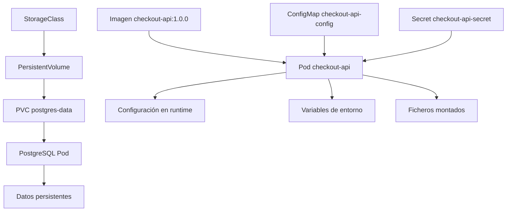
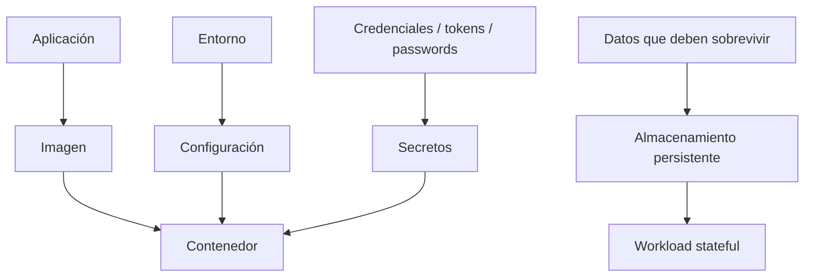
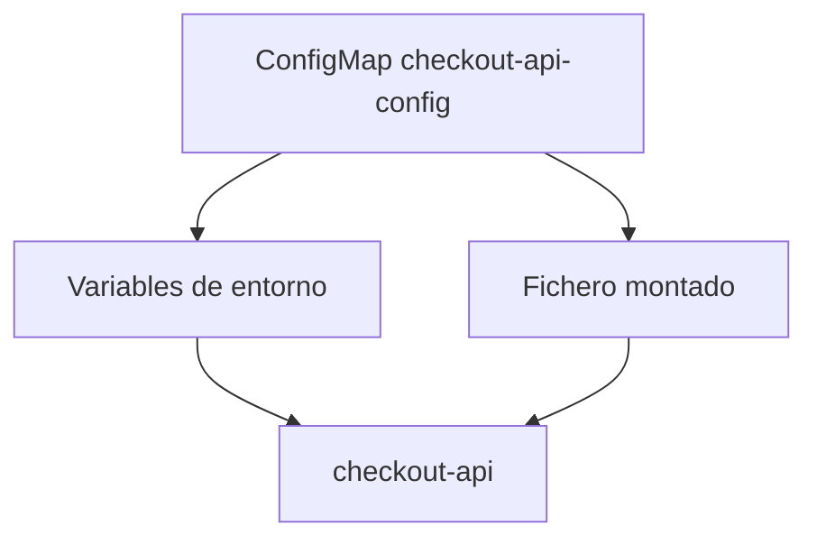
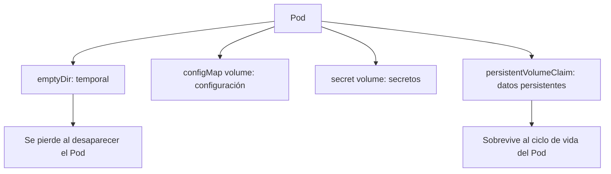
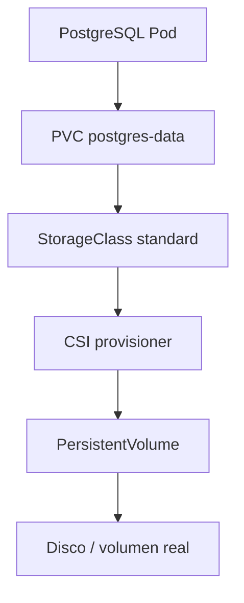
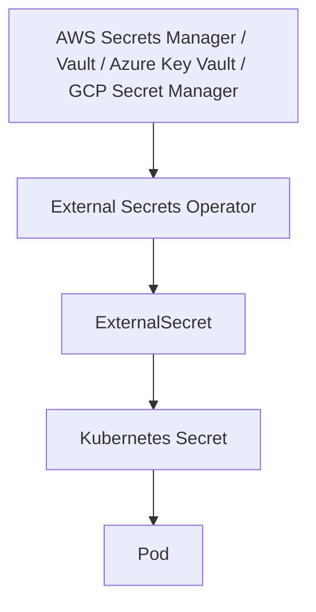
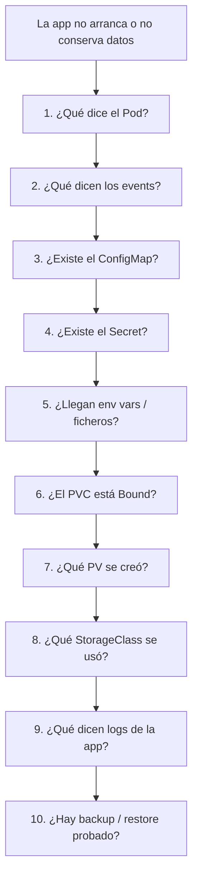

<!-- COURSE_NAV_START -->
[Anterior](<7. Networking.md>) | [Indice](README.md) | [Siguiente](<9. Testing automatizado de Kubernetes.md>)
<!-- COURSE_NAV_END -->

# 8. Configuración, secretos y almacenamiento

## Objetivo del módulo

En los módulos anteriores aprendiste a ejecutar `checkout-api`, exponerla con Services, conectar workloads mediante DNS interno y empezar a pensar en red, readiness, rollouts y troubleshooting.

Ahora toca separar tres cosas que suelen mezclarse mal:

```text
configuración
secretos
datos persistentes
```

Una aplicación en Kubernetes no debería depender de una imagen distinta para cada entorno.

Tampoco debería llevar secretos dentro de la imagen.

Y no debería asumir que el filesystem del contenedor es un lugar seguro para guardar datos que deben sobrevivir.

Kubernetes ofrece objetos específicos para esto:

- `ConfigMap` para configuración no sensible
- `Secret` para información sensible, entendiendo bien sus límites
- `Volume` para montar datos dentro de Pods
- `PersistentVolume` y `PersistentVolumeClaim` para persistencia desacoplada del Pod
- `StorageClass` para provisioning dinámico
- `VolumeSnapshot` para snapshots, si el CSI driver lo soporta
- Herramientas externas como External Secrets Operator o Velero para gestión de secretos y backup/restore
La documentación oficial define ConfigMap como un objeto API para almacenar datos no confidenciales en pares clave-valor, consumibles como variables de entorno, argumentos o ficheros montados en un volumen. También explica que permite desacoplar configuración específica de entorno de las imágenes de contenedor. ([Kubernetes](https://kubernetes.io/docs/concepts/configuration/configmap/ "ConfigMaps"))

La idea central del módulo es esta:

> La imagen empaqueta la aplicación. ConfigMaps y Secrets inyectan configuración. Volumes y PVCs gestionan datos. Si mezclas esas responsabilidades, haces que el sistema sea más frágil, menos portable y más difícil de operar.



---

## 8.1. Qué vas a aprender y qué no vas a aprender todavía

Vas a aprender:

- Qué es configuración en Kubernetes
- Qué problema resuelve ConfigMap
- Cuándo consumir ConfigMaps como variables de entorno
- Cuándo consumir ConfigMaps como ficheros
- Qué es Secret
- Por qué base64 no es cifrado
- Qué límites tienen los Secrets nativos
- Qué buenas prácticas mínimas aplicar con Secrets
- Qué es un Volume
- Qué diferencia hay entre `emptyDir`, ConfigMap volume, Secret volume y PVC
- Qué es un PersistentVolume
- Qué es un PersistentVolumeClaim
- Qué es una StorageClass
- Qué es dynamic provisioning
- Qué es CSI
- Qué son snapshots de volumen
- Qué significa backup y restore en Kubernetes
- Qué papel pueden tener External Secrets Operator, SOPS, KMS y Velero
- Cómo practicarlo con `checkout-api`, `payment-api`, `redis` y un PostgreSQL de laboratorio
- Cómo diagnosticar errores comunes: ConfigMap ausente, Secret ausente, PVC pendiente, permisos de volumen y configuración no actualizada
No vamos a profundizar todavía en:

- Gestión avanzada de secretos por proveedor cloud
- Rotación real de credenciales en producción
- Cifrado completo de etcd gestionado por proveedor
- Backups de bases de datos con consistencia transaccional real
- Operación avanzada de PostgreSQL en Kubernetes
- Operators de bases de datos
- Disaster recovery multi-cluster
- CSI drivers específicos de cada cloud
- Vault avanzado
- GitOps con secretos cifrados
Eso vendrá después o en rutas profesionales.

La regla pedagógica del módulo será:

```text
Primero separar responsabilidades
Luego explicar el objeto
Luego definir el contrato
Luego aplicar manifest
Luego inspeccionar
Luego provocar fallos
Luego automatizar con Taskfile
```

---

## 8.2. El problema: imagen, configuración, secretos y datos no son lo mismo

Antes de escribir YAML, hay que separar conceptos.

Una imagen debería responder:

> ¿Qué aplicación ejecuto?

La configuración debería responder:

> ¿Cómo se comporta esta aplicación en este entorno?

Un secreto debería responder:

> ¿Qué dato sensible necesita la aplicación para operar?

El almacenamiento persistente debería responder:

> ¿Qué datos deben sobrevivir al ciclo de vida de Pods y contenedores?



### Ejemplo con `checkout-api`

`checkout-api` necesita:

|Necesidad|Tipo|
|---|---|
|`PORT=8080`|Configuración|
|`LOG_LEVEL=debug`|Configuración|
|`PAYMENT_API_URL=http://payment-api`|Configuración|
|`REDIS_HOST=redis`|Configuración|
|`POSTGRES_HOST=postgres`|Configuración|
|`POSTGRES_USER=shop`|Secreto o configuración sensible según contexto|
|`POSTGRES_PASSWORD=...`|Secreto|
|Código Express|Imagen|
|Dependencias npm|Imagen|
|Datos de PostgreSQL|Almacenamiento persistente|

### Error de diseño habitual

Mala separación:

```text
checkout-api-prod:1.0.0
checkout-api-staging:1.0.0
checkout-api-dev:1.0.0
```

Mejor separación:

```text
checkout-api:1.0.0
ConfigMap dev / staging / prod
Secret dev / staging / prod
```

### Criterio de comprensión

Debes poder explicar:

> Si cambio de entorno, debería cambiar configuración y secretos, no reconstruir la imagen salvo que cambie la aplicación.

---

## 8.3. ConfigMap

### Qué problema resuelve

ConfigMap permite almacenar configuración no sensible fuera de la imagen.

Esto reduce acoplamiento entre imagen y entorno.

La misma imagen puede ejecutarse en local, test, staging o producción con configuración distinta.

Kubernetes documenta ConfigMap como objeto API para datos no confidenciales en pares clave-valor, consumibles por Pods como variables de entorno, argumentos o ficheros montados. ([Kubernetes](https://kubernetes.io/docs/concepts/configuration/configmap/ "ConfigMaps"))

### Cuándo usar ConfigMap

Usa ConfigMap para:

- URLs internas no sensibles
- Feature flags no sensibles
- Nombres de host
- Configuración de logging
- Parámetros de comportamiento
- Ficheros de configuración no sensibles
No lo uses para:

- Passwords
- Tokens
- API keys
- Certificados privados
- Credenciales de base de datos
- Cualquier dato que no quieras exponer a cualquiera con permisos de lectura sobre ConfigMaps


### Contrato de configuración de `checkout-api`

Vamos a mover esta configuración fuera del Deployment:

```text
SERVICE_NAME=checkout-api
PORT=8080
LOG_LEVEL=debug
PAYMENT_API_URL=http://payment-api
REDIS_HOST=redis
POSTGRES_HOST=postgres
```

### Manifest

Crea:

```text
kubernetes/05-config/configmap.yaml
```

Contenido:

```yaml
apiVersion: v1
kind: ConfigMap
metadata:
  name: checkout-api-config
  namespace: shop
  labels:
    app.kubernetes.io/name: checkout-api
    app.kubernetes.io/component: api
    app.kubernetes.io/part-of: shop
data:
  SERVICE_NAME: checkout-api
  PORT: "8080"
  LOG_LEVEL: debug
  PAYMENT_API_URL: http://payment-api
  REDIS_HOST: redis
  POSTGRES_HOST: postgres
```

### Aplicar

```bash
kubectl apply -f kubernetes/05-config/configmap.yaml
```

### Ver

```bash
kubectl get configmap checkout-api-config -n shop
kubectl get configmap checkout-api-config -n shop -o yaml
kubectl get configmap checkout-api-config -n shop -o json | jq '.data'
```

### Criterio de comprensión

Debes poder explicar:

> ConfigMap guarda configuración no sensible y permite cambiar comportamiento por entorno sin cambiar la imagen.

---

## 8.4. Consumir ConfigMap como variables de entorno

### Qué problema resuelve

Para valores pequeños, simples y de uso directo, las variables de entorno son cómodas.

Ejemplos:

```text
LOG_LEVEL
PAYMENT_API_URL
REDIS_HOST
```

### Cómo se consume

En el Deployment de `checkout-api`, puedes usar:

```yaml
envFrom:
  - configMapRef:
      name: checkout-api-config
```

Esto inyecta todas las claves del ConfigMap como variables de entorno.

### Fragmento del Deployment

En:

```text
kubernetes/02-deployment/deployment.yaml
```

reemplaza las variables de entorno fijas por:

```yaml
envFrom:
  - configMapRef:
      name: checkout-api-config
```

Mantén Downward API como `env`, porque no viene del ConfigMap:

```yaml
env:
  - name: POD_NAME
    valueFrom:
      fieldRef:
        fieldPath: metadata.name
  - name: POD_NAMESPACE
    valueFrom:
      fieldRef:
        fieldPath: metadata.namespace
  - name: POD_IP
    valueFrom:
      fieldRef:
        fieldPath: status.podIP
```

### Qué debes saber

Cuando consumes un ConfigMap como variables de entorno, los valores se leen al arrancar el contenedor.

Si cambias el ConfigMap, los contenedores existentes no actualizan automáticamente sus variables de entorno.

Normalmente necesitas recrear Pods o hacer rollout.

### Validar

```bash
kubectl rollout restart deployment/checkout-api -n shop
kubectl rollout status deployment/checkout-api -n shop
kubectl exec -n shop deploy/checkout-api -- printenv | sort
```

### DevEx del bloque

Añade:

```yaml
k8s:config:apply:
  desc: Apply checkout-api ConfigMap
  cmds:
    - kubectl apply -f kubernetes/05-config/configmap.yaml

k8s:config:get:
  desc: Show checkout-api ConfigMap
  cmds:
    - kubectl get configmap checkout-api-config -n {{.NAMESPACE}} -o yaml

k8s:deployment:restart:
  desc: Restart checkout-api Deployment
  cmds:
    - kubectl rollout restart deployment/checkout-api -n {{.NAMESPACE}}
    - kubectl rollout status deployment/checkout-api -n {{.NAMESPACE}}

k8s:app:env:
  desc: Show checkout-api runtime environment
  cmds:
    - kubectl exec -n {{.NAMESPACE}} deploy/checkout-api -- printenv | sort
```

### Criterio de comprensión

Debes poder explicar:

> ConfigMap como env var es simple, pero los Pods ya arrancados no cambian automáticamente sus variables si el ConfigMap cambia.

---

## 8.5. Consumir ConfigMap como fichero

### Qué problema resuelve

No toda configuración encaja bien en variables de entorno.

A veces necesitas un fichero:

- Configuración multi-línea
- Plantillas
- Configuración de una herramienta
- Reglas no sensibles
- Ficheros `.properties`, `.json`, `.yaml`, `.ini`
ConfigMap puede montarse como volumen para que la aplicación lea ficheros. Kubernetes documenta ese modo de consumo como una de las formas habituales de usar ConfigMaps en Pods. ([Kubernetes](https://kubernetes.io/docs/tasks/configure-pod-container/configure-pod-configmap/ "Configure a Pod to Use a ConfigMap"))

### Manifest con fichero de configuración

Amplía `configmap.yaml`:

```yaml
apiVersion: v1
kind: ConfigMap
metadata:
  name: checkout-api-config
  namespace: shop
  labels:
    app.kubernetes.io/name: checkout-api
    app.kubernetes.io/component: api
    app.kubernetes.io/part-of: shop
data:
  SERVICE_NAME: checkout-api
  PORT: "8080"
  LOG_LEVEL: debug
  PAYMENT_API_URL: http://payment-api
  REDIS_HOST: redis
  POSTGRES_HOST: postgres
  app-config.json: |
    {
      "featureFlags": {
        "newCheckoutFlow": true,
        "asyncNotifications": false
      },
      "timeouts": {
        "paymentApiMs": 2000,
        "inventoryApiMs": 1500
      }
    }
```

### Montarlo en el Deployment

Añade volumen:

```yaml
volumes:
  - name: checkout-api-config-files
    configMap:
      name: checkout-api-config
      items:
        - key: app-config.json
          path: app-config.json
```

Añade mount al contenedor:

```yaml
volumeMounts:
  - name: checkout-api-config-files
    mountPath: /etc/checkout-api
    readOnly: true
```

### Validar

```bash
kubectl exec -n shop deploy/checkout-api -- cat /etc/checkout-api/app-config.json
```

### Criterio de comprensión

Debes poder explicar:

> Variables de entorno encajan bien para valores simples. Ficheros montados encajan mejor para configuración estructurada o multi-línea.

## 8.5. bis ResourceQuota y LimitRange

Requests y limits declaran necesidades de un contenedor.

ResourceQuota y LimitRange gobiernan el consumo dentro de un namespace.

### LimitRange

LimitRange define valores mínimos, máximos o por defecto para recursos dentro de un namespace.

Ejemplo:

```yaml
apiVersion: v1
kind: LimitRange
metadata:
  name: shop-defaults
  namespace: shop
spec:
  limits:
    - type: Container
      defaultRequest:
        cpu: 100m
        memory: 128Mi
      default:
        memory: 256Mi
      min:
        cpu: 50m
        memory: 64Mi
      max:
        cpu: "1"
        memory: 512Mi
```

### ResourceQuota

ResourceQuota limita el consumo total del namespace.

Ejemplo:

```yaml
apiVersion: v1
kind: ResourceQuota
metadata:
  name: shop-quota
  namespace: shop
spec:
  hard:
    requests.cpu: "2"
    requests.memory: 2Gi
    limits.memory: 4Gi
    pods: "20"
    secrets: "20"
    configmaps: "20"
```

### Validar

```bash
kubectl apply -f limitrange.yaml
kubectl apply -f resourcequota.yaml
kubectl describe limitrange shop-defaults -n shop
kubectl describe resourcequota shop-quota -n shop
```

### Criterio de comprensión

Debes poder explicar:

> Requests y limits pertenecen al Pod. LimitRange y ResourceQuota pertenecen al namespace y definen guardarraíles.

---

## 8.6. Secret

### Qué problema resuelve

Secret permite separar datos sensibles del manifest de la aplicación y de la imagen.

La documentación oficial define Secret como un objeto que contiene una pequeña cantidad de datos sensibles, como passwords, tokens o claves. También indica que usar Secrets evita incluir datos confidenciales directamente en el código de la aplicación. ([Kubernetes](https://kubernetes.io/docs/concepts/configuration/secret/ "Secrets"))

### Qué debes entender antes de usar Secrets

Un Secret nativo de Kubernetes no es una solución completa de gestión de secretos.

Es una pieza del modelo.

Puntos importantes:

- Los Secrets son objetos de Kubernetes
- Pueden ser leídos por personas o ServiceAccounts con permisos suficientes
- Por defecto, Kubernetes históricamente ha almacenado Secrets en etcd codificados, no necesariamente cifrados
- La documentación oficial de buenas prácticas recomienda configurar cifrado en reposo para Secrets en etcd y aplicar controles de acceso estrictos. ([Kubernetes](https://kubernetes.io/docs/concepts/security/secrets-good-practices/ "Good practices for Kubernetes Secrets"))
### Base64 no es cifrado

En YAML, muchos Secrets aparecen con valores base64:

```yaml
data:
  POSTGRES_PASSWORD: c2hvcC1wYXNzd29yZA==
```

Eso no significa que esté cifrado.

Puedes decodificarlo:

```bash
echo 'c2hvcC1wYXNzd29yZA==' | base64 -d
```

Por eso, para aprendizaje, usaremos `stringData`, que es más legible. Kubernetes lo convierte al formato interno correspondiente.

### Contrato de Secret para laboratorio

Queremos un Secret para:

```text
POSTGRES_USER=shop
POSTGRES_PASSWORD=shop-password
```

En producción, estos valores no deberían vivir en texto plano en Git.

Para el laboratorio, sí los usaremos de forma explícita porque el objetivo es aprender el modelo.

### Manifest

Crea:

```text
kubernetes/05-config/secret.yaml
```

Contenido:

```yaml
apiVersion: v1
kind: Secret
metadata:
  name: checkout-api-secret
  namespace: shop
  labels:
    app.kubernetes.io/name: checkout-api
    app.kubernetes.io/component: api
    app.kubernetes.io/part-of: shop
type: Opaque
stringData:
  POSTGRES_USER: shop
  POSTGRES_PASSWORD: shop-password
```

### Aplicar

```bash
kubectl apply -f kubernetes/05-config/secret.yaml
```

### Ver metadata sin exponer valores

```bash
kubectl get secret checkout-api-secret -n shop
kubectl describe secret checkout-api-secret -n shop
```

### Ver valores codificados

```bash
kubectl get secret checkout-api-secret -n shop -o json | jq '.data'
```

### Decodificar para aprendizaje

```bash
kubectl get secret checkout-api-secret -n shop -o jsonpath='{.data.POSTGRES_PASSWORD}' | base64 -d
```

### Criterio de comprensión

Debes poder explicar:

> Secret evita meter datos sensibles en imagen o código, pero no elimina la necesidad de RBAC, cifrado en reposo, rotación y gestión segura fuera del cluster.

---

## 8.7. Consumir Secrets en Pods

### Qué problema resuelve

La aplicación necesita acceder a datos sensibles en runtime.

Igual que ConfigMap, Secret puede consumirse como variables de entorno o como ficheros montados.

### Consumir como variables de entorno

Añade al contenedor de `checkout-api`:

```yaml
envFrom:
  - configMapRef:
      name: checkout-api-config
  - secretRef:
      name: checkout-api-secret
```

### Riesgo operativo

Consumir secretos como variables de entorno es cómodo, pero puede hacer que aparezcan en dumps, diagnósticos o salidas de entorno si alguien ejecuta:

```bash
kubectl exec -n shop deploy/checkout-api -- printenv
```

Para ciertos secretos, montarlos como ficheros puede ser preferible.

### Consumir como fichero

Añade volumen:

```yaml
volumes:
  - name: checkout-api-secret-files
    secret:
      secretName: checkout-api-secret
```

Añade mount:

```yaml
volumeMounts:
  - name: checkout-api-secret-files
    mountPath: /etc/checkout-api/secrets
    readOnly: true
```

Validar:

```bash
kubectl exec -n shop deploy/checkout-api -- ls -la /etc/checkout-api/secrets
```

No imprimas valores sensibles salvo en laboratorio controlado.

### Criterio de comprensión

Debes poder explicar:

> Secrets pueden llegar al contenedor como env vars o como ficheros. La forma elegida afecta exposición, ergonomía y operación.

---

## 8.8. Buenas prácticas mínimas para Secrets

### Qué problema resuelven

Un Secret mal gestionado sigue siendo un riesgo.

La documentación oficial de buenas prácticas recomienda, entre otros puntos, cifrado en reposo para Secrets en etcd y controles de acceso estrictos. ([Kubernetes](https://kubernetes.io/docs/concepts/security/secrets-good-practices/ "Good practices for Kubernetes Secrets"))

### Reglas mínimas

Para este roadmap, aplica estas reglas:

- No metas secretos en imágenes
- No metas secretos reales en Git
- No imprimas secretos en logs
- No uses ConfigMap para datos sensibles
- Limita quién puede leer Secrets con RBAC
- Usa cifrado en reposo para Secrets en clusters reales
- Usa un gestor externo de secretos cuando tenga sentido
- Rota secretos
- Documenta qué workloads consumen qué secretos
- Evita dar permisos de lectura de todos los Secrets del namespace sin necesidad
### Herramientas relacionadas

|Necesidad|Herramienta|
|---|---|
|Sincronizar secretos desde gestores externos|External Secrets Operator|
|Cifrar YAML antes de guardarlo en Git|SOPS|
|Cifrar con claves gestionadas|KMS|
|Gestionar secretos centralizados|Vault, AWS Secrets Manager, Azure Key Vault, GCP Secret Manager|
|GitOps con secretos cifrados|SOPS + Flux / Argo CD, Sealed Secrets, External Secrets|

External Secrets Operator se presenta como un operador para sincronizar secretos desde APIs externas hacia Kubernetes, usando recursos custom como `ExternalSecret` y `SecretStore`. ([external-secrets.io](https://external-secrets.io/ "External Secrets Operator: Introduction"))

### Criterio de comprensión

Debes poder explicar:

> Kubernetes Secret es una primitiva útil, pero la gestión profesional de secretos requiere controles de acceso, cifrado, rotación y, a menudo, integración con un gestor externo.

---

## 8.9. Volumes

### Qué problema resuelven

El filesystem del contenedor es efímero.

Si un contenedor muere o se recrea, los datos escritos dentro del contenedor pueden perderse.

Kubernetes Volumes resuelven distintas necesidades de almacenamiento dentro del Pod.

No todos los volúmenes son persistentes.

### Tipos que debes entender ahora

|Tipo|Uso|
|---|---|
|`emptyDir`|Espacio temporal compartido mientras vive el Pod|
|`configMap`|Montar configuración como ficheros|
|`secret`|Montar secretos como ficheros|
|`persistentVolumeClaim`|Montar almacenamiento persistente|
|`projected`|Combinar varias fuentes en un volumen|



### Criterio de comprensión

Debes poder explicar:

> Volume no siempre significa persistencia. `emptyDir` desaparece con el Pod; un PVC apunta a almacenamiento persistente.

---

## 8.10. PersistentVolume, PersistentVolumeClaim y StorageClass

### Qué problema resuelven

Un Pod no debería conocer los detalles físicos del almacenamiento.

La aplicación dice:

> Necesito almacenamiento de estas características.

El cluster resuelve:

> Qué volumen real satisface esa solicitud.

Kubernetes documenta PersistentVolume como una pieza de almacenamiento del cluster, provisionada por un administrador o dinámicamente mediante StorageClass. PersistentVolumeClaim es la solicitud de almacenamiento que hace un usuario. ([Kubernetes](https://kubernetes.io/docs/concepts/storage/persistent-volumes/ "Persistent Volumes"))

StorageClass permite a los administradores describir clases de almacenamiento disponibles, que pueden mapear a distintos niveles de calidad, políticas de backup u otras políticas del proveedor. Kubernetes no impone qué significa cada clase. ([Kubernetes](https://kubernetes.io/docs/concepts/storage/storage-classes/ "Storage Classes"))

### Contrato mental

|Objeto|Pregunta|
|---|---|
|StorageClass|¿Qué tipo de almacenamiento ofrece el cluster?|
|PersistentVolume|¿Qué volumen real existe?|
|PersistentVolumeClaim|¿Qué almacenamiento pide mi workload?|
|Pod|¿Qué claim monta para leer o escribir datos?|



### Dynamic provisioning

Con dynamic provisioning, no creas manualmente el PV.

Creas un PVC que referencia una StorageClass, y el provisioner crea el volumen real.

### CSI

CSI, Container Storage Interface, permite integrar sistemas de almacenamiento con Kubernetes mediante drivers.

La capacidad real depende del driver instalado.

### Criterio de comprensión

Debes poder explicar:

> El Pod no debería depender de un disco concreto. Pide almacenamiento mediante PVC, y el cluster lo satisface usando StorageClass y el provisioner disponible.

---

## 8.11. PVC para PostgreSQL de laboratorio

### Qué problema resuelve

En módulos anteriores usaste Redis y PostgreSQL como dependencias de laboratorio.

Ahora queremos que PostgreSQL tenga datos persistentes aunque el Pod se recree.

No estamos enseñando producción de PostgreSQL en Kubernetes.

Estamos enseñando el contrato de almacenamiento.

### PVC

Crea:

```text
kubernetes/06-storage/postgres-pvc.yaml
```

Contenido:

```yaml
apiVersion: v1
kind: PersistentVolumeClaim
metadata:
  name: postgres-data
  namespace: shop
  labels:
    app.kubernetes.io/name: postgres
    app.kubernetes.io/component: database
    app.kubernetes.io/part-of: shop
spec:
  accessModes:
    - ReadWriteOnce
  resources:
    requests:
      storage: 1Gi
```

No especificamos `storageClassName` para que el cluster use la default StorageClass, si existe.

En kind, normalmente hay una StorageClass local por defecto, pero esto puede variar según instalación.

### PostgreSQL Secret

Crea:

```text
kubernetes/05-config/postgres-secret.yaml
```

Contenido:

```yaml
apiVersion: v1
kind: Secret
metadata:
  name: postgres-secret
  namespace: shop
  labels:
    app.kubernetes.io/name: postgres
    app.kubernetes.io/component: database
    app.kubernetes.io/part-of: shop
type: Opaque
stringData:
  POSTGRES_DB: shop
  POSTGRES_USER: shop
  POSTGRES_PASSWORD: shop-password
```

### PostgreSQL Deployment de laboratorio

Crea:

```text
kubernetes/02-deployment/postgres-deployment.yaml
```

Contenido:

```yaml
apiVersion: apps/v1
kind: Deployment
metadata:
  name: postgres
  namespace: shop
  labels:
    app.kubernetes.io/name: postgres
    app.kubernetes.io/component: database
    app.kubernetes.io/part-of: shop
spec:
  replicas: 1
  selector:
    matchLabels:
      app.kubernetes.io/name: postgres
      app.kubernetes.io/component: database
  template:
    metadata:
      labels:
        app.kubernetes.io/name: postgres
        app.kubernetes.io/component: database
        app.kubernetes.io/part-of: shop
    spec:
      containers:
        - name: postgres
          image: postgres:16-alpine
          ports:
            - name: postgres
              containerPort: 5432
          envFrom:
            - secretRef:
                name: postgres-secret
          volumeMounts:
            - name: postgres-data
              mountPath: /var/lib/postgresql/data
          resources:
            requests:
              cpu: 100m
              memory: 256Mi
            limits:
              cpu: 500m
              memory: 512Mi
      volumes:
        - name: postgres-data
          persistentVolumeClaim:
            claimName: postgres-data
```

### PostgreSQL Service

Crea:

```text
kubernetes/03-service/postgres-service.yaml
```

Contenido:

```yaml
apiVersion: v1
kind: Service
metadata:
  name: postgres
  namespace: shop
  labels:
    app.kubernetes.io/name: postgres
    app.kubernetes.io/component: database
    app.kubernetes.io/part-of: shop
spec:
  type: ClusterIP
  selector:
    app.kubernetes.io/name: postgres
    app.kubernetes.io/component: database
  ports:
    - name: postgres
      port: 5432
      targetPort: postgres
```

### Aplicar

```bash
kubectl apply -f kubernetes/05-config/postgres-secret.yaml
kubectl apply -f kubernetes/06-storage/postgres-pvc.yaml
kubectl apply -f kubernetes/02-deployment/postgres-deployment.yaml
kubectl apply -f kubernetes/03-service/postgres-service.yaml
```

### Observar

```bash
kubectl get pvc -n shop
kubectl get pv
kubectl get pods -n shop -l app.kubernetes.io/name=postgres
kubectl describe pvc postgres-data -n shop
kubectl describe pod -n shop -l app.kubernetes.io/name=postgres
```

### Criterio de comprensión

Debes poder explicar:

> PostgreSQL monta un PVC. Si el Pod se recrea, el claim sigue existiendo y puede volver a montarse según las reglas del storage disponible.

---

## 8.12. Probar persistencia de PostgreSQL

### Qué queremos comprobar

Queremos comprobar que el dato vive en el volumen, no en el contenedor.

### Crear una tabla

```bash
POSTGRES_POD="$(kubectl get pod -n shop -l app.kubernetes.io/name=postgres -o jsonpath='{.items[0].metadata.name}')"

kubectl exec -n shop "$POSTGRES_POD" -- psql -U shop -d shop -c "CREATE TABLE IF NOT EXISTS learning_notes (id serial PRIMARY KEY, note text);"

kubectl exec -n shop "$POSTGRES_POD" -- psql -U shop -d shop -c "INSERT INTO learning_notes(note) VALUES ('persistent data from kubernetes lab');"

kubectl exec -n shop "$POSTGRES_POD" -- psql -U shop -d shop -c "SELECT * FROM learning_notes;"
```

### Borrar el Pod

```bash
kubectl delete pod -n shop "$POSTGRES_POD"
```

Esperar recreación:

```bash
kubectl rollout status deployment/postgres -n shop
```

Consultar de nuevo:

```bash
POSTGRES_POD="$(kubectl get pod -n shop -l app.kubernetes.io/name=postgres -o jsonpath='{.items[0].metadata.name}')"

kubectl exec -n shop "$POSTGRES_POD" -- psql -U shop -d shop -c "SELECT * FROM learning_notes;"
```

### Qué demuestra

Demuestra que el dato sobrevivió al Pod.

No demuestra que tengas una estrategia de backup real.

No demuestra que PostgreSQL esté bien operado para producción.

No demuestra alta disponibilidad.

### Criterio de comprensión

Debes poder explicar:

> Persistencia no es backup. Que el dato sobreviva a un Pod recreado no significa que esté protegido frente a corrupción, borrado accidental o pérdida del volumen.

---

## 8.13. Reclaim policy y ciclo de vida del almacenamiento

### Qué problema resuelve

Cuando borras un PVC, ¿qué ocurre con el volumen real?

Depende de la `reclaimPolicy` del PV o de la StorageClass usada para crearlo.

Políticas habituales:

|Reclaim policy|Qué significa|
|---|---|
|`Delete`|Al borrar el PVC, el volumen subyacente puede eliminarse|
|`Retain`|El volumen queda retenido para recuperación manual|

### Comandos

```bash
kubectl get pv
kubectl get pv -o json | jq '.items[] | {name: .metadata.name, reclaimPolicy: .spec.persistentVolumeReclaimPolicy, claim: .spec.claimRef}'
kubectl get storageclass
kubectl describe storageclass
```

### Cuidado

En entornos cloud, `Delete` puede borrar el disco real.

En laboratorio puede parecer cómodo.

En producción, la decisión debe ser consciente.

### Criterio de comprensión

Debes poder explicar:

> Borrar un Pod no es lo mismo que borrar un PVC. Borrar un PVC puede tener consecuencias sobre el volumen real según la reclaim policy.

---

## 8.14. VolumeSnapshots

### Qué problema resuelven

Un snapshot captura el contenido de un volumen en un punto temporal, si el driver de almacenamiento lo soporta.

La documentación oficial explica que VolumeSnapshots ofrecen una forma estandarizada de copiar el contenido de un volumen en un momento concreto sin crear un volumen completamente nuevo, y que la funcionalidad depende del soporte del sistema de almacenamiento. ([Kubernetes](https://kubernetes.io/docs/concepts/storage/volume-snapshots/ "Volume Snapshots"))

### Condiciones importantes

Para usar snapshots necesitas:

- CRDs de snapshots instalados
- Snapshot controller
- CSI driver que soporte snapshots
- `VolumeSnapshotClass` compatible
La documentación oficial también describe `VolumeSnapshotClass` como el equivalente conceptual a StorageClass, pero para snapshots. ([Kubernetes](https://kubernetes.io/docs/concepts/storage/volume-snapshot-classes/ "Volume Snapshot Classes"))

### Manifest conceptual

Este manifest es conceptual. Puede no funcionar en kind si no tienes snapshot controller y CSI compatible.

```yaml
apiVersion: snapshot.storage.k8s.io/v1
kind: VolumeSnapshot
metadata:
  name: postgres-data-snapshot
  namespace: shop
spec:
  volumeSnapshotClassName: example-snapshot-class
  source:
    persistentVolumeClaimName: postgres-data
```

### Criterio de comprensión

Debes poder explicar:

> VolumeSnapshot es una API estándar, pero su funcionamiento real depende de los componentes de snapshot y del CSI driver instalado.

---

## 8.15. Backup y restore

### Qué problema resuelve

Persistencia no es backup.

Un PVC puede sobrevivir a un Pod, pero no necesariamente te protege contra:

- Borrado accidental
- Corrupción lógica
- Migraciones destructivas
- Pérdida del volumen
- Pérdida del cluster
- Error humano
- Desastre regional
- Borrado de Secrets necesarios para restaurar
Backup y restore deben cubrir tanto recursos Kubernetes como datos.

Velero es una herramienta ampliamente usada para backup y restore de recursos Kubernetes y volúmenes persistentes. Su documentación oficial cubre instalación, arquitectura y personalización según versión. ([Velero](https://velero.io/docs/main/ "Velero Docs - Overview"))

### Qué puede incluir un backup

- Manifests de recursos
- Namespaces
- ConfigMaps
- Secrets, con cuidado especial
- PVCs
- Snapshots de volúmenes, si el proveedor lo soporta
- Metadata necesaria para restaurar
- Orden de restauración
### Qué no debes asumir

No asumas que:

- Backup de manifests equivale a backup de datos
- Snapshot equivale a backup completo
- Backup existe si nunca probaste restore
- Backup de Secrets es seguro sin cifrado y control de acceso
- PostgreSQL es consistente si haces snapshot sin considerar transacciones
### Práctica didáctica mínima

Para este módulo, no instalaremos Velero como requisito obligatorio.

Sí crearemos una práctica manual de exportación de manifiestos y una práctica de persistencia.

Exportar recursos del namespace:

```bash
kubectl get all,configmap,secret,pvc -n shop -o yaml > .tmp/shop-resources-backup.yaml
```

Esto no es backup profesional.

Es una práctica para entender que recursos y datos son cosas distintas.

### Criterio de comprensión

Debes poder explicar:

> Backup no existe de verdad hasta que has probado restore. En Kubernetes, además, debes distinguir backup de objetos, backup de datos y backup de secretos.

---

## 8.16. External Secrets, SOPS y KMS

### Qué problema resuelven

En producción, no quieres poner secretos reales en YAML en texto plano.

Tampoco quieres depender únicamente de crear Secrets manualmente con `kubectl`.

Hay varias estrategias.

### External Secrets Operator

External Secrets Operator sincroniza secretos desde APIs externas hacia Kubernetes. Su documentación lo presenta como una colección de recursos custom, como `ExternalSecret`, orientados a traer secretos desde proveedores externos hacia Secrets nativos. ([external-secrets.io](https://external-secrets.io/ "External Secrets Operator: Introduction"))

Modelo conceptual:



### SOPS

SOPS permite cifrar ficheros antes de guardarlos en Git.

Puede integrarse con KMS, GPG, age y flujos GitOps.

### KMS

KMS permite gestionar claves de cifrado en un proveedor o sistema centralizado.

### Cuándo usar cada enfoque

|Enfoque|Encaja cuando|
|---|---|
|Secret manual|Laboratorio, pruebas pequeñas|
|SOPS|Quieres guardar YAML cifrado en Git|
|External Secrets Operator|Ya tienes gestor externo de secretos|
|Vault|Necesitas gestión avanzada, políticas y emisión dinámica|
|KMS|Necesitas cifrado con claves gestionadas y auditoría|

### Criterio de comprensión

Debes poder explicar:

> Kubernetes Secret es el objeto que consume el Pod, pero el origen profesional del secreto puede estar fuera del cluster.

---

## 8.17. Failure lab 1: ConfigMap ausente

### Qué queremos comprobar

Queremos ver qué ocurre si un Deployment referencia un ConfigMap que no existe.

### Crear fallo

Borra el ConfigMap:

```bash
kubectl delete configmap checkout-api-config -n shop
```

Reinicia Deployment:

```bash
kubectl rollout restart deployment/checkout-api -n shop
kubectl rollout status deployment/checkout-api -n shop --timeout=60s || true
```

### Observar

```bash
kubectl get pods -n shop -l app.kubernetes.io/name=checkout-api
kubectl describe pod -n shop -l app.kubernetes.io/name=checkout-api
kubectl get events -n shop --sort-by=.metadata.creationTimestamp
```

### Restaurar

```bash
kubectl apply -f kubernetes/05-config/configmap.yaml
kubectl rollout restart deployment/checkout-api -n shop
kubectl rollout status deployment/checkout-api -n shop
```

### Preguntas

- ¿El Deployment existe?
- ¿Los nuevos Pods arrancan?
- ¿Qué event explica el fallo?
- ¿Dónde se ve que falta el ConfigMap?
- ¿Por qué aplicar el ConfigMap y reiniciar corrige el problema?
### Criterio de comprensión

Debes poder explicar:

> Si un Pod referencia un ConfigMap obligatorio que no existe, Kubernetes puede aceptar el Deployment pero fallar al crear contenedores correctamente.

---

## 8.18. Failure lab 2: Secret ausente

### Qué queremos comprobar

Queremos ver el mismo patrón con Secrets.

### Crear fallo

Borra el Secret:

```bash
kubectl delete secret checkout-api-secret -n shop
```

Reinicia:

```bash
kubectl rollout restart deployment/checkout-api -n shop
kubectl rollout status deployment/checkout-api -n shop --timeout=60s || true
```

### Observar

```bash
kubectl get pods -n shop -l app.kubernetes.io/name=checkout-api
kubectl describe pod -n shop -l app.kubernetes.io/name=checkout-api
kubectl get events -n shop --sort-by=.metadata.creationTimestamp
```

### Restaurar

```bash
kubectl apply -f kubernetes/05-config/secret.yaml
kubectl rollout restart deployment/checkout-api -n shop
kubectl rollout status deployment/checkout-api -n shop
```

### Preguntas

- ¿Qué diferencia hay entre Secret ausente y ConfigMap ausente?
- ¿Qué event aparece?
- ¿El error está en la app o en la configuración del Pod?
- ¿Cómo lo detectarías en una pipeline antes de desplegar?
### Criterio de comprensión

Debes poder explicar:

> Secrets también forman parte del contrato de runtime. Si faltan, el problema puede aparecer al crear el Pod, no necesariamente dentro del código de la aplicación.

---

## 8.19. Failure lab 3: PVC pendiente

### Qué queremos comprobar

Queremos entender qué pasa cuando un PVC no puede satisfacerse.

### Crear PVC con StorageClass inexistente

Crea:

```text
kubernetes/06-storage/postgres-pvc-bad-storageclass.yaml
```

Contenido:

```yaml
apiVersion: v1
kind: PersistentVolumeClaim
metadata:
  name: postgres-data-bad-storageclass
  namespace: shop
spec:
  storageClassName: does-not-exist
  accessModes:
    - ReadWriteOnce
  resources:
    requests:
      storage: 1Gi
```

Aplicar:

```bash
kubectl apply -f kubernetes/06-storage/postgres-pvc-bad-storageclass.yaml
```

Observar:

```bash
kubectl get pvc -n shop
kubectl describe pvc postgres-data-bad-storageclass -n shop
kubectl get events -n shop --sort-by=.metadata.creationTimestamp
```

Limpiar:

```bash
kubectl delete -f kubernetes/06-storage/postgres-pvc-bad-storageclass.yaml --ignore-not-found
```

### Preguntas

- ¿El PVC se queda Pending?
- ¿Qué event aparece?
- ¿Qué StorageClasses existen en tu cluster?
- ¿Qué significa que un PVC no esté Bound?
### Criterio de comprensión

Debes poder explicar:

> Un PVC Pending normalmente significa que Kubernetes no ha podido encontrar o provisionar almacenamiento que satisfaga la solicitud.

---

## 8.20. Troubleshooting progresivo de configuración y storage

No empieces por reinstalar el cluster.

Sigue una secuencia.



### Comandos base

```bash
kubectl get pods -n shop
kubectl describe pod -n shop -l app.kubernetes.io/name=checkout-api
kubectl get events -n shop --sort-by=.metadata.creationTimestamp

kubectl get configmap -n shop
kubectl get secret -n shop
kubectl get pvc -n shop
kubectl get pv
kubectl get storageclass

kubectl exec -n shop deploy/checkout-api -- printenv | sort
kubectl exec -n shop deploy/checkout-api -- ls -la /etc/checkout-api || true
```

### Criterio de comprensión

Debes poder explicar:

> Troubleshooting de configuración y storage empieza por el Pod y los events, luego confirma objetos referenciados, después volúmenes, claims, StorageClass y finalmente datos.

---

## 8.21. Taskfile del módulo 8

Añade estas tareas al `Taskfile.yml`.

```yaml
  k8s:config:apply:
    desc: Apply checkout-api ConfigMap and Secret
    cmds:
      - kubectl apply -f kubernetes/05-config/configmap.yaml
      - kubectl apply -f kubernetes/05-config/secret.yaml

  k8s:config:get:
    desc: Show checkout-api ConfigMap and Secret metadata
    cmds:
      - kubectl get configmap checkout-api-config -n {{.NAMESPACE}} -o yaml
      - kubectl describe secret checkout-api-secret -n {{.NAMESPACE}}

  k8s:config:data:
    desc: Show checkout-api ConfigMap data
    cmds:
      - kubectl get configmap checkout-api-config -n {{.NAMESPACE}} -o json | jq '.data'

  k8s:secret:metadata:
    desc: Show checkout-api Secret metadata without values
    cmds:
      - kubectl get secret checkout-api-secret -n {{.NAMESPACE}}
      - kubectl describe secret checkout-api-secret -n {{.NAMESPACE}}

  k8s:secret:decode:lab:
    desc: Decode checkout-api Secret for lab purposes only
    cmds:
      - kubectl get secret checkout-api-secret -n {{.NAMESPACE}} -o jsonpath='{.data.POSTGRES_PASSWORD}' | base64 -d
      - echo

  k8s:deployment:restart:
    desc: Restart checkout-api Deployment
    cmds:
      - kubectl rollout restart deployment/checkout-api -n {{.NAMESPACE}}
      - kubectl rollout status deployment/checkout-api -n {{.NAMESPACE}}

  k8s:app:env:
    desc: Show checkout-api runtime environment
    cmds:
      - kubectl exec -n {{.NAMESPACE}} deploy/checkout-api -- printenv | sort

  k8s:app:config:file:
    desc: Show checkout-api mounted config file
    cmds:
      - kubectl exec -n {{.NAMESPACE}} deploy/checkout-api -- cat /etc/checkout-api/app-config.json

  k8s:postgres:apply:
    desc: Apply PostgreSQL lab resources
    cmds:
      - kubectl apply -f kubernetes/05-config/postgres-secret.yaml
      - kubectl apply -f kubernetes/06-storage/postgres-pvc.yaml
      - kubectl apply -f kubernetes/02-deployment/postgres-deployment.yaml
      - kubectl apply -f kubernetes/03-service/postgres-service.yaml

  k8s:postgres:status:
    desc: Show PostgreSQL lab status
    cmds:
      - kubectl get secret postgres-secret -n {{.NAMESPACE}}
      - kubectl get pvc postgres-data -n {{.NAMESPACE}}
      - kubectl get pv
      - kubectl get deploy postgres -n {{.NAMESPACE}}
      - kubectl get pods -n {{.NAMESPACE}} -l app.kubernetes.io/name=postgres -o wide
      - kubectl get svc postgres -n {{.NAMESPACE}}

  k8s:postgres:insert:
    desc: Insert lab data into PostgreSQL
    cmds:
      - |
        POSTGRES_POD="$(kubectl get pod -n {{.NAMESPACE}} -l app.kubernetes.io/name=postgres -o jsonpath='{.items[0].metadata.name}')"
        kubectl exec -n {{.NAMESPACE}} "$POSTGRES_POD" -- psql -U shop -d shop -c "CREATE TABLE IF NOT EXISTS learning_notes (id serial PRIMARY KEY, note text);"
        kubectl exec -n {{.NAMESPACE}} "$POSTGRES_POD" -- psql -U shop -d shop -c "INSERT INTO learning_notes(note) VALUES ('persistent data from kubernetes lab');"
        kubectl exec -n {{.NAMESPACE}} "$POSTGRES_POD" -- psql -U shop -d shop -c "SELECT * FROM learning_notes;"

  k8s:postgres:select:
    desc: Select lab data from PostgreSQL
    cmds:
      - |
        POSTGRES_POD="$(kubectl get pod -n {{.NAMESPACE}} -l app.kubernetes.io/name=postgres -o jsonpath='{.items[0].metadata.name}')"
        kubectl exec -n {{.NAMESPACE}} "$POSTGRES_POD" -- psql -U shop -d shop -c "SELECT * FROM learning_notes;"

  k8s:postgres:delete-pod:
    desc: Delete PostgreSQL Pod to test persistence
    cmds:
      - |
        POSTGRES_POD="$(kubectl get pod -n {{.NAMESPACE}} -l app.kubernetes.io/name=postgres -o jsonpath='{.items[0].metadata.name}')"
        kubectl delete pod -n {{.NAMESPACE}} "$POSTGRES_POD"
        kubectl rollout status deployment/postgres -n {{.NAMESPACE}}

  k8s:postgres:delete:
    desc: Delete PostgreSQL lab resources but keep PVC unless explicitly removed
    cmds:
      - kubectl delete -f kubernetes/03-service/postgres-service.yaml --ignore-not-found
      - kubectl delete -f kubernetes/02-deployment/postgres-deployment.yaml --ignore-not-found
      - kubectl delete -f kubernetes/05-config/postgres-secret.yaml --ignore-not-found

  k8s:postgres:pvc:delete:
    desc: Delete PostgreSQL PVC. This may delete underlying storage depending on reclaim policy
    cmds:
      - kubectl delete -f kubernetes/06-storage/postgres-pvc.yaml --ignore-not-found

  k8s:storage:status:
    desc: Show storage objects
    cmds:
      - kubectl get storageclass
      - kubectl get pvc -n {{.NAMESPACE}}
      - kubectl get pv
      - kubectl get pv -o json | jq '.items[] | {name: .metadata.name, reclaimPolicy: .spec.persistentVolumeReclaimPolicy, claim: .spec.claimRef}'

  k8s:failure:configmap:missing:
    desc: Delete ConfigMap and restart checkout-api to observe failure
    cmds:
      - kubectl delete configmap checkout-api-config -n {{.NAMESPACE}} --ignore-not-found
      - kubectl rollout restart deployment/checkout-api -n {{.NAMESPACE}}
      - kubectl rollout status deployment/checkout-api -n {{.NAMESPACE}} --timeout=60s || true
      - kubectl get pods -n {{.NAMESPACE}} -l app.kubernetes.io/name=checkout-api
      - kubectl get events -n {{.NAMESPACE}} --sort-by=.metadata.creationTimestamp

  k8s:failure:secret:missing:
    desc: Delete Secret and restart checkout-api to observe failure
    cmds:
      - kubectl delete secret checkout-api-secret -n {{.NAMESPACE}} --ignore-not-found
      - kubectl rollout restart deployment/checkout-api -n {{.NAMESPACE}}
      - kubectl rollout status deployment/checkout-api -n {{.NAMESPACE}} --timeout=60s || true
      - kubectl get pods -n {{.NAMESPACE}} -l app.kubernetes.io/name=checkout-api
      - kubectl get events -n {{.NAMESPACE}} --sort-by=.metadata.creationTimestamp

  k8s:failure:pvc:bad-storageclass:apply:
    desc: Apply PVC with non-existing StorageClass
    cmds:
      - kubectl apply -f kubernetes/06-storage/postgres-pvc-bad-storageclass.yaml

  k8s:failure:pvc:bad-storageclass:inspect:
    desc: Inspect PVC with non-existing StorageClass
    cmds:
      - kubectl get pvc -n {{.NAMESPACE}}
      - kubectl describe pvc postgres-data-bad-storageclass -n {{.NAMESPACE}} || true
      - kubectl get events -n {{.NAMESPACE}} --sort-by=.metadata.creationTimestamp

  k8s:failure:pvc:bad-storageclass:delete:
    desc: Delete PVC with non-existing StorageClass
    cmds:
      - kubectl delete -f kubernetes/06-storage/postgres-pvc-bad-storageclass.yaml --ignore-not-found

  k8s:backup:resources:
    desc: Export namespace resources to a local YAML file for learning purposes
    cmds:
      - mkdir -p .tmp
      - kubectl get all,configmap,secret,pvc -n {{.NAMESPACE}} -o yaml > .tmp/shop-resources-backup.yaml
      - ls -lh .tmp/shop-resources-backup.yaml

  k8s:troubleshoot:config-storage:
    desc: Troubleshoot configuration, secrets and storage progressively
    cmds:
      - kubectl get pods -n {{.NAMESPACE}} -o wide
      - kubectl get events -n {{.NAMESPACE}} --sort-by=.metadata.creationTimestamp
      - kubectl get configmap -n {{.NAMESPACE}}
      - kubectl get secret -n {{.NAMESPACE}}
      - kubectl get pvc -n {{.NAMESPACE}}
      - kubectl get pv
      - kubectl get storageclass
```

---

## 8.22. Práctica principal del módulo

### Objetivo

Separar configuración, secretos y datos persistentes en el sistema `shop`.

### Resultado esperado

Al final deberías tener:

```text
kubernetes-learning-lab/
  kubernetes/
    05-config/
      configmap.yaml
      secret.yaml
      postgres-secret.yaml
    06-storage/
      postgres-pvc.yaml
      postgres-pvc-bad-storageclass.yaml
    02-deployment/
      deployment.yaml
      postgres-deployment.yaml
    03-service/
      postgres-service.yaml
```

### Paso 1. Preparar cluster y namespace

```bash
task k8s:kind:create
task k8s:image:prepare
task k8s:namespace:apply
```

### Paso 2. Aplicar ConfigMap y Secret de `checkout-api`

```bash
task k8s:config:apply
task k8s:config:get
task k8s:config:data
task k8s:secret:metadata
```

### Paso 3. Aplicar Deployment de `checkout-api`

```bash
task k8s:deployment:apply
task k8s:deployment:status
```

### Paso 4. Validar configuración en runtime

```bash
task k8s:app:env
task k8s:app:config:file
```

### Paso 5. Aplicar PostgreSQL con PVC

```bash
task k8s:postgres:apply
task k8s:postgres:status
task k8s:storage:status
```

### Paso 6. Insertar datos

```bash
task k8s:postgres:insert
task k8s:postgres:select
```

### Paso 7. Borrar Pod y comprobar persistencia

```bash
task k8s:postgres:delete-pod
task k8s:postgres:select
```

### Paso 8. Ejecutar failure labs

ConfigMap ausente:

```bash
task k8s:failure:configmap:missing
task k8s:config:apply
task k8s:deployment:restart
```

Secret ausente:

```bash
task k8s:failure:secret:missing
task k8s:config:apply
task k8s:deployment:restart
```

PVC con StorageClass inexistente:

```bash
task k8s:failure:pvc:bad-storageclass:apply
task k8s:failure:pvc:bad-storageclass:inspect
task k8s:failure:pvc:bad-storageclass:delete
```

### Paso 9. Exportar recursos para aprendizaje

```bash
task k8s:backup:resources
```

### Paso 10. Limpiar

```bash
task k8s:postgres:delete
task k8s:postgres:pvc:delete
kubectl delete -f kubernetes/02-deployment/deployment.yaml --ignore-not-found
kubectl delete -f kubernetes/05-config/secret.yaml --ignore-not-found
kubectl delete -f kubernetes/05-config/configmap.yaml --ignore-not-found
task k8s:namespace:delete
task k8s:kind:delete
```

### Criterio de finalización

La práctica está completa cuando puedes explicar:

- Qué configuración vive en ConfigMap
- Qué datos viven en Secret
- Qué no deberías guardar en ConfigMap
- Cómo llega la configuración al contenedor
- Cómo llega el Secret al contenedor
- Qué valores se actualizan solo al recrear Pods
- Qué datos sobreviven al borrado del Pod de PostgreSQL
- Qué diferencia hay entre borrar un Pod, borrar un Deployment y borrar un PVC
- Qué significa PVC `Bound`
- Qué significa PVC `Pending`
- Qué papel tiene StorageClass
- Por qué persistencia no equivale a backup
---

## 8.23. Ejercicios cortos

### Ejercicio 1. Separar responsabilidades

Clasifica cada dato:

|Dato|Imagen|ConfigMap|Secret|PVC|
|---|---|---|---|---|
|Código de `checkout-api`|||||
|`LOG_LEVEL=debug`|||||
|`PAYMENT_API_URL=http://payment-api`|||||
|`POSTGRES_PASSWORD`|||||
|Datos de tablas PostgreSQL|||||
|`app-config.json` no sensible|||||

---

### Ejercicio 2. ConfigMap como env var

Ejecuta:

```bash
kubectl get configmap checkout-api-config -n shop -o json | jq '.data'
kubectl exec -n shop deploy/checkout-api -- printenv | grep -E 'LOG_LEVEL|PAYMENT_API_URL|REDIS_HOST'
```

Responde:

- ¿Qué claves tiene el ConfigMap?
- ¿Qué claves llegan al contenedor?
- ¿Qué ocurre si cambias el ConfigMap sin reiniciar Pods?
---

### Ejercicio 3. Secret y base64

Ejecuta en laboratorio:

```bash
kubectl get secret checkout-api-secret -n shop -o json | jq '.data'
kubectl get secret checkout-api-secret -n shop -o jsonpath='{.data.POSTGRES_PASSWORD}' | base64 -d
```

Responde:

- ¿Por qué base64 no es cifrado?
- ¿Quién podría leer este valor?
- ¿Qué controles necesitas en un cluster real?
---

### Ejercicio 4. PVC y PV

Ejecuta:

```bash
kubectl get pvc -n shop
kubectl get pv
kubectl describe pvc postgres-data -n shop
```

Responde:

- ¿El PVC está `Bound`?
- ¿Qué PV está asociado?
- ¿Qué StorageClass se usó?
- ¿Qué reclaim policy tiene el PV?
---

### Ejercicio 5. Persistencia

Ejecuta:

```bash
task k8s:postgres:insert
task k8s:postgres:delete-pod
task k8s:postgres:select
```

Responde:

- ¿El dato sobrevivió?
- ¿Qué objeto permitió esa persistencia?
- ¿Qué pasaría si borras el PVC?
- ¿Esto demuestra que tienes backup?
---

### Ejercicio 6. PVC Pending

Ejecuta:

```bash
task k8s:failure:pvc:bad-storageclass:apply
task k8s:failure:pvc:bad-storageclass:inspect
```

Responde:

- ¿Por qué no se crea el volumen?
- ¿Qué dice el event?
- ¿Qué StorageClasses existen realmente?
- ¿Cómo lo corregirías?
Limpia:

```bash
task k8s:failure:pvc:bad-storageclass:delete
```

---

## 8.24. Errores habituales

### Error 1. Guardar secretos en ConfigMap

ConfigMap es para datos no sensibles.

Si contiene password, token o API key, el problema no es Kubernetes. El problema es el diseño de configuración.

---

### Error 2. Pensar que Secret cifra automáticamente todo

Secret separa datos sensibles de imagen y código, pero necesitas RBAC, cifrado en reposo, auditoría y buena gestión operacional.

---

### Error 3. Creer que base64 es seguridad

Base64 es codificación, no cifrado.

Si alguien puede leer el Secret, puede decodificarlo.

---

### Error 4. Cambiar ConfigMap y esperar que env vars cambien solas

Si el ConfigMap se consume como variables de entorno, los Pods existentes no cambian automáticamente.

Normalmente necesitas rollout restart.

---

### Error 5. Pensar que todo Volume es persistente

`emptyDir` muere con el Pod.

ConfigMap volume y Secret volume proyectan objetos.

PVC apunta a almacenamiento persistente.

---

### Error 6. Usar PostgreSQL en Kubernetes sin entender storage

Este módulo usa PostgreSQL para aprender PVCs.

No es una recomendación directa de producción.

Operar bases de datos en Kubernetes requiere backups, restores probados, upgrades, monitoreo, storage fiable, seguridad y, normalmente, un operator o servicio gestionado.

---

### Error 7. Confundir persistencia con backup

Persistencia mantiene datos entre recreaciones de Pod.

Backup permite recuperar ante pérdida, corrupción o error humano.

No son lo mismo.

---

### Error 8. Borrar PVC sin entender reclaim policy

Borrar un PVC puede borrar el volumen real si la política lo permite.

Antes de borrar, mira PV y reclaim policy.

---

### Error 9. Usar snapshots sin comprobar soporte real

VolumeSnapshot depende de snapshot controller, CRDs y CSI driver compatible.

Que exista el YAML no significa que el cluster pueda crear snapshots.

---

## 8.25. Criterio de salida del módulo

Puedes pasar al módulo 9 cuando puedas hacer todo esto sin seguir una receta ciegamente.

### Conceptos

Debes poder explicar:

- Qué es configuración
- Qué es un ConfigMap
- Qué no debe ir en ConfigMap
- Qué es un Secret
- Por qué base64 no es cifrado
- Qué controles adicionales necesitan los Secrets
- Diferencia entre consumir ConfigMap o Secret como env vars o como ficheros
- Qué es un Volume
- Qué diferencia hay entre `emptyDir`, ConfigMap volume, Secret volume y PVC
- Qué es PersistentVolume
- Qué es PersistentVolumeClaim
- Qué es StorageClass
- Qué es dynamic provisioning
- Qué es CSI
- Qué es reclaim policy
- Qué es VolumeSnapshot
- Qué condiciones necesita VolumeSnapshot
- Qué diferencia hay entre persistencia, snapshot, backup y restore
- Qué papel pueden tener External Secrets Operator, SOPS, KMS y Velero
### Práctica

Debes poder:

- Crear ConfigMap de `checkout-api`
- Crear Secret de `checkout-api`
- Inyectar configuración al Deployment
- Montar configuración como fichero
- Ver configuración en runtime
- Crear Secret de PostgreSQL
- Crear PVC de PostgreSQL
- Montar PVC en PostgreSQL
- Insertar datos
- Borrar Pod y validar persistencia
- Ver PVC, PV y StorageClass
- Provocar ConfigMap ausente
- Provocar Secret ausente
- Provocar PVC Pending
- Diagnosticar cada caso con `get`, `describe`, events, `jq`, `yq` y Taskfile
### DevEx

Debes poder ejecutar:

```bash
task k8s:config:apply
task k8s:config:get
task k8s:secret:metadata
task k8s:deployment:restart
task k8s:app:env
task k8s:app:config:file
task k8s:postgres:apply
task k8s:postgres:status
task k8s:postgres:insert
task k8s:postgres:delete-pod
task k8s:postgres:select
task k8s:storage:status
task k8s:failure:configmap:missing
task k8s:failure:secret:missing
task k8s:failure:pvc:bad-storageclass:apply
task k8s:failure:pvc:bad-storageclass:inspect
task k8s:backup:resources
task k8s:troubleshoot:config-storage
```

### Frase final de comprensión

Debes poder explicar esta frase:

> Kubernetes separa aplicación, configuración, secretos y datos. ConfigMap y Secret cambian cómo se comporta un workload; PVC cambia dónde viven los datos; StorageClass cambia cómo se obtiene almacenamiento; backup y restore cambian tu capacidad real de recuperación.

---

## 8.26. Referencias oficiales

|Tema|Referencia|
|---|---|
|ConfigMaps|Kubernetes Docs, ConfigMaps. ([Kubernetes](https://kubernetes.io/docs/concepts/configuration/configmap/ "ConfigMaps"))|
|Usar ConfigMaps en Pods|Kubernetes Docs, Configure a Pod to Use a ConfigMap. ([Kubernetes](https://kubernetes.io/docs/tasks/configure-pod-container/configure-pod-configmap/ "Configure a Pod to Use a ConfigMap"))|
|Secrets|Kubernetes Docs, Secrets. ([Kubernetes](https://kubernetes.io/docs/concepts/configuration/secret/ "Secrets"))|
|Buenas prácticas para Secrets|Kubernetes Docs, Good practices for Kubernetes Secrets. ([Kubernetes](https://kubernetes.io/docs/concepts/security/secrets-good-practices/ "Good practices for Kubernetes Secrets"))|
|PersistentVolumes|Kubernetes Docs, Persistent Volumes. ([Kubernetes](https://kubernetes.io/docs/concepts/storage/persistent-volumes/ "Persistent Volumes"))|
|StorageClasses|Kubernetes Docs, Storage Classes. ([Kubernetes](https://kubernetes.io/docs/concepts/storage/storage-classes/ "Storage Classes"))|
|VolumeSnapshots|Kubernetes Docs, Volume Snapshots. ([Kubernetes](https://kubernetes.io/docs/concepts/storage/volume-snapshots/ "Volume Snapshots"))|
|VolumeSnapshotClasses|Kubernetes Docs, Volume Snapshot Classes. ([Kubernetes](https://kubernetes.io/docs/concepts/storage/volume-snapshot-classes/ "Volume Snapshot Classes"))|
|External Secrets Operator|External Secrets Operator Documentation. ([external-secrets.io](https://external-secrets.io/ "External Secrets Operator: Introduction"))|
|Velero|Velero Documentation. ([Velero](https://velero.io/docs/main/ "Velero Docs - Overview"))|

## 8.27. Lecturas de apoyo

|Libro|Qué leer|
|---|---|
|_Kubernetes in Action_|Capítulos 6 y 7: volumes, PersistentVolumes, PersistentVolumeClaims, StorageClass, ConfigMaps y Secrets.|
|_Kubernetes: Up and Running_|Capítulos 13 y 15: ConfigMaps, Secrets, external services, reliable singletons, dynamic provisioning, StatefulSets y PersistentVolumes.|
|_Cloud Native DevOps with Kubernetes_|Capítulos 10 y 11: ConfigMaps, Secrets, encryption at rest, SOPS, KMS, RBAC, backups, etcd, Velero y cluster state.|
|_Kubernetes Patterns_|Capítulos 18 a 21: EnvVar Configuration, Configuration Resource, Immutable Configuration y Configuration Template.|

<!-- COURSE_NAV_START -->
[Anterior](<7. Networking.md>) | [Indice](README.md) | [Siguiente](<9. Testing automatizado de Kubernetes.md>)
<!-- COURSE_NAV_END -->
