## Idea central del roadmap

Kubernetes no se aprende bien como una lista de objetos.

Se aprende como una progresión:

1. Primero entiendes cómo vive una aplicación como proceso
2. Después entiendes cómo empaquetarla como contenedor
3. Después entiendes cómo coordinar varios contenedores
4. Después entiendes por qué aparece Kubernetes
5. Después aprendes a expresar estado deseado
6. Después aprendes a diagnosticar cuando el estado real no coincide
7. Después aprendes a validar, desplegar, proteger, observar y operar
La guía no busca que memorices YAML.

Busca que puedas razonar sobre sistemas.

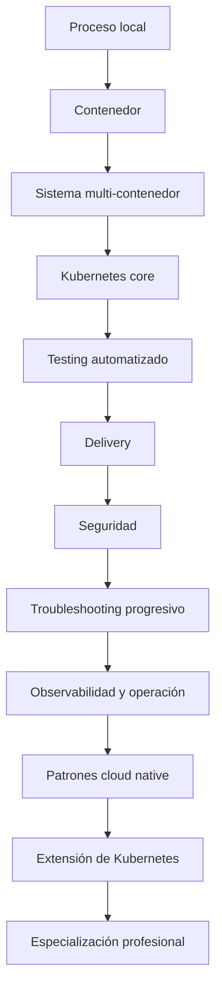

---

# Capas del roadmap

El roadmap completo está dividido en tres capas.

## Capa 1. Base obligatoria

Esta capa construye la comprensión mínima seria.

Incluye:

- Fundamentos técnicos
- DevEx reproducible
- `jq` y `yq`
- Contenedores
- Docker
- Podman
- Compose
- Por qué aparece Kubernetes
- Primer cluster
- `kubectl`
- Modelo mental de Kubernetes
- Pods
- Workloads
- Networking
- Configuración, secretos y almacenamiento
## Capa 2. Profesionalización

Esta capa convierte el conocimiento básico en capacidad profesional.

Incluye:

- Testing automatizado de Kubernetes
- Delivery de aplicaciones
- Seguridad
- Troubleshooting progresivo
- Operación, observabilidad y fiabilidad con Grafana LGTM
- Patrones cloud native
## Capa 3. Especialización

Esta capa permite profundizar según rol.

Incluye:

- Extensión de Kubernetes
- CRDs
- Controllers
- Operators
- Admission webhooks
- Profesionalización por rol
- Proyecto final completo
- Orden recomendado de lectura
- Lecturas por libro


---

# Accesos directos a los documentos del repositorio

Este roadmap ahora incluye accesos directos a todos los documentos `.md` del repo para que puedas saltar entre teoría, práctica y referencias sin buscar archivos manualmente.

## Índice navegable

|Bloque|Documento|
|---|---|
|General|[README](./README.md)|
|General|[Recursos](./Recursos.md)|
|Roadmap principal|[Roadmap completo para aprender Kubernetes de 0 a profesional, con referencias](./Roadmap%20completo%20para%20aprender%20Kubernetes%20de%200%20a%20profesional,%20con%20referencias.md)|
|Base (0)|[0. Fundamentos, DevEx y entorno reproducible](./0.%20Fundamentos,%20DevEx%20y%20entorno%20reproducible.md)|
|Base (1)|[1. Contenedores, Docker, Podman y Compose](./1.%20Contenedores,%20Docker,%20Podman%20y%20Compose.md)|
|Base (2)|[2. Por qué aparece Kubernetes](./2.%20Por%20qu%C3%A9%20aparece%20Kubernetes.md)|
|Base (3)|[3. Primer cluster y kubectl](./3.%20Primer%20cluster%20y%20kubectl.md)|
|Base (4)|[4. Modelo mental de Kubernetes](./4.%20Modelo%20mental%20de%20Kubernetes.md)|
|Base (5)|[5. Pods y objetos básicos](./5.%20Pods%20y%20objetos%20b%C3%A1sicos.md)|
|Base (6)|[6. Workloads](./6.%20Workloads.md)|
|Base (7)|[7. Networking](./7.%20Networking.md)|
|Base (8)|[8. Configuración, secretos y almacenamiento](./8.%20Configuraci%C3%B3n,%20secretos%20y%20almacenamiento.md)|
|Profesionalización (9)|[9. Testing automatizado de Kubernetes](./9.%20Testing%20automatizado%20de%20Kubernetes.md)|
|Profesionalización (10)|[10. Delivery de aplicaciones](./10.%20Delivery%20de%20aplicaciones.md)|
|Profesionalización (11)|[11. Seguridad](./11.%20Seguridad.md)|
|Profesionalización (12)|[12. Operación, observabilidad y fiabilidad con Grafana LGTM](./12.%20Operaci%C3%B3n,%20observabilidad%20y%20fiabilidad%20con%20Grafana%20LGTM.md)|
|Profesionalización (13)|[13. Patrones cloud native](./13.%20Patrones%20cloud%20native.md)|
|Especialización (14)|[14. Extensión de Kubernetes](./14.%20Extensi%C3%B3n%20de%20Kubernetes.md)|
|Especialización (15)|[15. Profesionalización por rol](./15.%20Profesionalizaci%C3%B3n%20por%20rol.md)|
|Especialización (16)|[16. Proyecto final del roadmap](./16.%20Proyecto%20final%20del%20roadmap.md)|

## Nota de cobertura

- La sección **12. Troubleshooting progresivo** está desarrollada dentro de este documento principal y, por ahora, no existe como archivo separado en el repositorio.
- Si luego quieres, se puede extraer esa sección a un archivo independiente para mantener la misma estructura modular del resto del roadmap.

---

# Sistema de ejemplo usado durante el roadmap

Para que las prácticas, diagramas y ejercicios tengan continuidad, todo el roadmap usa el mismo sistema de ejemplo.

## Sistema base

Una aplicación de comercio llamada `shop`.

Componentes:

- `frontend`
- `checkout-api`
- `payment-api`
- `inventory-api`
- `notification-worker`
- `Redis`
- `PostgreSQL`
Namespace principal:

- `shop`
Imagen principal:

- `checkout-api:1.0.0`
Ingress o Gateway:

- `shop-web`
Quality gate principal:

- `task test:k8s`
Entrada de troubleshooting:

- `task debug:*`
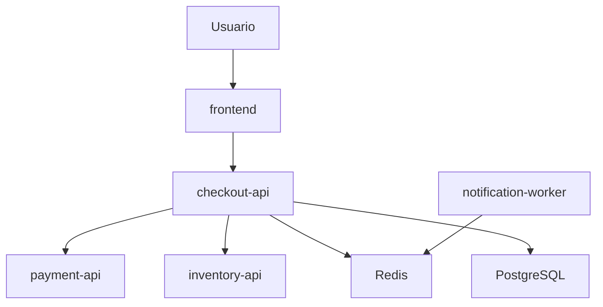

---

# Capa 1. Base obligatoria

---

# 0. Fundamentos, DevEx y entorno reproducible

## Objetivo

Construir la base técnica y preparar un entorno de aprendizaje que puedas ejecutar muchas veces sin fricción.

Este nivel tiene tres responsabilidades:

1. Aprender los fundamentos mínimos: Linux, red, HTTP, DNS, Git, YAML, JSON y procesos
2. Crear una experiencia de desarrollo reproducible con Taskfile
3. Aprender herramientas de inspección como `jq` y `yq`
Kubernetes tiene muchas piezas. Por eso conviene tener un entorno ordenado desde el principio.

---

## 0.1. Fundamentos técnicos

### Qué estudiar

- Procesos
- PID
- Señales como `SIGTERM` y `SIGKILL`
- Usuarios y permisos
- Puertos
- TCP y UDP
- HTTP y HTTPS
- DNS
- TLS básico
- Variables de entorno
- Logs
- Git
- YAML
- JSON
- `curl`
- `grep`
- `ps`
- `top`
- `ss`
- `tail`
- `less`
### Referencias

|Tipo|Recurso|
|---|---|
|HTTP|MDN HTTP Overview|
|DNS|MDN DNS / Domain names|
|Git|Pro Git Book|
|YAML|YAML 1.2.2 Specification|
|Kubernetes|Kubernetes Documentation home|
|Linux|Red Hat, What is Linux?|

---

## 0.2. DevEx mínima del roadmap

### Objetivo

Crear un repositorio de aprendizaje que no sea una carpeta llena de comandos sueltos.

Desde el principio deberías tener una forma común de ejecutar:

- Validaciones
- Build de imágenes
- Ejecución con Docker
- Ejecución con Podman
- Levantar Compose
- Crear cluster local
- Aplicar manifests
- Ver estado
- Ejecutar smoke tests
- Limpiar recursos
- Reproducir escenarios de fallo
Aquí entra Taskfile.

Taskfile no reemplaza Docker, Podman, Compose, Kubernetes ni CI/CD.

Su papel es otro:

> Taskfile es la capa de entrada humana al repo.

El usuario no tiene que recordar veinte comandos distintos. Aprende los conceptos, pero ejecuta las prácticas de forma repetible.

Ejemplo:

```bash
task doctor
task container:build
task compose:up
task k8s:kind:create
task k8s:apply
task k8s:status
task k8s:smoke
task clean
```

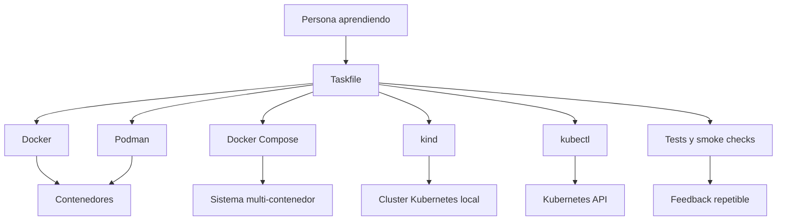

---

## 0.3. jq y yq como herramientas base

### Objetivo

Aprender a inspeccionar y transformar JSON y YAML de forma fiable.

Kubernetes se expresa habitualmente con YAML, pero su API trabaja con objetos. `kubectl` puede devolver información en JSON o YAML, y muchas tareas reales consisten en consultar campos, filtrar listas, validar estructura o comparar recursos.

Aquí entran `jq` y `yq`.

- `jq` sirve para consultar, filtrar y transformar JSON
- `yq` sirve para consultar, filtrar y transformar YAML
- `kubectl get -o json` combinado con `jq` permite inspeccionar el estado real del cluster
- `yq` permite revisar y transformar manifests antes de aplicarlos
- Ambos reducen dependencia de inspección manual y hacen posible crear comprobaciones automatizadas
### Qué estudiar

- JSON básico
- YAML básico
- Selectores de campos
- Filtros
- Arrays
- Objetos
- Pipes
- Transformaciones
- Salida tabular
- Uso con `kubectl`
- Uso con manifests locales
- Uso en scripts de validación
- Uso en Taskfile
- Uso en troubleshooting
### Referencias

|Tipo|Recurso|Uso|
|---|---|---|
|Herramienta|jq|Para consultar y transformar JSON.|
|Herramienta|yq|Para consultar y transformar YAML.|
|Kubernetes|kubectl output formats|Para combinar `kubectl` con JSON, YAML y JSONPath.|

---

## 0.4. jq aplicado a Kubernetes

### Objetivo

Usar `jq` para leer el estado real del cluster sin depender solo de la salida humana de `kubectl`.

### Ejemplos

Listar nombres de Pods en todos los namespaces:

```bash
kubectl get pods -A -o json | jq -r '.items[].metadata.name'
```

Listar namespace y nombre de cada Pod:

```bash
kubectl get pods -A -o json \
  | jq -r '.items[] | [.metadata.namespace, .metadata.name] | @tsv'
```

Listar imágenes usadas por Pods:

```bash
kubectl get pods -A -o json \
  | jq -r '.items[].spec.containers[].image' \
  | sort -u
```

Listar Pods que no están Ready:

```bash
kubectl get pods -A -o json \
  | jq -r '
    .items[]
    | select(
        [.status.containerStatuses[]? | select(.ready == false)] | length > 0
      )
    | [.metadata.namespace, .metadata.name] | @tsv
  '
```

Detectar contenedores sin requests:

```bash
kubectl get pods -A -o json \
  | jq -r '
    .items[]
    | . as $pod
    | .spec.containers[]
    | select(.resources.requests == null)
    | [$pod.metadata.namespace, $pod.metadata.name, .name] | @tsv
  '
```

Extraer eventos relevantes:

```bash
kubectl get events -A -o json \
  | jq -r '
    .items[]
    | [.involvedObject.kind, .involvedObject.name, .reason, .message]
    | @tsv
  '
```

Eventos con señales de fallo:

```bash
kubectl get events -A -o json \
  | jq -r '
    .items[]
    | select(.reason | test("Failed|BackOff|Unhealthy|FailedScheduling"))
    | [.metadata.namespace, .involvedObject.name, .reason, .message]
    | @tsv
  '
```

### Práctica

Usa `jq` para responder:

- ¿Qué imágenes se están ejecutando en el cluster?
- ¿Qué Pods no están Ready?
- ¿Qué Pods no tienen requests?
- ¿Qué Pods han sido reiniciados?
- ¿Qué eventos mencionan `Failed`, `BackOff`, `Unhealthy` o `FailedScheduling`?
- ¿Qué Services no tienen endpoints?
- ¿Qué Deployments no tienen todas sus réplicas disponibles?
### Criterio de salida

Puedes continuar cuando puedas explicar:

> `kubectl get` me da objetos. `jq` me permite hacer preguntas precisas sobre esos objetos.

---

## 0.5. yq aplicado a manifests

### Objetivo

Usar `yq` para leer, validar y transformar manifests antes de aplicarlos.

### Ejemplos

Listar el `kind` de todos los manifests de una carpeta:

```bash
yq '.kind' kubernetes/**/*.yaml
```

Listar nombres de recursos:

```bash
yq '.metadata.name' kubernetes/**/*.yaml
```

Cambiar el namespace de un manifest:

```bash
yq -i '.metadata.namespace = "shop"' kubernetes/02-deployment/deployment.yaml
```

Ver la imagen de un Deployment:

```bash
yq '.spec.template.spec.containers[].image' kubernetes/02-deployment/deployment.yaml
```

Cambiar tag de imagen:

```bash
yq -i '
  .spec.template.spec.containers[] |=
  select(.name == "checkout-api").image = "checkout-api:1.0.0"
' kubernetes/02-deployment/deployment.yaml
```

Comprobar si hay probes:

```bash
yq '.spec.template.spec.containers[] | {name, readinessProbe, livenessProbe}' kubernetes/**/*.yaml
```

Comprobar si hay requests y limits:

```bash
yq '.spec.template.spec.containers[] | {name, resources}' kubernetes/**/*.yaml
```

### Práctica

Usa `yq` para:

- Leer todos los `kind` del repo
- Comprobar que todos los recursos tienen `metadata.name`
- Comprobar que todos los recursos tienen `metadata.labels`
- Cambiar el namespace de todos los manifests de laboratorio
- Cambiar el tag de una imagen
- Detectar Deployments sin `readinessProbe`
- Detectar contenedores sin `resources.requests`
- Comparar un manifest antes y después de una transformación
### Criterio de salida

Puedes continuar cuando puedas explicar:

> YAML no es solo texto. En Kubernetes representa objetos. `yq` me permite inspeccionar y transformar esos objetos antes de enviarlos al API Server.

---

## 0.6. jq, yq y Taskfile juntos

### Objetivo

Incorporar `jq` y `yq` al flujo reproducible del repo.

### Ejemplo de tareas

```yaml
version: '3'

tasks:
  tools:check:
    desc: Check local tools required for this roadmap
    cmds:
      - docker --version
      - podman --version
      - docker compose version
      - kubectl version --client
      - kind version
      - jq --version
      - yq --version

  manifests:list-kinds:
    desc: List Kubernetes resource kinds from manifests
    cmds:
      - yq '.kind' kubernetes/**/*.yaml

  manifests:list-names:
    desc: List Kubernetes resource names from manifests
    cmds:
      - yq '.metadata.name' kubernetes/**/*.yaml

  cluster:list-images:
    desc: List images currently running in the cluster
    cmds:
      - kubectl get pods -A -o json | jq -r '.items[].spec.containers[].image' | sort -u

  cluster:not-ready:
    desc: List pods that are not ready
    cmds:
      - kubectl get pods -A -o json | jq -r '.items[] | select(([.status.containerStatuses[]? | select(.ready == false)] | length) > 0) | [.metadata.namespace, .metadata.name] | @tsv'

  cluster:events:failures:
    desc: Show failure-related Kubernetes events
    cmds:
      - kubectl get events -A -o json | jq -r '.items[] | select(.reason | test("Failed|BackOff|Unhealthy|FailedScheduling")) | [.metadata.namespace, .reason, .message] | @tsv'
```

---

## 0.7. Ejemplo de estructura de repositorio

```text
kubernetes-learning-lab/
  Taskfile.yml
  README.md
  .env.example

  apps/
    frontend/
    checkout-api/
    payment-api/
    inventory-api/
    notification-worker/

  containers/
    docker/
    podman/

  compose/
    compose.yaml

  kubernetes/
    00-namespace/
    01-pod/
    02-deployment/
    03-service/
    04-ingress-or-gateway/
    05-config/
    06-storage/
    07-security/
    08-observability/

  scripts/
    smoke-test.sh
    wait-for-rollout.sh
    validate-tools.sh
    inspect-json.sh
    inspect-yaml.sh

  tests/
    manifests/
    policies/
    cluster/
    smoke/
    failure-lab/

  docs/
    commands.md
    troubleshooting.md
    failure-lab.md
    references.md
    jq-yq.md
```

---

## 0.8. Ejemplo inicial de Taskfile

```yaml
version: '3'

vars:
  APP_NAME: checkout-api
  IMAGE_NAME: checkout-api
  IMAGE_TAG: 1.0.0
  KIND_CLUSTER: shop-learning
  NAMESPACE: shop

tasks:
  default:
    desc: List available tasks
    cmds:
      - task --list

  doctor:
    desc: Check required local tools
    cmds:
      - docker --version
      - podman --version
      - docker compose version
      - kubectl version --client
      - kind version
      - helm version || true
      - jq --version
      - yq --version

  clean:
    desc: Clean generated local resources
    cmds:
      - docker compose -f compose/compose.yaml down -v || true
      - kind delete cluster --name {{.KIND_CLUSTER}} || true

  container:build:docker:
    desc: Build the application image with Docker
    cmds:
      - docker build -t {{.IMAGE_NAME}}:{{.IMAGE_TAG}} ./apps/{{.APP_NAME}}

  container:run:docker:
    desc: Run the application with Docker
    cmds:
      - docker run --rm -p 8080:8080 {{.IMAGE_NAME}}:{{.IMAGE_TAG}}

  container:build:podman:
    desc: Build the application image with Podman
    cmds:
      - podman build -t {{.IMAGE_NAME}}:{{.IMAGE_TAG}} ./apps/{{.APP_NAME}}

  container:run:podman:
    desc: Run the application with Podman
    cmds:
      - podman run --rm -p 8080:8080 {{.IMAGE_NAME}}:{{.IMAGE_TAG}}

  compose:up:
    desc: Start the local multi-container environment
    cmds:
      - docker compose -f compose/compose.yaml up -d --build

  compose:logs:
    desc: Follow local Compose logs
    cmds:
      - docker compose -f compose/compose.yaml logs -f

  compose:down:
    desc: Stop the local Compose environment
    cmds:
      - docker compose -f compose/compose.yaml down

  k8s:kind:create:
    desc: Create a local Kubernetes cluster with kind
    cmds:
      - kind create cluster --name {{.KIND_CLUSTER}}

  k8s:kind:delete:
    desc: Delete the local Kubernetes cluster
    cmds:
      - kind delete cluster --name {{.KIND_CLUSTER}}

  k8s:apply:
    desc: Apply Kubernetes manifests
    cmds:
      - kubectl apply -f kubernetes/00-namespace
      - kubectl apply -f kubernetes/01-pod
      - kubectl apply -f kubernetes/02-deployment
      - kubectl apply -f kubernetes/03-service

  k8s:delete:
    desc: Delete Kubernetes manifests
    cmds:
      - kubectl delete -f kubernetes/03-service --ignore-not-found
      - kubectl delete -f kubernetes/02-deployment --ignore-not-found
      - kubectl delete -f kubernetes/01-pod --ignore-not-found
      - kubectl delete -f kubernetes/00-namespace --ignore-not-found

  k8s:status:
    desc: Show useful Kubernetes status
    cmds:
      - kubectl get nodes
      - kubectl get pods -A
      - kubectl get svc -A
      - kubectl get events -A --sort-by=.metadata.creationTimestamp

  k8s:images:
    desc: Show images running in the cluster
    cmds:
      - kubectl get pods -A -o json | jq -r '.items[].spec.containers[].image' | sort -u

  k8s:not-ready:
    desc: Show pods that are not ready
    cmds:
      - kubectl get pods -A -o json | jq -r '.items[] | select(([.status.containerStatuses[]? | select(.ready == false)] | length) > 0) | [.metadata.namespace, .metadata.name] | @tsv'

  manifests:kinds:
    desc: Show kinds defined in Kubernetes manifests
    cmds:
      - yq '.kind' kubernetes/**/*.yaml

  manifests:names:
    desc: Show resource names defined in Kubernetes manifests
    cmds:
      - yq '.metadata.name' kubernetes/**/*.yaml

  k8s:smoke:
    desc: Run smoke tests against the Kubernetes deployment
    cmds:
      - ./scripts/smoke-test.sh

  k8s:debug:
    desc: Print common debugging information
    cmds:
      - kubectl get pods -A -o wide
      - kubectl get deploy -A
      - kubectl get rs -A
      - kubectl get svc -A
      - kubectl get ingress -A || true
      - kubectl get events -A --sort-by=.metadata.creationTimestamp
      - kubectl get pods -A -o json | jq -r '.items[] | [.metadata.namespace, .metadata.name, .status.phase] | @tsv'
```

Este Taskfile no debe ocultar los comandos. Debe hacerlos visibles, repetibles y fáciles de ejecutar.

---

## 0.9. Práctica

Antes de seguir, deberías poder:

- Levantar `checkout-api` localmente
- Exponerla en un puerto
- Cambiar configuración con variables de entorno
- Leer logs
- Hacer una petición con `curl`
- Parar el proceso de forma limpia
- Explicar qué pasa cuando el proceso muere
- Leer YAML básico
- Leer JSON básico
- Consultar JSON con `jq`
- Consultar YAML con `yq`
- Ejecutar tareas comunes desde Taskfile
---

## 0.10. Criterio de salida

Puedes pasar al nivel 1 cuando puedas:

- Ejecutar `task doctor`
- Levantar `checkout-api` sin contenedor
- Explicar procesos, puertos, logs y variables de entorno
- Leer YAML básico
- Leer JSON básico
- Usar `jq` para inspeccionar salida JSON
- Usar `yq` para inspeccionar manifests YAML
- Ejecutar tareas comunes desde Taskfile
- Explicar que Taskfile automatiza acciones, pero no reemplaza el conocimiento de las herramientas
Puedes continuar cuando entiendes esta frase:

> Una aplicación en producción no es solo código. Es un proceso, con configuración, puertos, permisos, dependencias, límites, logs, estado y comportamiento ante fallos.

---

# 1. Contenedores, Docker, Podman y Compose

## 1.1. Contenedores como concepto

### Objetivo

Entender contenedores sin confundirlos con Docker.

Un contenedor es una forma de ejecutar un proceso aislado, empaquetado y reproducible.

Docker y Podman son herramientas para construir y ejecutar contenedores. Kubernetes no es Docker distribuido. Kubernetes orquesta workloads que normalmente se ejecutan como contenedores, usando runtimes compatibles con el ecosistema OCI.

La idea importante es esta:

> Una imagen es el paquete. Un contenedor es un proceso ejecutándose a partir de ese paquete.

Cuando ejecutas una aplicación sin contenedor, dependes mucho del entorno local: versión del lenguaje, librerías instaladas, variables, sistema operativo, permisos y configuración.

Cuando construyes una imagen, intentas capturar todo lo necesario para ejecutar esa aplicación de forma más repetible.

Cuando ejecutas un contenedor, arrancas un proceso aislado con su filesystem, variables, red, usuario, límites y configuración.

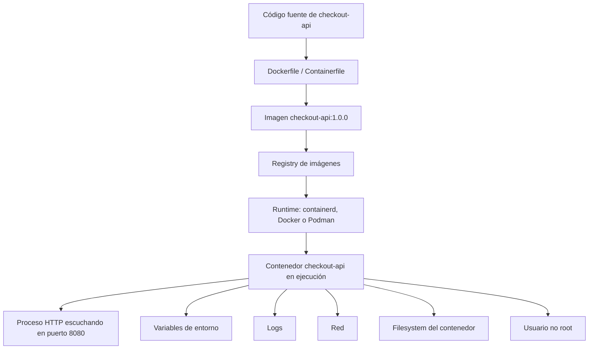

### Qué estudiar

- Contenedor
- Imagen
- Imagen vs contenedor
- Registry
- Dockerfile
- Containerfile
- Volúmenes
- Redes
- Docker
- Podman
- Docker Compose
- Limitaciones de Compose
- OCI
- Runtimes
- Namespaces
- Cgroups
- Filesystem del contenedor
- Procesos
- Puertos
- Variables de entorno
- Tags y digests
- Imágenes OCI
- Seguridad básica de imágenes
### Documentación y enlaces

|Tipo|Recurso|Uso|
|---|---|---|
|Estándar|Open Container Initiative|Para entender que existen especificaciones abiertas alrededor de imágenes y runtimes de contenedores.|
|Kubernetes|Container runtimes|Para entender cómo Kubernetes se relaciona con containerd, CRI-O y CRI.|
|Docker|What is Docker?|Para entender la plataforma Docker, imágenes, contenedores, daemon, cliente y registries.|
|Docker|Dockerfile overview|Para aprender a construir imágenes correctamente.|
|Podman|Podman documentation|Para entender Podman como herramienta daemonless para trabajar con contenedores e imágenes OCI.|
|Podman|podman pod|Para practicar pods locales antes de entrar en Pods de Kubernetes.|
|Compose|Docker Compose docs|Para definir y ejecutar aplicaciones multi-contenedor.|

### Lecturas de libros

|Libro|Qué leer|
|---|---|
|_Érase una vez Docker_|Introducción a contenedores, instalación de Docker, primeros pasos, gestión de imágenes, contenedores, redes, publicación de puertos y Compose.|
|_Kubernetes: Up and Running_|Capítulo 2: imágenes, Dockerfiles, seguridad de imagen, multistage builds, registry y runtime.|
|_Kubernetes in Action_|Capítulos 1 y 2: contenedores, Docker, creación de imagen, ejecución, registry y primeros pasos hacia Kubernetes.|
|_Cloud Native DevOps with Kubernetes_|Capítulos 1 y 2: cloud, DevOps, contenedores, Dockerfile, imágenes mínimas, registries y primer despliegue.|

### Nota de actualidad

Los conceptos siguen siendo útiles, pero el aprendizaje no debe quedarse en Docker. Conviene entender OCI, containerd, CRI-O, Podman y Docker Compose para no confundir una herramienta concreta con el modelo de contenedores.

### Práctica

Construye `checkout-api` y haz esto:

1. Ejecutarla sin contenedor
2. Crear imagen con Docker
3. Ejecutarla con Docker
4. Ejecutarla con Podman
5. Subirla a un registry
6. Ejecutarla desde el registry
7. Cambiar tag por digest
8. Reducir tamaño de imagen
9. Ejecutarla como usuario no root
10. Analizar qué datos se pierden al borrar el contenedor
### Criterio de salida

Debes poder explicar:

> Una imagen es el paquete. Un contenedor es un proceso ejecutándose a partir de esa imagen. Docker y Podman son herramientas. El estándar y el modelo de ejecución son más importantes que una herramienta concreta.

---

## 1.2. Docker

### Objetivo

Aprender Docker como herramienta práctica para construir, ejecutar y distribuir contenedores.

### Qué estudiar

- `docker run`
- `docker ps`
- `docker logs`
- `docker exec`
- `docker build`
- `docker pull`
- `docker push`
- `docker inspect`
- Dockerfile
- Multi-stage builds
- Docker networks
- Docker volumes
- Docker registries
### Documentación y enlaces

|Tipo|Recurso|Uso|
|---|---|---|
|Oficial|Docker overview|Base conceptual de Docker, daemon, cliente, imágenes, contenedores y registries.|
|Oficial|Dockerfile overview|Para construir imágenes de forma limpia.|
|Oficial|Docker Compose|Para pasar de un contenedor a una app multi-contenedor.|

### Práctica

Haz una app con:

- `checkout-api`
- `PostgreSQL`
- `Redis`
- Volumen para `PostgreSQL`
- Red interna
- Variables de entorno
- Logs
- Reinicio de contenedores
- Borrado de contenedores sin borrar datos
- Borrado de volumen para observar pérdida de estado
### Criterio de salida

Debes poder explicar:

- Qué hace Docker
- Qué es específico de Docker
- Qué es común a los contenedores
- Qué resuelve Docker en desarrollo local
- Qué no resuelve Docker en operación distribuida
---

## 1.3. Podman

### Objetivo

Aprender Podman como alternativa y complemento a Docker.

Podman es especialmente útil para entender contenedores rootless, flujos daemonless y pods locales.

### Qué estudiar

- CLI de Podman
- Rootless containers
- Imágenes OCI
- Pods en Podman
- Diferencia entre daemon y daemonless
- Compatibilidad conceptual con Docker
- Uso local de pods
### Documentación y enlaces

|Tipo|Recurso|Uso|
|---|---|---|
|Oficial|Podman docs|Base para instalar, ejecutar y construir contenedores con Podman.|
|Oficial|podman pod|Para entender cómo Podman agrupa contenedores en pods.|
|Kubernetes|Pods|Para comparar el concepto de pod local con el Pod como unidad de ejecución en Kubernetes.|

### Práctica

Repite los ejercicios de Docker con Podman:

- `podman run`
- `podman ps`
- `podman logs`
- `podman exec`
- `podman build`
- `podman pull`
- `podman push`
- `podman pod create`
- `podman pod ps`
Luego crea un pod local con:

- `checkout-api`
- Un contenedor auxiliar de logs o debug
- Puerto compartido
- Logs separados
- Parada y arranque del pod completo
### Criterio de salida

Debes poder explicar:

> Podman ayuda a entender que Docker no es el concepto. El concepto son contenedores, imágenes, runtimes, procesos aislados y, en algunos casos, pods.

---

## 1.4. Docker Compose como puente hacia Kubernetes

### Objetivo

Aprender a ejecutar sistemas multi-contenedor antes de entrar en orquestación real.

Compose es una herramienta excelente para desarrollo local, pero no es un orquestador completo. Compose te enseña dependencias, redes, volúmenes, servicios y configuración.

Kubernetes aparece cuando necesitas scheduling, reconciliación, rollouts, seguridad, observabilidad, escalado y operación multi-nodo.

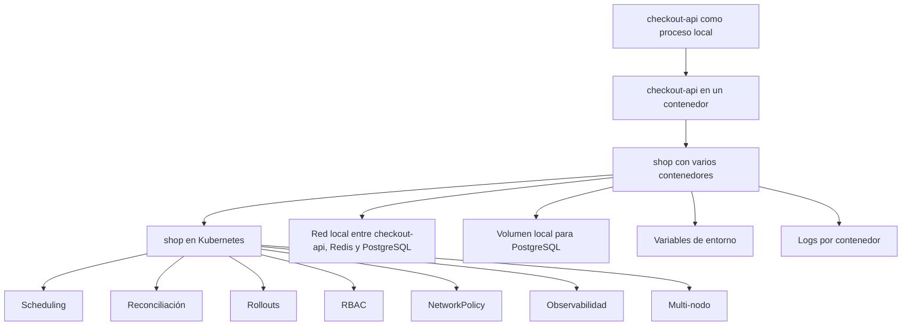

### Documentación y enlaces

|Tipo|Recurso|Uso|
|---|---|---|
|Oficial|Docker Compose docs|Para definir y ejecutar aplicaciones multi-contenedor.|
|Kubernetes|Overview|Para entender el salto desde ejecución local a plataforma declarativa de workloads.|
|Kubernetes|Workloads|Para ver cómo Kubernetes modela Pods, Deployments, Jobs, CronJobs, StatefulSets y DaemonSets.|

### Práctica

Crea un `compose.yaml` con:

- `frontend`
- `checkout-api`
- `payment-api`
- `inventory-api`
- `notification-worker`
- `PostgreSQL`
- `Redis`
- Volumen
- Red interna
- Variables
- Healthchecks
- Comando de migración
Después documenta los límites:

- Escalado
- Scheduling
- Rollouts
- Rollbacks
- Secretos
- Seguridad
- Observabilidad
- Multi-nodo
- Multi-equipo
- Auto-recuperación
### Criterio de salida

Debes poder explicar:

> Compose es ideal para desarrollo local y sistemas simples. Kubernetes empieza a tener sentido cuando necesitas operar workloads distribuidos de forma declarativa, segura, observable y recuperable.

---

# 2. Por qué aparece Kubernetes

## Objetivo

Entender Kubernetes como respuesta a problemas de operación, no como moda.

Ejecutar un contenedor no suele ser el gran problema.

El problema aparece cuando tienes muchos servicios, muchos despliegues, muchos nodos, muchos equipos y muchos fallos parciales ocurriendo al mismo tiempo.

Imagina este sistema:

- `frontend`
- `checkout-api`
- `payment-api`
- `inventory-api`
- `notification-worker`
- `Redis`
- `PostgreSQL`
En local puedes levantar algo parecido con Compose.

Pero en producción empiezan las preguntas difíciles:

- ¿Dónde se ejecuta cada servicio?
- ¿Qué pasa si muere `checkout-api`?
- ¿Qué pasa si un nodo se queda sin memoria?
- ¿Cómo descubren los servicios dónde está `payment-api`?
- ¿Cómo haces un rollout sin cortar tráfico?
- ¿Cómo vuelves atrás si la nueva versión falla?
- ¿Cómo separas configuración, secretos y binario?
- ¿Cómo reduces permisos?
- ¿Cómo observas qué está fallando?
- ¿Cómo evitas que un servicio hable con otro que no debería?
- ¿Cómo mantienes el estado deseado sin estar arreglando cosas a mano?
Kubernetes aparece para modelar y operar ese tipo de problemas.

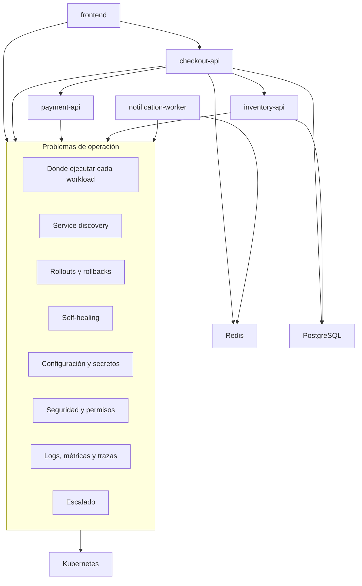

## Qué estudiar

- Orquestación
- Estado deseado
- Estado actual
- Reconciliación
- Scheduling
- Self-healing
- Service discovery
- Configuración declarativa
- Rollouts y rollbacks
- Escalado
- Seguridad
- Observabilidad
## Documentación y enlaces

|Tipo|Recurso|Uso|
|---|---|---|
|Oficial|Kubernetes Overview|Para entender qué es Kubernetes y qué problema resuelve.|
|Oficial|Kubernetes Components|Para empezar a ver API Server, etcd, scheduler, kubelet y controllers.|
|Oficial|Kubernetes Objects|Para entender que Kubernetes trabaja con objetos declarativos.|

## Lecturas de libros

|Libro|Qué leer|
|---|---|
|_Kubernetes in Action_|Capítulo 1: necesidad de Kubernetes, contenedores, arquitectura y beneficios.|
|_Kubernetes: Up and Running_|Capítulo 1: velocidad, inmutabilidad, configuración declarativa, self-healing, escalado y eficiencia.|
|_Cloud Native DevOps with Kubernetes_|Capítulo 1: cloud, DevOps, contenedores, Kubernetes, cloud native y operaciones.|

## Criterio de salida

Debes poder explicar:

> Kubernetes no existe porque ejecutar un contenedor sea difícil. Existe porque operar muchos contenedores, en muchos nodos, con cambios constantes, seguridad, red, fallos y equipos distintos sí es difícil.

---

# 3. Primer cluster y kubectl

## Objetivo

Tener un entorno de práctica y aprender a hablar con la API de Kubernetes.

## Qué estudiar

- `kubectl`
- `kubeconfig`
- Contexts
- Namespaces
- Clusters locales
- Clusters gestionados
- Manifiestos
- `kubectl apply`
- `kubectl get`
- `kubectl describe`
- `kubectl logs`
- `kubectl exec`
- `kubectl port-forward`
- Salida JSON con `kubectl get -o json`
- Salida YAML con `kubectl get -o yaml`
- Uso de `jq` con `kubectl`
- Uso de `yq` con manifests
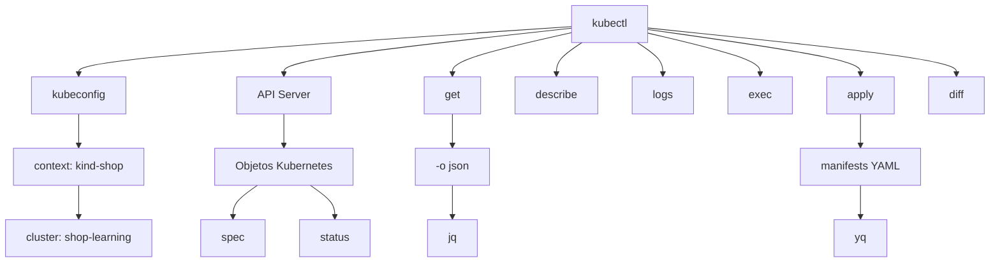

## Documentación y enlaces

|Tipo|Recurso|Uso|
|---|---|---|
|Oficial|Install tools|Para instalar `kubectl` y herramientas básicas.|
|Oficial|kubectl command-line tool|Para entender `kubectl` como cliente de la API.|
|Local|kind|Para crear clusters locales reproducibles.|
|Local|minikube|Para practicar con un cluster local guiado.|
|Kubernetes|Container runtimes|Para entender el runtime usado por los nodos.|
|Herramienta|jq|Para analizar salida JSON de `kubectl`.|
|Herramienta|yq|Para analizar manifests YAML.|

## Lecturas de libros

|Libro|Qué leer|
|---|---|
|_Kubernetes: Up and Running_|Capítulo 3: cluster, minikube, cloud providers, cliente Kubernetes y componentes.|
|_Kubernetes: Up and Running_|Capítulo 4: `kubectl`, namespaces, contexts, objetos, labels, annotations y debugging.|
|_Cloud Native DevOps with Kubernetes_|Capítulo 3: arquitectura, managed Kubernetes, self-hosting y costes.|
|_Cloud Native DevOps with Kubernetes_|Capítulo 7: `kubectl`, logs, exec, port-forward, contexts, namespaces y herramientas útiles.|
|_Kubernetes in Action_|Capítulo 2: cluster local, Minikube, GKE, aliases y primer despliegue.|

## Práctica

Crea un repo:

```text
kubernetes-learning-lab/
  apps/
    frontend/
    checkout-api/
    payment-api/
    inventory-api/
    notification-worker/
  containers/
    docker/
    podman/
    compose/
  manifests/
    01-pod/
    02-deployment/
    03-service/
  notes/
    commands.md
    troubleshooting.md
```

Debes poder:

- Crear un cluster local
- Ver nodos
- Desplegar `checkout-api` como Pod
- Leer logs
- Entrar en el contenedor
- Hacer port-forward
- Borrar recursos
- Reconstruir todo desde manifiestos
- Obtener Pods en JSON
- Filtrar Pods con `jq`
- Inspeccionar manifests con `yq`
## Criterio de salida

Debes poder explicar:

> Kubernetes se controla a través de una API. `kubectl` no es Kubernetes. Es un cliente de esa API.

---

# 4. Modelo mental de Kubernetes

## Objetivo

Pasar de usar comandos a entender el sistema.

## Qué estudiar

- API Server
- etcd
- Scheduler
- Controller Manager
- Cloud Controller Manager
- Kubelet
- Kube-proxy
- Container runtime
- CNI
- CoreDNS
- Desired state
- Actual state
- `spec`
- `status`
- Events
- Controllers
- Reconciliation loops
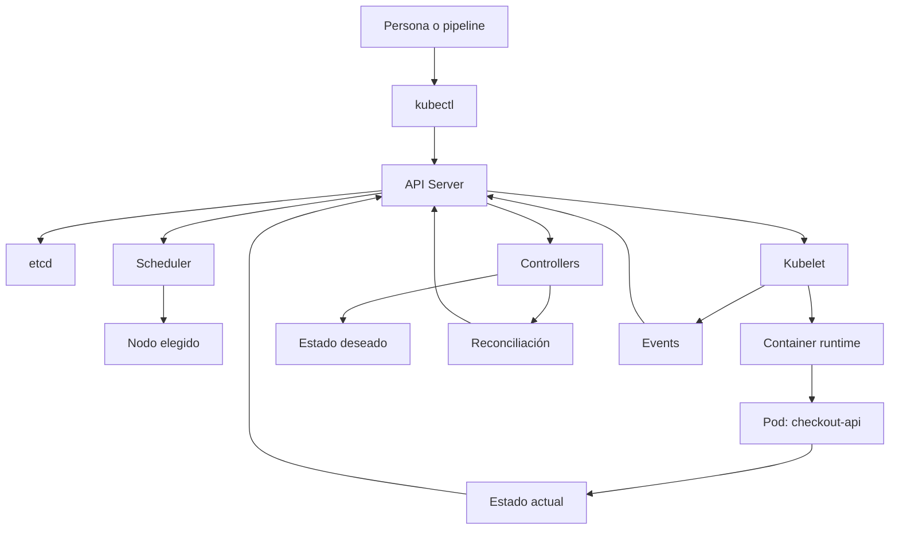

## Qué significa el modelo

Kubernetes no funciona como una shell remota.

Kubernetes guarda objetos. Esos objetos tienen una intención en `spec` y una observación en `status`.

Los controllers miran continuamente la diferencia entre lo que debería existir y lo que existe. Cuando hay diferencia, intentan reconciliar.

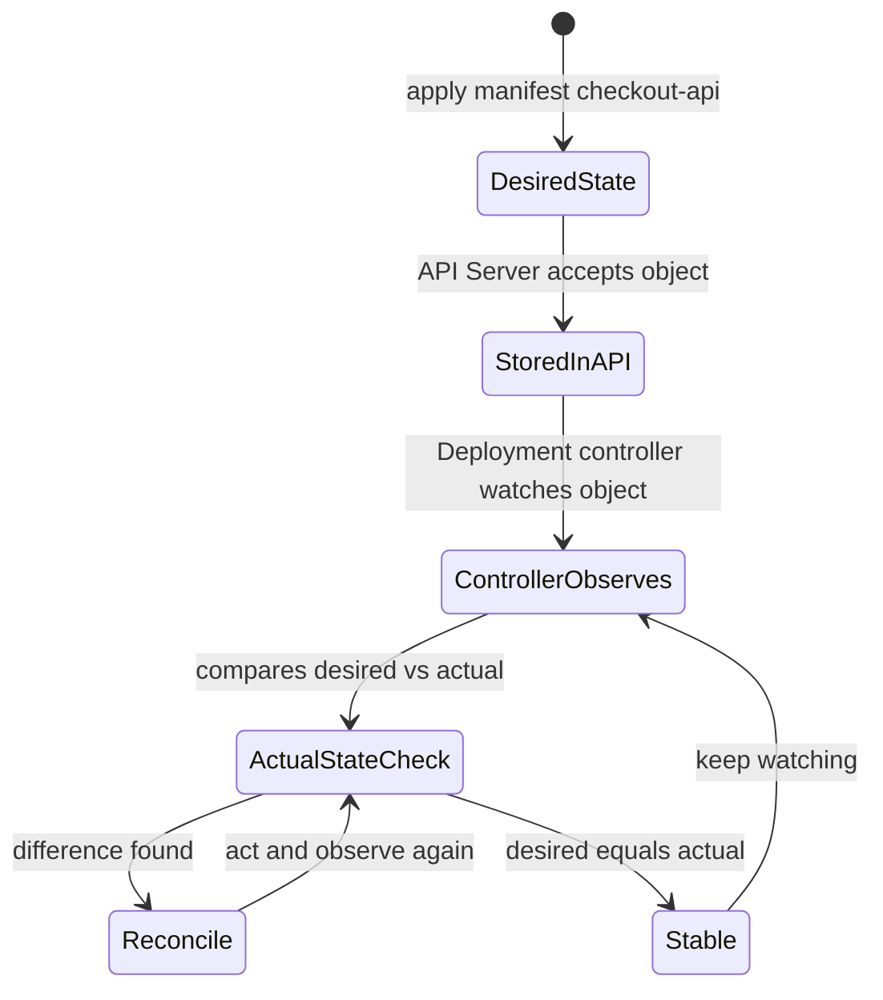

## Documentación y enlaces

|Tipo|Recurso|Uso|
|---|---|---|
|Oficial|Cluster Architecture|Para entender control plane, nodos y componentes.|
|Oficial|Kubernetes Components|Para estudiar API Server, etcd, scheduler, controller manager, kubelet y kube-proxy.|
|Oficial|Controllers|Para entender el patrón de control y reconciliación.|
|Oficial|Kubernetes API|Para entender Kubernetes como API declarativa.|

## Lecturas de libros

|Libro|Qué leer|
|---|---|
|_Kubernetes in Action_|Capítulo 11: internals, etcd, API Server, scheduler, controllers, kubelet, kube-proxy, add-ons, eventos, CNI, Services y alta disponibilidad.|
|_Cloud Native DevOps with Kubernetes_|Capítulos 3 y 4: arquitectura, control plane, node components, objetos, Deployments, Pods, ReplicaSets, scheduler, manifests, Services y Helm básico.|
|_Kubernetes: Up and Running_|Capítulos 3, 4, 5, 9 y 10: cluster, `kubectl`, Pods, ReplicaSets, reconciliation loops y Deployments.|

## Práctica

Crea un Deployment con tres réplicas de `checkout-api`.

Luego:

- Borra un Pod manualmente
- Observa cómo vuelve
- Cambia la imagen
- Observa el rollout
- Usa una imagen inexistente
- Observa el fallo
- Haz rollback
- Revisa eventos
- Usa `kubectl describe`
- Extrae el estado con `kubectl get deploy -o json | jq`
- Compara el manifest local con el recurso aplicado
## Criterio de salida

Debes poder explicar:

- Qué hace el API Server
- Qué guarda etcd
- Qué decide el scheduler
- Qué hace kubelet
- Qué hace un controller
- Por qué Kubernetes puede autocorregir ciertos fallos
- Por qué Kubernetes también puede repetir errores declarados por ti
---

# 5. Pods y objetos básicos

## Objetivo

Entender la unidad mínima de ejecución en Kubernetes.

## Qué estudiar

- Pods
- Pod lifecycle
- Init containers
- Sidecar containers
- Ephemeral containers
- Labels
- Selectors
- Namespaces
- Annotations
- Probes
- Resource requests
- Resource limits
- SecurityContext
- Downward API
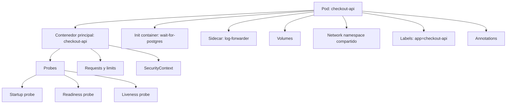

## Documentación y enlaces

|Tipo|Recurso|Uso|
|---|---|---|
|Oficial|Workloads|Entrada a Pods, workload APIs y gestión de workloads.|
|Oficial|Pods|Para entender el Pod como unidad de ejecución.|
|Oficial|Pod Lifecycle|Para entender fases, condiciones y reinicios.|
|Oficial|Init Containers|Para preparar un Pod antes de arrancar la app principal.|
|Oficial|Sidecar Containers|Para composición dentro de un Pod.|
|Oficial|Labels and Selectors|Para identidad operativa y selección de objetos.|
|Oficial|Namespaces|Para agrupar recursos.|
|Oficial|Annotations|Para metadatos no selectivos.|
|Oficial|Liveness, Readiness and Startup Probes|Para salud, readiness y arranque.|
|Oficial|Resource Management for Pods and Containers|Para requests, limits y recursos.|

## Lecturas de libros

|Libro|Qué leer|
|---|---|
|_Kubernetes in Action_|Capítulos 3 y 4: Pods, labels, selectors, namespaces, liveness probes, ReplicationControllers, ReplicaSets, DaemonSets, Jobs y CronJobs.|
|_Kubernetes: Up and Running_|Capítulos 5 y 6: Pods, health checks, resource management, volumes, labels y annotations.|
|_Kubernetes Patterns_|Capítulos 4, 5 y 6: Health Probe, Managed Lifecycle y Automated Placement.|
|_Cloud Native DevOps with Kubernetes_|Capítulos 5 y 8: resources, probes, lifecycle, containers, image tags, digests, ports, env vars, security context y volumes.|

## Nota de actualidad

Para sidecars, usa documentación oficial actual. En Kubernetes moderno, los sidecar containers pueden modelarse como una clase especial de init containers con `restartPolicy: Always`.

## Práctica

Crea un Pod `checkout-api` con:

- App principal
- Init container `wait-for-postgres`
- Readiness probe
- Liveness probe
- Startup probe
- Requests y limits
- SecurityContext restrictivo
- Configuración por variable de entorno
- `emptyDir`
Después rómpelo con:

- Imagen incorrecta
- Puerto incorrecto
- Probe incorrecta
- Memoria insuficiente
- Configuración ausente
- Usuario sin permisos
## Criterio de salida

Debes poder diagnosticar:

- `ImagePullBackOff`
- `CrashLoopBackOff`
- `CreateContainerConfigError`
- `OOMKilled`
- Pod `Pending`
- Readiness fallando
- Liveness reiniciando el contenedor
- Problemas de permisos
---

# 6. Workloads

## Objetivo

Elegir el tipo correcto de controlador según el trabajo que quieres ejecutar.

## Qué estudiar

- ReplicaSet
- Deployment
- DaemonSet
- Job
- CronJob
- StatefulSet
- HPA
- VPA
- PodDisruptionBudget
- Rollouts
- Rollbacks
- Scheduling básico
- Requests
- Limits
- QoS
- LimitRange
- ResourceQuota
- Taints
- Tolerations
- Node affinity
- Pod affinity
- Pod anti-affinity
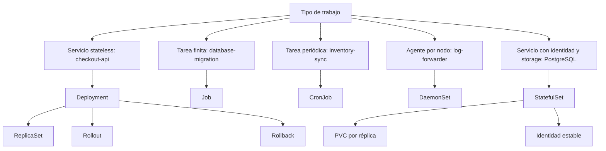

## Documentación y enlaces

|Tipo|Recurso|Uso|
|---|---|---|
|Oficial|Workloads|Vista general de Pods, Deployments, ReplicaSets, StatefulSets, DaemonSets, Jobs y CronJobs.|
|Oficial|Deployments|Para aplicaciones stateless y rollouts declarativos.|
|Oficial|ReplicaSet|Para entender cómo se mantienen réplicas.|
|Oficial|StatefulSets|Para identidad estable, storage estable y workloads stateful.|
|Oficial|DaemonSet|Para agentes por nodo.|
|Oficial|Jobs|Para tareas finitas.|
|Oficial|CronJob|Para tareas periódicas.|
|Oficial|Autoscaling Workloads|Para HPA, VPA y escalado de workloads.|
|Oficial|Scheduling, Preemption and Eviction|Para placement, taints, tolerations, affinity y evictions.|

## Lecturas de libros

|Libro|Qué leer|
|---|---|
|_Kubernetes in Action_|Capítulos 4, 9 y 10: controllers, Deployments, rollbacks, StatefulSets, identidad estable, storage estable y node failures.|
|_Kubernetes in Action_|Capítulo 14: requests, limits, QoS, LimitRange, ResourceQuota y monitorización de recursos.|
|_Kubernetes in Action_|Capítulo 15: HPA, VPA y Cluster Autoscaler.|
|_Kubernetes in Action_|Capítulo 16: taints, tolerations, node affinity, pod affinity y anti-affinity.|
|_Kubernetes: Up and Running_|Capítulos 9 a 12: ReplicaSets, Deployments, DaemonSets, Jobs y CronJobs.|
|_Kubernetes Patterns_|Batch Job, Periodic Job, Daemon Service, Singleton Service y Stateful Service.|
|_Kubernetes Patterns_|Capítulo 24: Elastic Scale, incluyendo HPA, VPA y cluster autoscaling.|

## Práctica

Construye:

- `checkout-api` como Deployment
- `database-migration` como Job
- `inventory-sync` como CronJob
- `log-forwarder` como DaemonSet
- `PostgreSQL` de laboratorio con StatefulSet
- Service para cada pieza
- HPA para `checkout-api`
- Requests y limits en todos los workloads
- PDB para `checkout-api` y `PostgreSQL`
- Afinidad o anti-affinity en al menos un caso controlado
## Criterio de salida

Debes poder responder:

- ¿Por qué `checkout-api` es un Deployment y no un Job?
- ¿Por qué `database-migration` es un Job y no un Deployment?
- ¿Por qué `log-forwarder` es un DaemonSet y no un Deployment?
- ¿Por qué `PostgreSQL` requiere StatefulSet?
- ¿Qué pasa si borro un Pod de `checkout-api`?
- ¿Qué pasa si borro un PVC de `PostgreSQL`?
- ¿Qué ocurre durante un rollout fallido?
- ¿Cómo vuelvo a una versión anterior?
- ¿Cómo afectan requests y limits al scheduling?
- ¿Cuándo usarías HPA, VPA o Cluster Autoscaler?
- ¿Qué problema resuelven taints, tolerations, affinity y anti-affinity?
---

# 7. Networking

## Objetivo

Entender cómo se comunican los workloads dentro y fuera del cluster.

Kubernetes networking no va solo de abrir puertos.

Va de dar identidad estable a workloads efímeros.

Un Pod puede morir y volver con otra IP. Un Deployment puede crear nuevas réplicas durante un rollout. Un Service mantiene un punto estable de acceso para que otros workloads no dependan de Pods concretos.

Ejemplo:

- `frontend` recibe tráfico externo
- `frontend` llama a `checkout-api`
- `checkout-api` llama a `payment-api`
- `checkout-api` consulta `inventory-api`
- `checkout-api` usa `Redis` para estado temporal
- `checkout-api` usa `PostgreSQL` para persistencia
- `notification-worker` consume trabajos desde `Redis`
- `PostgreSQL` no debe aceptar tráfico externo
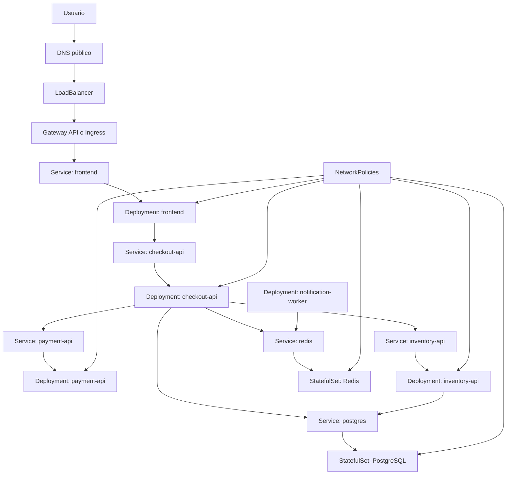

## Qué estudiar

- Pod IP
- Service
- ClusterIP
- NodePort
- LoadBalancer
- Headless Service
- EndpointSlices
- DNS interno
- Ingress
- Ingress Controller
- Gateway API
- NetworkPolicy
- CNI
- TLS
## Documentación y enlaces

|Tipo|Recurso|Uso|
|---|---|---|
|Oficial|Services, Load Balancing, and Networking|Entrada principal a networking en Kubernetes.|
|Oficial|Service|Para identidad estable sobre Pods efímeros.|
|Oficial|Ingress|Para entrada HTTP/HTTPS al cluster.|
|Oficial|Ingress Controllers|Para entender que un Ingress necesita un controller.|
|Oficial|Gateway API|Para el modelo moderno de entrada y routing con separación de responsabilidades.|
|Oficial|EndpointSlices|Para entender endpoints escalables detrás de Services.|
|Oficial|Network Policies|Para controlar tráfico entre Pods.|
|Oficial|DNS for Services and Pods|Para resolución interna de nombres.|
|CNI|Cilium docs|Para profundizar en networking, NetworkPolicy, eBPF y operación avanzada.|
|TLS|cert-manager docs|Para automatizar certificados TLS en Kubernetes.|

## Lecturas de libros

|Libro|Qué leer|
|---|---|
|_Kubernetes in Action_|Capítulo 5: Services, endpoints, NodePort, LoadBalancer, Ingress, TLS, readiness, headless services, DNS y troubleshooting de Services.|
|_Kubernetes: Up and Running_|Capítulos 7 y 8: Service Discovery e Ingress.|
|_Kubernetes Patterns_|Capítulo 12: Service Discovery.|

## Nota de actualidad

Services, DNS e Ingress son conceptos fundamentales. Gateway API, Cilium y cert-manager deben estudiarse desde documentación actual porque evolucionan más rápido que los libros.

## Práctica

Construye:

- `frontend`
- `checkout-api`
- `payment-api`
- `inventory-api`
- `notification-worker`
- `Redis`
- `PostgreSQL`
- Ingress o Gateway API
- TLS
- NetworkPolicies
Valida:

- `frontend` solo habla con `checkout-api`
- `checkout-api` habla con `payment-api`, `inventory-api`, `Redis` y `PostgreSQL`
- `notification-worker` habla con `Redis`
- `payment-api` no habla directamente con `PostgreSQL` si no lo necesita
- `PostgreSQL` no acepta tráfico externo
- `Redis` no acepta tráfico desde `frontend`
- Nada habla con servicios no permitidos
## Criterio de salida

Debes poder explicar:

- Cómo llega una petición externa hasta `frontend`
- Cómo `frontend` descubre `checkout-api`
- Cómo `checkout-api` descubre `payment-api`
- Por qué un Service no debería depender de una IP concreta de Pod
- Diferencia entre Service, Ingress y Gateway API
- Por qué un Ingress necesita controller
- Qué resuelve DNS dentro del cluster
- Qué hace una NetworkPolicy
- Por qué una NetworkPolicy depende del CNI
---

# 8. Configuración, secretos y almacenamiento

## Objetivo

Separar binario, configuración, secretos y datos persistentes.

## Qué estudiar

- ConfigMaps
- Secrets
- External Secrets
- Sops
- KMS
- Volumes
- PersistentVolumes
- PersistentVolumeClaims
- StorageClasses
- Dynamic provisioning
- CSI
- Snapshots
- Backup
- Restore
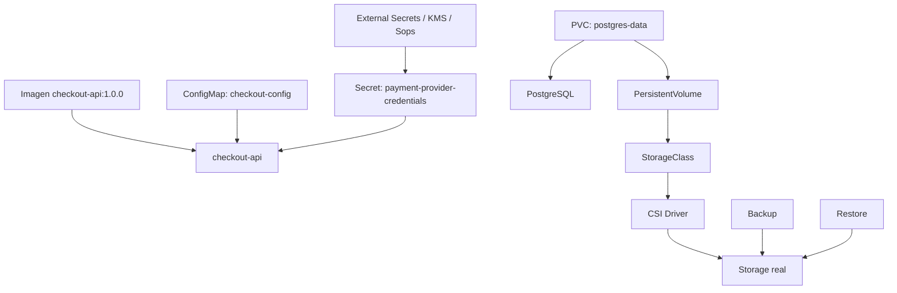

## Documentación y enlaces

|Tipo|Recurso|Uso|
|---|---|---|
|Oficial|Configuration|Entrada a ConfigMaps, Secrets, probes, resources y kubeconfig.|
|Oficial|ConfigMaps|Para configuración no sensible.|
|Oficial|Secrets|Para datos sensibles, entendiendo sus límites.|
|Oficial|Good practices for Kubernetes Secrets|Para gestionar Secrets con más criterio.|
|Oficial|Storage|Entrada a volumes, PV, PVC, StorageClass, dynamic provisioning y snapshots.|
|Oficial|Volumes|Para entender tipos de volumen.|
|Oficial|Persistent Volumes|Para persistencia desacoplada del Pod.|
|Oficial|Storage Classes|Para provisioning dinámico.|
|Oficial|Volume Snapshots|Para snapshots, cuando el driver lo soporte.|
|Herramienta|External Secrets Operator|Para integrar Secrets externos en Kubernetes.|
|Herramienta|Velero|Para backups y restore de recursos y volúmenes.|

## Lecturas de libros

|Libro|Qué leer|
|---|---|
|_Kubernetes in Action_|Capítulos 6 y 7: volumes, PV, PVC, StorageClass, ConfigMaps y Secrets.|
|_Kubernetes: Up and Running_|Capítulos 13 y 15: ConfigMaps, Secrets, external services, reliable singletons, dynamic provisioning, StatefulSets y Persistent Volumes.|
|_Cloud Native DevOps with Kubernetes_|Capítulo 10: ConfigMaps, Secrets, encryption at rest, estrategias de gestión de secretos, Sops y KMS.|
|_Cloud Native DevOps with Kubernetes_|Capítulo 11: RBAC, security scanning, backups, etcd, resource state, cluster state y Velero.|

## Práctica

Crea:

- `checkout-api` configurada por ConfigMap
- Secret para credenciales de `payment-api`
- `PostgreSQL` de laboratorio con PVC
- Backup manual
- Restore en otro namespace
- Rotación de Secret
- Cambio de ConfigMap con redeploy controlado
## Criterio de salida

Debes poder explicar:

- Diferencia entre ConfigMap y Secret
- Por qué base64 no es cifrado
- Qué ocurre si un PVC se queda huérfano
- Qué pasa con el storage al borrar un StatefulSet
- Cómo restaurar estado en otro namespace o cluster
- Qué configuración debe versionarse y cuál no
---

# Capa 2. Profesionalización

---

# 9. Testing automatizado de Kubernetes

## Objetivo

Aprender a comprobar de forma automatizada que los manifests, políticas, despliegues y comportamientos básicos de una aplicación en Kubernetes funcionan antes de integrarlos en una pipeline de delivery.

Esta sección no va de TDD.

Va de construir una estrategia de feedback fiable para Kubernetes.

La idea clave es:

> No basta con que un YAML sea válido. Tiene que renderizarse bien, cumplir schemas, respetar políticas, ser aceptado por el API Server, desplegarse en un cluster real y demostrar que la aplicación responde.

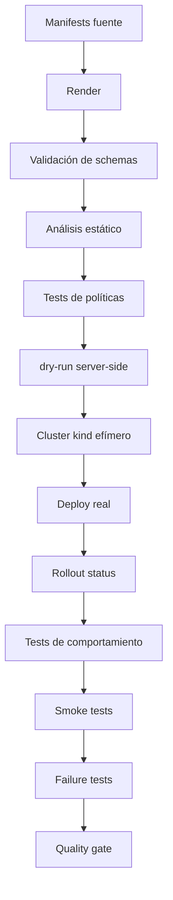

---

## 9.1. Qué estudiar

### Validación de manifests

- Render de manifests
- Validación de schemas
- Validación contra distintas versiones de Kubernetes
- Diferencia entre validación local y validación del API Server
- `kubectl apply --dry-run=server`
- `kubectl diff`
- Uso de `yq` para inspección previa
- Uso de `jq` para inspección del estado aplicado
### Análisis estático

- Falta de probes
- Falta de resource requests
- Falta de limits, cuando aplique
- Uso de imágenes con `latest`
- SecurityContext débil
- Services sin selectors correctos
- Configuración frágil
- Riesgos comunes en manifests
### Tests de políticas

- Políticas que aceptan recursos válidos
- Políticas que rechazan recursos peligrosos
- Reglas de seguridad
- Reglas de naming
- Reglas de recursos mínimos
- Reglas sobre imágenes
- Reglas sobre namespaces
- Reglas sobre NetworkPolicies
### Tests en cluster local

- kind como cluster efímero
- Aplicar manifests en un cluster real
- Esperar rollouts
- Comprobar Pods Ready
- Comprobar Services
- Comprobar endpoints
- Comprobar Jobs completados
- Comprobar CronJobs
- Comprobar PVCs
- Comprobar NetworkPolicies
### Smoke tests

- Health endpoint
- Readiness endpoint
- Endpoint principal de `checkout-api`
- Conectividad interna
- Conectividad externa
- Respuesta HTTP esperada
- Validación mínima del flujo principal
### Failure tests

- Imagen inexistente
- ConfigMap ausente
- Secret ausente
- Service selector incorrecto
- Readiness rota
- Memory limit demasiado bajo
- RBAC insuficiente
- NetworkPolicy bloqueando tráfico
- PVC pendiente
- Job fallido
---

## 9.2. Documentación y enlaces

|Tipo|Recurso|Uso|
|---|---|---|
|Kubernetes|`kubectl apply`|Para `--dry-run=server`, validación y aplicación declarativa.|
|Kubernetes|`kubectl diff`|Para ver cambios antes de aplicarlos.|
|Kubernetes|kind|Para crear clusters locales efímeros en pruebas automatizadas.|
|Kubernetes|Kustomize|Para renderizar manifests desde bases y overlays.|
|Helm|Helm template|Para renderizar charts antes de aplicar.|
|Helm|Helm lint|Para detectar problemas básicos en charts.|
|Testing|kubeconform|Para validar manifests contra schemas de Kubernetes.|
|Testing|kube-score|Para análisis estático de manifests.|
|Testing|Polaris|Para auditoría de configuración y buenas prácticas.|
|Policy|Kyverno CLI|Para probar políticas y recursos sin depender siempre de un cluster completo.|
|Policy|OPA Conftest|Para probar políticas como código si usas Rego.|
|Kubernetes tests|Chainsaw|Para tests declarativos sobre recursos Kubernetes.|
|Kubernetes tests|KUTTL|Para testing de operators, controllers y comportamiento Kubernetes.|
|Infra tests|Terratest|Para tests más programáticos, especialmente si mezclas Kubernetes, cloud e infraestructura.|
|Cluster validation|Sonobuoy|Para conformance y diagnóstico de clusters, más útil para platform teams que para cada PR de app.|
|CLI|jq|Para inspeccionar estado real del cluster en JSON.|
|CLI|yq|Para inspeccionar manifests renderizados en YAML.|

---

## 9.3. Lecturas de libros

|Libro|Qué leer|
|---|---|
|_Cloud Native DevOps with Kubernetes_|Capítulo 6: Operating Clusters, especialmente conformance, validation, auditing y chaos testing.|
|_Cloud Native DevOps with Kubernetes_|Capítulo 14: Continuous Deployment, especialmente tests, build de contenedor, validación de manifests, publicación de imagen y despliegue.|
|_Kubernetes in Action_|Capítulo 17: best practices for development and testing, lifecycle, shutdown, logs, manifests y CI/CD.|
|_Kubernetes: Up and Running_|Capítulo 14: RBAC y testing de autorización con `can-i`.|
|_Kubernetes: Up and Running_|Capítulo 17: aplicaciones reales y testing.|
|_Kubernetes Patterns_|Health Probe, Declarative Deployment, Managed Lifecycle, Service Discovery, Elastic Scale, Controller y Operator.|

---

## 9.4. Práctica

Crear una suite de testing para el sistema `shop`.

La suite debería comprobar:

1. Los manifests se renderizan correctamente
2. Los manifests cumplen schemas
3. Los manifests pasan análisis estático
4. Las políticas aceptan recursos válidos
5. Las políticas rechazan recursos peligrosos
6. El API Server acepta los recursos con `dry-run=server`
7. Los recursos se despliegan en kind
8. El Deployment `checkout-api` llega a Ready
9. El Service `checkout-api` tiene endpoints
10. El smoke test responde correctamente
11. Un Job de migración termina correctamente
12. Una NetworkPolicy permite y bloquea lo esperado
13. Un fallo provocado deja señales diagnosticables
---

## 9.5. Ejemplo de estructura

```text
kubernetes-learning-lab/
  tests/
    manifests/
      rendered/
      schema/
      static-analysis/

    policies/
      kyverno/
      conftest/

    cluster/
      chainsaw/
        checkout-api-ready/
        checkout-service-has-endpoints/
        migration-job-completes/
        network-policy/

    smoke/
      smoke-test.sh

    failure-lab/
      checkout-image-pull-error/
      payment-missing-secret/
      checkout-bad-service-selector/
      checkout-bad-readiness/
      rbac-denied/
```

---

## 9.6. Ejemplo de Taskfile para testing

```yaml
version: '3'

vars:
  CLUSTER: shop-test
  RENDERED: .tmp/rendered.yaml
  NAMESPACE: shop

tasks:
  test:k8s:
    desc: Run the full Kubernetes test suite
    cmds:
      - task manifests:render
      - task manifests:inspect
      - task manifests:validate
      - task manifests:score
      - task policies:test
      - task cluster:create
      - task manifests:dry-run
      - task cluster:deploy
      - task cluster:test
      - task smoke:test
      - task cluster:inspect
      - task cluster:delete

  manifests:render:
    desc: Render Kubernetes manifests
    cmds:
      - mkdir -p .tmp
      - kubectl kustomize kubernetes/overlays/local > {{.RENDERED}}

  manifests:inspect:
    desc: Inspect rendered manifests with yq
    cmds:
      - yq '.kind' {{.RENDERED}}
      - yq '.metadata.name' {{.RENDERED}}

  manifests:validate:
    desc: Validate rendered manifests against Kubernetes schemas
    cmds:
      - kubeconform -strict -summary -ignore-missing-schemas {{.RENDERED}}

  manifests:score:
    desc: Run static analysis on rendered manifests
    cmds:
      - kube-score score {{.RENDERED}}

  policies:test:
    desc: Test Kubernetes policies
    cmds:
      - kyverno test tests/policies || true

  cluster:create:
    desc: Create disposable kind cluster
    cmds:
      - kind create cluster --name {{.CLUSTER}}

  cluster:delete:
    desc: Delete disposable kind cluster
    cmds:
      - kind delete cluster --name {{.CLUSTER}}

  manifests:dry-run:
    desc: Validate manifests against the Kubernetes API server
    cmds:
      - kubectl apply --dry-run=server --validate=strict -f {{.RENDERED}}

  cluster:deploy:
    desc: Deploy manifests to the test cluster
    cmds:
      - kubectl apply -f {{.RENDERED}}
      - kubectl rollout status deployment/checkout-api -n {{.NAMESPACE}} --timeout=120s

  cluster:test:
    desc: Run Kubernetes behavior tests
    cmds:
      - chainsaw test tests/cluster/chainsaw

  cluster:inspect:
    desc: Inspect cluster state after deployment
    cmds:
      - kubectl get pods -A -o json | jq -r '.items[] | [.metadata.namespace, .metadata.name, .status.phase] | @tsv'
      - kubectl get pods -A -o json | jq -r '.items[].spec.containers[].image' | sort -u

  smoke:test:
    desc: Run smoke tests
    cmds:
      - ./tests/smoke/smoke-test.sh
```

---

## 9.7. Criterio de salida

Puedes pasar a Delivery cuando puedas:

- Renderizar manifests de forma repetible
- Validar manifests contra schemas
- Detectar problemas comunes de configuración
- Probar políticas con casos válidos e inválidos
- Crear un cluster kind efímero
- Aplicar manifests en ese cluster
- Esperar rollouts
- Ejecutar smoke tests
- Provocar un fallo y diagnosticarlo con comandos
- Usar `jq` para inspeccionar el estado real
- Usar `yq` para inspeccionar manifests
- Ejecutar todo con un solo comando:
```bash
task test:k8s
```

---

# 10. Delivery de aplicaciones

## Objetivo

Pasar de aplicar YAML manualmente a entregar cambios de forma repetible, revisable y reversible.

Esta sección consume la suite creada en la sección 9.

El objetivo de Delivery es convertir esas comprobaciones en quality gates dentro del flujo de entrega.

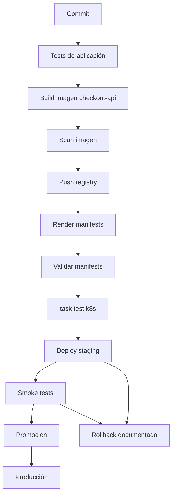

## Qué estudiar

- Manifiestos declarativos
- `kubectl apply`
- `kubectl diff`
- Server-side apply
- Kustomize
- Helm
- GitOps
- Argo CD
- Flux
- CI/CD
- Quality gates
- Build de imagen
- Scan de imagen
- Push a registry
- Render de manifests
- `task test:k8s`
- Deploy a staging
- Smoke tests
- Promoción
- Rollbacks
- Progressive delivery
- Validación de manifests
## Documentación y enlaces

|Tipo|Recurso|Uso|
|---|---|---|
|Oficial|Declarative Management of Kubernetes Objects|Para gestionar objetos con ficheros declarativos.|
|Oficial|Kustomize desde Kubernetes docs|Para bases, overlays, generators y `kubectl apply -k`.|
|Oficial|Kustomize site|Para entender Kustomize como configuración template-free.|
|Oficial|Helm docs|Para charts, values, templates, releases, upgrades y rollbacks.|
|Oficial|Argo CD docs|Para GitOps declarativo sobre Kubernetes.|
|Oficial|Flux docs|Para GitOps basado en reconciliation continua.|

## Lecturas de libros

|Libro|Qué leer|
|---|---|
|_Cloud Native DevOps with Kubernetes_|Capítulo 12: Helm, charts, templates, dependencies, upgrades, rollbacks, chart repos, Sops, Helmfile, Kustomize y herramientas de manifests.|
|_Cloud Native DevOps with Kubernetes_|Capítulo 13: development workflow, deployment strategies, rolling updates, blue-green, canary y migraciones con Helm.|
|_Cloud Native DevOps with Kubernetes_|Capítulo 14: continuous deployment, tests, validación de manifests, publicación de imagen y deploy.|
|_Kubernetes in Action_|Capítulo 9: Deployments, rollouts, rollbacks, control del rollout y bloqueo de versiones defectuosas.|
|_Kubernetes in Action_|Capítulo 17: best practices, manifests, desarrollo y CI/CD.|
|_Kubernetes Patterns_|Capítulo 3: Declarative Deployment, rolling, fixed, blue-green y canary release.|

## Nota de actualización

Herramientas como Draft, ksonnet, Gitkube o kubeval pueden aparecer en libros antiguos. Para una formación actual, el núcleo práctico debería apoyarse en Helm, Kustomize, Argo CD, Flux, kubeconform, policy tests y quality gates.

## Práctica

Crea una pipeline que haga:

1. Tests
2. Build de imagen
3. Scan de imagen
4. Push a registry
5. Actualización de manifests
6. Validación de manifests
7. `task test:k8s`
8. Deploy a entorno de pruebas
9. Smoke tests
10. Promoción a staging
11. Rollback documentado
## Criterio de salida

Debes poder demostrar:

- Un cambio llega a Kubernetes sin comandos manuales
- El manifiesto está versionado
- El despliegue es reversible
- El estado aplicado se puede auditar
- El entorno se puede reconstruir desde Git
- Un fallo de rollout se detecta y se revierte
- La suite de testing de Kubernetes se ejecuta como quality gate antes del despliegue
---

# 11. Seguridad

## Objetivo

Reducir permisos, exposición y blast radius.

## Qué estudiar

- RBAC
- ServiceAccounts
- Pod Security Standards
- Pod Security Admission
- SecurityContext
- NetworkPolicy
- Secrets
- Image scanning
- SBOM
- Admission control
- Audit logs
- Supply chain security
- Node hardening
- API Server hardening
- Multi-tenancy
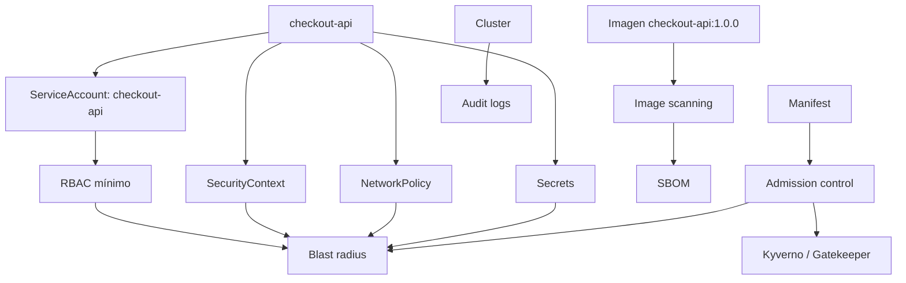

## Documentación y enlaces

|Tipo|Recurso|Uso|
|---|---|---|
|Oficial|Kubernetes Security|Entrada principal a seguridad.|
|Oficial|Cloud Native Security|Modelo general de seguridad cloud native.|
|Oficial|Pod Security Standards|Para niveles Privileged, Baseline y Restricted.|
|Oficial|Pod Security Admission|Para aplicar Pod Security Standards en namespaces.|
|Oficial|Service Accounts|Para identidad de workloads.|
|Oficial|Controlling Access to the Kubernetes API|Para autenticación, autorización y acceso a la API.|
|Oficial|RBAC good practices|Para mínimo privilegio.|
|Oficial|Good practices for Kubernetes Secrets|Para tratar secretos de forma más segura.|
|Oficial|Security Checklist|Para revisión de seguridad.|
|Tooling|Kyverno docs|Policy as code y validación/mutación de recursos.|
|Tooling|OPA Gatekeeper docs|Policy as code con OPA en Kubernetes.|
|Tooling|Trivy docs|Escaneo de imágenes, repositorios, Kubernetes, IaC, SBOM y vulnerabilidades.|

## Lecturas de libros

|Libro|Qué leer|
|---|---|
|_Kubernetes in Action_|Capítulo 12: API Server security, authentication, ServiceAccounts, RBAC, Roles, RoleBindings, ClusterRoles y ClusterRoleBindings.|
|_Kubernetes in Action_|Capítulo 13: security contexts, host namespaces, capabilities, runAsUser, privileged mode, read-only filesystem y NetworkPolicy.|
|_Kubernetes: Up and Running_|Capítulo 14: RBAC, identity, roles, role bindings, `can-i` y RBAC en source control.|
|_Cloud Native DevOps with Kubernetes_|Capítulo 11: RBAC, cluster-admin, security scanning, backups, etcd y Velero.|

## Nota de actualización

PodSecurityPolicy debe tratarse como contenido histórico. En un roadmap actual debe sustituirse por Pod Security Admission, Pod Security Standards, Kyverno u OPA Gatekeeper.

## Práctica

Crea un namespace `shop` con:

- ServiceAccount por aplicación
- RBAC mínimo
- NetworkPolicy deny by default
- Pod Security Admission en modo restricted
- Secret externo o cifrado
- Imagen no root
- Read-only filesystem
- Escaneo de imagen
- Policy que bloquee `latest`
## Criterio de salida

Debes poder responder:

- ¿Qué puede hacer `checkout-api` dentro del cluster?
- ¿Qué secretos puede leer?
- ¿Con qué workloads puede hablar?
- ¿Qué pasaría si este contenedor se ve comprometido?
- ¿Cuál es el blast radius?
- ¿Qué policy impide desplegar algo peligroso?
---

# 12. Troubleshooting progresivo

## Objetivo

Aprender a diagnosticar Kubernetes de forma ordenada, desde señales simples hasta fallos distribuidos.

Troubleshooting no es una lista de comandos.

Es una forma de pensar.

El objetivo es construir una secuencia:

1. Qué debería estar pasando
2. Qué está pasando
3. Dónde aparece la primera diferencia
4. Qué señal lo demuestra
5. Qué cambio corrige la causa
6. Qué test, policy o alerta evitaría repetir el fallo
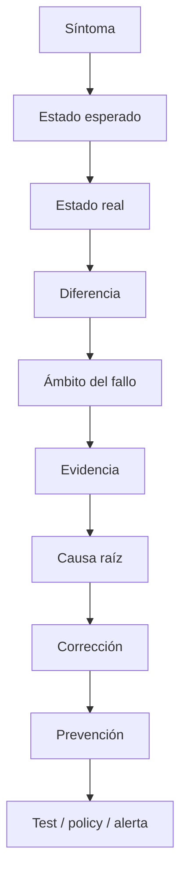

---

## 12.1. Modelo mental de troubleshooting

### Preguntas base

- ¿El recurso existe?
- ¿El recurso fue aceptado por el API Server?
- ¿El controller lo está reconciliando?
- ¿El Pod fue programado?
- ¿El contenedor arrancó?
- ¿La app está viva?
- ¿La app está ready?
- ¿El Service selecciona Pods?
- ¿Hay endpoints?
- ¿DNS resuelve?
- ¿La red permite tráfico?
- ¿La autorización permite la acción?
- ¿El storage está ligado?
- ¿La configuración existe?
- ¿El secreto existe?
- ¿Los límites de recursos son razonables?
- ¿Los eventos dicen algo más temprano que los logs?
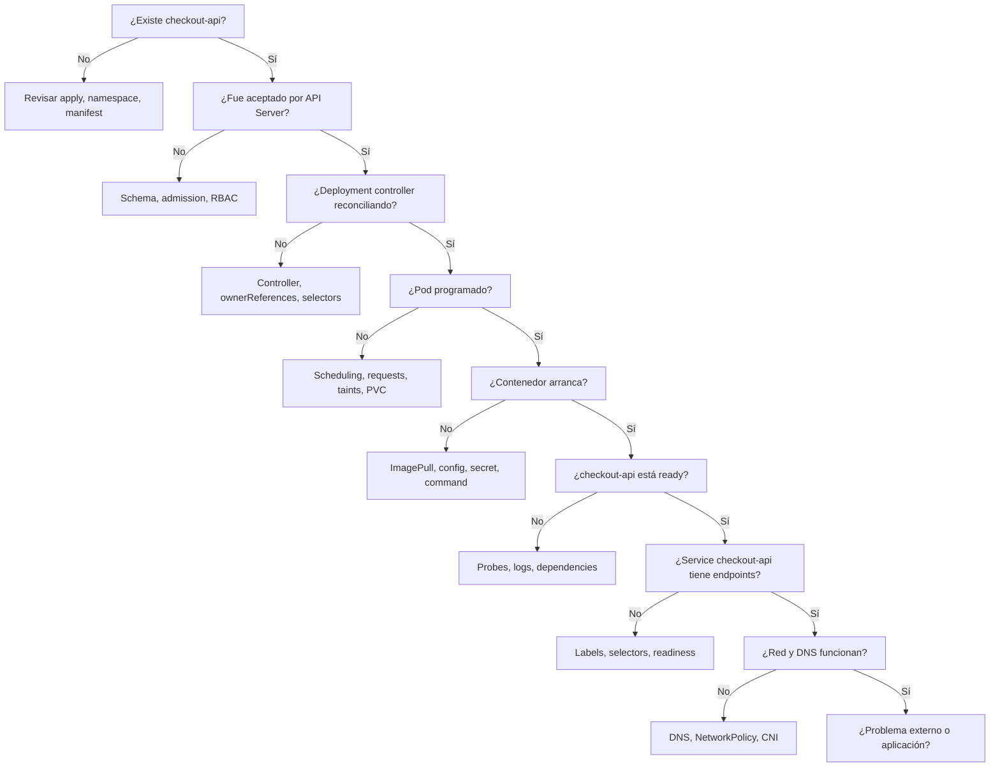

---

## 12.2. Nivel 1 de troubleshooting: comandos esenciales

### Qué estudiar

- `kubectl get`
- `kubectl describe`
- `kubectl logs`
- `kubectl logs --previous`
- `kubectl events`
- `kubectl exec`
- `kubectl port-forward`
- `kubectl rollout status`
- `kubectl rollout history`
- `kubectl rollout undo`
- `kubectl auth can-i`
- `kubectl top`
- `kubectl explain`
- `kubectl get -o yaml`
- `kubectl get -o json`
- `jq`
- `yq`
### Práctica

Para cada recurso desplegado, ejecuta:

```bash
kubectl get pods -A
kubectl get pods -A -o wide
kubectl describe pod <pod> -n shop
kubectl logs <pod> -n shop
kubectl logs <pod> -n shop --previous
kubectl get events -A --sort-by=.metadata.creationTimestamp
kubectl get deploy -A
kubectl rollout status deployment/checkout-api -n shop
kubectl get svc -A
kubectl get endpointslices -A
kubectl auth can-i get pods -n shop
kubectl get pods -A -o json | jq -r '.items[] | [.metadata.namespace, .metadata.name, .status.phase] | @tsv'
```

### Criterio de salida

Debes poder explicar qué comando usarías para responder:

- ¿Existe el recurso?
- ¿En qué namespace está?
- ¿Qué evento explica el fallo?
- ¿Qué contenedor falló?
- ¿Qué imagen está usando?
- ¿Qué probes tiene?
- ¿Qué Service lo selecciona?
- ¿Qué permisos tiene?
---

## 12.3. Nivel 2 de troubleshooting: Pods y contenedores

### Síntomas

- `ImagePullBackOff`
- `ErrImagePull`
- `CrashLoopBackOff`
- `CreateContainerConfigError`
- `RunContainerError`
- `OOMKilled`
- `Pending`
- Readiness fallando
- Liveness reiniciando
- Startup probe demasiado agresiva
- Permisos de filesystem
### Qué estudiar

- `kubectl describe pod`
- `kubectl logs`
- `kubectl logs --previous`
- `kubectl get pod -o yaml`
- `kubectl get events`
- Image pull secrets
- Entrypoint y command
- Variables de entorno
- ConfigMap ausente
- Secret ausente
- Requests y limits
- SecurityContext
- Probes
### Práctica

Provoca y documenta:

|Fallo|Señal esperada|Comando principal|
|---|---|---|
|Imagen inexistente en `checkout-api`|`ImagePullBackOff`|`kubectl describe pod`|
|Comando incorrecto en `payment-api`|`CrashLoopBackOff`|`kubectl logs --previous`|
|Secret ausente en `payment-api`|`CreateContainerConfigError`|`kubectl describe pod`|
|Memory limit bajo en `inventory-api`|`OOMKilled`|`kubectl describe pod`|
|Readiness incorrecta en `checkout-api`|Pod Running pero not Ready|`kubectl describe pod`|
|Usuario sin permisos en `notification-worker`|Crash o permission denied|`kubectl logs`|

---

## 12.4. Nivel 3 de troubleshooting: Workloads

### Síntomas

- Deployment no disponible
- Rollout bloqueado
- ReplicaSet creado pero Pods fallando
- Job no completa
- CronJob no ejecuta
- StatefulSet no progresa
- DaemonSet no llega a todos los nodos
- HPA no escala
### Qué estudiar

- ReplicaSets
- Owner references
- Selectors
- Rollout history
- Rollback
- Job completions
- Job backoffLimit
- CronJob schedule
- StatefulSet identity
- PVCs por réplica
- DaemonSet scheduling
- HPA metrics
### Comandos

```bash
kubectl get deploy -A
kubectl describe deploy checkout-api -n shop
kubectl get rs -n shop
kubectl rollout status deployment/checkout-api -n shop
kubectl rollout history deployment/checkout-api -n shop
kubectl rollout undo deployment/checkout-api -n shop
kubectl get jobs -A
kubectl describe job database-migration -n shop
kubectl get cronjobs -A
kubectl get statefulsets -A
kubectl get daemonsets -A
kubectl get hpa -A
```

### Práctica

Provoca y documenta:

- Rollout de `checkout-api` con imagen rota
- Deployment `payment-api` con selector incorrecto
- Job `database-migration` que falla varias veces
- CronJob `inventory-sync` suspendido
- StatefulSet `PostgreSQL` con PVC pendiente
- DaemonSet `log-forwarder` que no puede programarse en un nodo por taint
- HPA de `checkout-api` sin métricas
---

## 12.5. Nivel 4 de troubleshooting: Networking

### Síntomas

- `frontend` no puede llamar a `checkout-api`
- `checkout-api` no puede llamar a `payment-api`
- `checkout-api` no puede resolver `inventory-api`
- `notification-worker` no puede conectar con `Redis`
- `checkout-api` no puede conectar con `PostgreSQL`
- Service sin endpoints
- DNS no resuelve
- Ingress responde 404
- Ingress responde 502
- Gateway no enruta
- NetworkPolicy bloquea tráfico
- TLS falla
- Desde dentro funciona, pero desde fuera no
- El LoadBalancer recibe tráfico, pero la app no responde
### Qué estudiar

- Services
- Selectors
- EndpointSlices
- DNS interno
- CoreDNS
- Ingress Controller
- Gateway API
- NetworkPolicy
- CNI
- TLS
- cert-manager
### Comandos

```bash
kubectl get svc -A
kubectl describe svc checkout-api -n shop
kubectl get endpointslices -A
kubectl get ingress -A
kubectl describe ingress shop-web -n shop
kubectl get gateway -A
kubectl get httproute -A
kubectl get networkpolicy -A
kubectl logs -n kube-system -l k8s-app=kube-dns
kubectl run debug-shell --rm -it --image=busybox -- sh
```

### Práctica

Provoca y documenta:

- `frontend` apunta a un nombre de Service incorrecto
- `checkout-api` no está Ready, por lo que no aparece como endpoint
- `payment-api` tiene labels que no coinciden con el selector del Service
- `inventory-api` falla por DNS mal escrito
- `notification-worker` queda bloqueado por una NetworkPolicy
- `PostgreSQL` recibe tráfico desde un workload no permitido
- Ingress existe, pero no hay Ingress Controller
- TLS secret ausente
- Ruta HTTP mal configurada
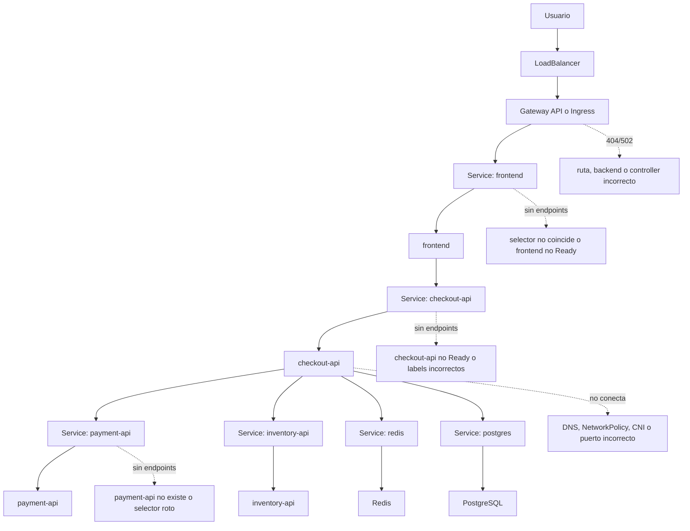

### Criterio de salida

Debes poder diagnosticar:

- Por qué `frontend` no llega a `checkout-api`
- Por qué `checkout-api` no llega a `payment-api`
- Por qué `checkout-api` no resuelve `inventory-api`
- Por qué `notification-worker` no conecta con `Redis`
- Por qué `PostgreSQL` está recibiendo tráfico que no debería
- Por qué un Service no tiene endpoints
- Por qué un Ingress responde 404 o 502
- Por qué una NetworkPolicy bloquea tráfico esperado
---

## 12.6. Nivel 5 de troubleshooting: Configuración, secretos y storage

### Síntomas

- ConfigMap ausente
- Secret ausente
- Variable de entorno incorrecta
- Fichero montado donde no toca
- PVC `Pending`
- Pod bloqueado por volumen
- StatefulSet no arranca
- Datos desaparecen tras borrar recursos
- Restore incompleto
### Qué estudiar

- ConfigMap
- Secret
- Volume mounts
- PVC
- PV
- StorageClass
- Dynamic provisioning
- Access modes
- Reclaim policy
- Snapshots
- Backup
- Restore
### Comandos

```bash
kubectl get configmap -A
kubectl describe configmap checkout-config -n shop
kubectl get secret -A
kubectl describe secret payment-provider-credentials -n shop
kubectl get pvc -A
kubectl describe pvc postgres-data -n shop
kubectl get pv
kubectl get storageclass
kubectl describe pod <pod> -n shop
```

### Práctica

Provoca y documenta:

- ConfigMap `checkout-config` inexistente
- Secret `payment-provider-credentials` inexistente
- Key incorrecta dentro del ConfigMap
- PVC sin StorageClass
- StatefulSet `PostgreSQL` con PVC retenido
- Borrado de StatefulSet sin borrar PVC
- Restore en otro namespace
---

## 12.7. Nivel 6 de troubleshooting: Seguridad y RBAC

### Síntomas

- `Forbidden`
- ServiceAccount sin permisos
- Pod no puede listar recursos
- Admission rechaza manifest
- Pod Security Admission bloquea Pod
- Policy bloquea imagen
- NetworkPolicy bloquea comunicación
- Secret no accesible
### Qué estudiar

- ServiceAccounts
- Roles
- RoleBindings
- ClusterRoles
- ClusterRoleBindings
- `kubectl auth can-i`
- Admission controllers
- Pod Security Admission
- Kyverno
- Gatekeeper
- Audit logs
### Comandos

```bash
kubectl auth can-i get pods -n shop
kubectl auth can-i get configmaps -n shop --as=system:serviceaccount:shop:checkout-api
kubectl auth can-i get secrets -n shop --as=system:serviceaccount:shop:checkout-api
kubectl get role -A
kubectl get rolebinding -A
kubectl get clusterrole
kubectl get clusterrolebinding
kubectl describe role checkout-api -n shop
kubectl describe rolebinding checkout-api -n shop
```

### Práctica

Provoca y documenta:

- ServiceAccount sin permiso para leer ConfigMaps
- RoleBinding en namespace incorrecto
- Policy que rechaza `runAsRoot`
- Policy que rechaza imagen `latest`
- NetworkPolicy que bloquea tráfico necesario
- Admission webhook caído o demasiado restrictivo
---

## 12.8. Nivel 7 de troubleshooting: Nodos y cluster

### Síntomas

- Pods `Pending`
- `FailedScheduling`
- Nodo `NotReady`
- Presión de memoria
- Presión de disco
- Pods evicted
- CNI fallando
- CoreDNS fallando
- metrics-server ausente
- HPA sin métricas
- Volúmenes no montan
- Drenado de nodo afecta disponibilidad
### Qué estudiar

- Nodes
- Conditions
- Taints
- Tolerations
- Requests
- Limits
- Evictions
- CNI
- CoreDNS
- kubelet
- kube-proxy
- metrics-server
- Cluster Autoscaler
- PDB
- Drain
- Cordón de nodo
### Comandos

```bash
kubectl get nodes
kubectl describe node <node>
kubectl top nodes
kubectl top pods -A
kubectl get pods -A -o wide
kubectl get events -A --sort-by=.metadata.creationTimestamp
kubectl cordon <node>
kubectl drain <node> --ignore-daemonsets --delete-emptydir-data
kubectl uncordon <node>
```

### Práctica

Provoca y documenta:

- Pod con requests imposibles
- Nodo con taint sin toleration
- PDB que bloquea drain
- Pod evicted por recursos
- HPA sin metrics-server
- CoreDNS fallando
- Network plugin fallando en laboratorio controlado
---

## 12.9. Nivel 8 de troubleshooting: Delivery y GitOps

### Síntomas

- Pipeline verde pero deploy roto
- Manifests renderizados diferentes a lo esperado
- Argo CD OutOfSync
- Flux no reconcilia
- Helm release fallida
- Rollback incompleto
- Drift entre Git y cluster
- Secret no disponible durante deploy
- Hook de migración falla
### Qué estudiar

- Render de manifests
- Helm template
- Helm values
- Helm release history
- Kustomize overlays
- GitOps reconciliation
- Drift
- Rollback
- Progressive delivery
- Quality gates
### Comandos

```bash
helm template ./chart
helm lint ./chart
helm upgrade --install shop ./chart -n shop
helm history shop -n shop
helm rollback shop <revision> -n shop
kubectl diff -f <manifest>
kubectl apply --dry-run=server -f <manifest>
```

### Práctica

Provoca y documenta:

- Helm values incorrectos
- Kustomize overlay con patch roto
- Deployment aplicado manualmente que genera drift
- Rollback a versión anterior
- Hook de migración fallido
- Pipeline que no ejecuta `task test:k8s`
---

## 12.10. Nivel 9 de troubleshooting: Observabilidad

### Síntomas

- No hay logs
- Logs sin correlación
- Métricas ausentes
- Trazas incompletas
- Dashboard engañoso
- Alerta ruidosa
- Alerta ausente
- SLO no medido
- Incidente sin runbook
- Señal técnica sin impacto de usuario
### Qué estudiar

- Logs con Loki
- Métricas con Mimir
- Trazas con Tempo
- Dashboards con Grafana
- OpenTelemetry
- Grafana Alloy u OpenTelemetry Collector
- Alerting
- SLI
- SLO
- Runbooks
- Correlación entre señales
### Práctica

Para cada fallo del failure lab documenta:

- Síntoma visible para el usuario
- Evento de Kubernetes
- Log relevante
- Métrica relevante
- Traza relevante, si aplica
- Dashboard donde se ve
- Alerta que debería saltar
- Runbook que seguirías
- Test que lo habría detectado antes
---

## 12.11. Ejemplo de runbook de troubleshooting

````markdown
# Runbook: checkout-api no llega a Ready

## Síntoma

El Deployment `checkout-api` no alcanza disponibilidad.

## Comandos iniciales

```bash
kubectl get deploy checkout-api -n shop
kubectl describe deploy checkout-api -n shop
kubectl get rs -n shop
kubectl get pods -n shop -o wide
kubectl describe pod <pod> -n shop
kubectl logs <pod> -n shop
kubectl logs <pod> -n shop --previous
kubectl get events -n shop --sort-by=.metadata.creationTimestamp
````

## Preguntas

- ¿El Deployment existe?
    
- ¿El ReplicaSet existe?
    
- ¿Los Pods se crean?
    
- ¿Los Pods están Pending, Running, CrashLoopBackOff o ImagePullBackOff?
    
- ¿La app arranca?
    
- ¿La readiness probe pasa?
    
- ¿Hay endpoints en el Service?
    

## Causas frecuentes

- Imagen inexistente.
    
- ConfigMap ausente.
    
- Secret ausente.
    
- Probe mal configurada.
    
- Requests imposibles.
    
- Permisos insuficientes.
    
- App escucha en otro puerto.
    

## Corrección

Documentar la causa raíz y aplicar el cambio mínimo.

## Prevención

- Añadir test en `task test:k8s`.
    
- Añadir policy si aplica.
    
- Añadir alerta si aplica.
    
- Añadir caso al failure lab.
    

````

---

## 12.12. Ejemplo de Taskfile para troubleshooting

```yaml
version: '3'

vars:
  NAMESPACE: shop
  APP: checkout-api

tasks:
  debug:all:
    desc: Run progressive troubleshooting checks
    cmds:
      - task debug:resources
      - task debug:events
      - task debug:pods
      - task debug:services
      - task debug:rbac

  debug:resources:
    desc: Show main resources
    cmds:
      - kubectl get all -n {{.NAMESPACE}}
      - kubectl get configmap,secret,pvc -n {{.NAMESPACE}}

  debug:events:
    desc: Show namespace events
    cmds:
      - kubectl get events -n {{.NAMESPACE}} --sort-by=.metadata.creationTimestamp

  debug:pods:
    desc: Show pod status and images
    cmds:
      - kubectl get pods -n {{.NAMESPACE}} -o wide
      - kubectl get pods -n {{.NAMESPACE}} -o json | jq -r '.items[] | [.metadata.name, .status.phase] | @tsv'
      - kubectl get pods -n {{.NAMESPACE}} -o json | jq -r '.items[].spec.containers[].image' | sort -u

  debug:services:
    desc: Show services and endpoints
    cmds:
      - kubectl get svc -n {{.NAMESPACE}}
      - kubectl get endpointslices -n {{.NAMESPACE}}

  debug:rbac:
    desc: Check basic permissions
    cmds:
      - kubectl auth can-i get pods -n {{.NAMESPACE}}
      - kubectl auth can-i get configmaps -n {{.NAMESPACE}}
      - kubectl auth can-i get secrets -n {{.NAMESPACE}}
````

---

## 12.13. Criterio de salida

Puedes pasar a operación y observabilidad cuando puedas:

- Diagnosticar un Pod roto
- Diagnosticar un Deployment bloqueado
- Diagnosticar un Service sin endpoints
- Diagnosticar DNS interno
- Diagnosticar NetworkPolicy
- Diagnosticar RBAC
- Diagnosticar PVC pendiente
- Diagnosticar rollout fallido
- Usar eventos antes de saltar a conclusiones
- Usar `jq` para leer el estado real
- Usar `yq` para inspeccionar manifests
- Escribir un runbook breve para cada fallo
- Convertir un fallo aprendido en test, policy o alerta
---

# 13. Operación, observabilidad y fiabilidad con Grafana LGTM

## Objetivo

Aprender a diagnosticar, mantener y recuperar sistemas usando un stack de observabilidad basado en Grafana LGTM.

En este roadmap, la estrategia de observabilidad se basa en:

- Logs con Loki
- Métricas con Mimir
- Trazas con Tempo
- Visualización con Grafana
- Recolección con Grafana Alloy u OpenTelemetry Collector
La observabilidad no es instalar dashboards.

La observabilidad es poder responder preguntas operativas sobre un sistema real:

- ¿Está fallando `checkout-api`?
- ¿El fallo está en `payment-api` o en el proveedor externo de pagos?
- ¿`inventory-api` está respondiendo lento?
- ¿`notification-worker` está acumulando trabajos?
- ¿`PostgreSQL` está saturado?
- ¿El usuario está viendo errores o solo hay ruido interno?
- ¿Qué cambió antes del incidente?
- ¿Qué alerta debería haber avisado?
- ¿Qué runbook debería seguir el equipo?
```mermaid
flowchart TD
  Frontend["frontend"] --> Checkout["checkout-api"]
  Checkout --> Payment["payment-api"]
  Checkout --> Inventory["inventory-api"]
  Checkout --> Redis["Redis"]
  Checkout --> Postgres["PostgreSQL"]
  Worker["notification-worker"] --> Redis

  Frontend --> Logs["Logs"]
  Checkout --> Logs
  Payment --> Logs
  Inventory --> Logs
  Worker --> Logs

  Frontend --> Metrics["Métricas"]
  Checkout --> Metrics
  Payment --> Metrics
  Inventory --> Metrics
  Worker --> Metrics
  Redis --> Metrics
  Postgres --> Metrics

  Frontend --> Traces["Trazas"]
  Checkout --> Traces
  Payment --> Traces
  Inventory --> Traces

  Logs --> Alloy["Grafana Alloy / OTel Collector"]
  Metrics --> Alloy
  Traces --> Alloy

  Alloy --> Loki["Loki"]
  Alloy --> Mimir["Mimir"]
  Alloy --> Tempo["Tempo"]

  Loki --> Grafana["Grafana"]
  Mimir --> Grafana
  Tempo --> Grafana

  Grafana --> Dashboards["Dashboards"]
  Grafana --> Alerts["Alertas"]
  Alerts --> Runbooks["Runbooks"]
```

## Qué estudiar

- Troubleshooting
- Eventos de Kubernetes
- Logs con Loki
- Métricas con Mimir
- Trazas con Tempo
- Visualización con Grafana
- Instrumentación con OpenTelemetry
- Recolección con Grafana Alloy u OpenTelemetry Collector
- Alertas con Grafana Alerting o Alertmanager si decides mantenerlo
- kube-state-metrics
- metrics-server
- node-exporter
- HPA
- VPA
- Cluster Autoscaler
- PDB
- Drains
- Upgrades
- Backups
- Disaster recovery
- Runbooks
## Documentación y enlaces

|Tipo|Recurso|Uso|
|---|---|---|
|Oficial|Monitoring, Logging, and Debugging|Entrada principal a debug, logs y troubleshooting.|
|Oficial|Observability|Conceptos de observabilidad en administración del cluster.|
|Oficial|Logging Architecture|Arquitectura de logging en Kubernetes.|
|Oficial|Metrics for Kubernetes System Components|Métricas del sistema Kubernetes.|
|Oficial|System Logs|Logs del sistema.|
|Oficial|Traces For Kubernetes System Components|Trazas de componentes del sistema.|
|Tooling|Grafana docs|Dashboards, exploración, alertas, métricas, logs y trazas.|
|Tooling|Grafana Loki|Logs dentro del stack LGTM.|
|Tooling|Grafana Mimir|Métricas dentro del stack LGTM.|
|Tooling|Grafana Tempo|Trazas dentro del stack LGTM.|
|Tooling|Grafana Alloy|Recolección, procesamiento y envío de telemetría.|
|Tooling|OpenTelemetry|Instrumentación, métricas, logs y trazas vendor-neutral.|
|Tooling|Velero|Backup y restore.|

## Lecturas de libros

|Libro|Qué leer|
|---|---|
|_Cloud Native DevOps with Kubernetes_|Capítulo 6: cluster sizing, scaling, conformance, validation, auditing y chaos testing.|
|_Cloud Native DevOps with Kubernetes_|Capítulo 11: backups, etcd, Velero y monitoring cluster status.|
|_Cloud Native DevOps with Kubernetes_|Capítulo 15: observability, monitoring, black-box checks, logging, metrics, tracing y observability pipeline.|
|_Cloud Native DevOps with Kubernetes_|Capítulo 16: metrics, RED, USE, dashboards, alerting y herramientas de monitorización.|
|_Kubernetes in Action_|Capítulos 11, 14, 15, 16 y 17: internals, recursos, autoscaling, scheduling y best practices para apps.|
|_Kubernetes Patterns_|Health Probe y Elastic Scale.|
|_Observability with Grafana_|Logs con Loki, métricas con Mimir/Prometheus, trazas con Tempo, Kubernetes, dashboards, alerting, IaC y troubleshooting.|

## Práctica

Crea un failure lab con escenarios:

1. Imagen inexistente en `checkout-api`
2. Secret ausente en `payment-api`
3. ConfigMap mal escrito en `inventory-api`
4. Service selector incorrecto para `checkout-api`
5. DNS interno fallando entre `frontend` y `checkout-api`
6. Readiness probe demasiado agresiva en `payment-api`
7. Memory limit demasiado bajo en `inventory-api`
8. NetworkPolicy bloqueando `notification-worker` hacia `Redis`
9. RBAC insuficiente para un Job de mantenimiento
10. Nodo drenado mientras `checkout-api` tiene pocas réplicas
11. PVC sin StorageClass para `PostgreSQL`
12. Rollout con versión rota de `frontend`
Para cada caso documenta:

- Síntoma
- Comandos usados
- Causa raíz
- Corrección
- Prevención
- Señal observable
- Log esperado en Loki
- Métrica esperada en Mimir
- Traza esperada en Tempo, si aplica
- Dashboard en Grafana
- Alerta que tendría sentido
- Runbook asociado
## Criterio de salida

Debes poder entrar en un cluster desconocido y construir un diagnóstico ordenado sin actuar al azar.

También debes poder responder:

- Qué mirarías primero en eventos de Kubernetes
- Qué buscarías en Loki
- Qué métrica consultarías en Mimir
- Qué traza revisarías en Tempo
- Qué dashboard abrirías en Grafana
- Qué alerta debería haber saltado
- Qué runbook seguirías
---

# 14. Patrones cloud native

## Objetivo

Diseñar aplicaciones que Kubernetes pueda operar bien.

Kubernetes no arregla una aplicación mal diseñada.

La app debe ser una buena ciudadana cloud native:

- Health checks reales
- Shutdown correcto
- Configuración externa
- Recursos declarados
- Tolerancia a fallos parciales
- Observabilidad
- Seguridad mínima
- Comportamiento predecible ante reinicios
```mermaid
flowchart TD
  Patterns["Patrones cloud native"] --> Foundational["Fundacionales"]
  Patterns --> Behavioral["Comportamentales"]
  Patterns --> Structural["Estructurales"]
  Patterns --> Config["Configuración"]
  Patterns --> Advanced["Avanzados"]

  Foundational --> PD["Predictable Demands"]
  Foundational --> DD["Declarative Deployment"]
  Foundational --> HP["Health Probe"]
  Foundational --> ML["Managed Lifecycle"]
  Foundational --> AP["Automated Placement"]

  Behavioral --> BJ["Batch Job"]
  Behavioral --> PJ["Periodic Job"]
  Behavioral --> DS["Daemon Service"]
  Behavioral --> SS["Stateful Service"]

  Structural --> Init["Init Container"]
  Structural --> Sidecar["Sidecar"]
  Structural --> Adapter["Adapter"]
  Structural --> Ambassador["Ambassador"]

  Config --> Env["EnvVar Configuration"]
  Config --> CR["Configuration Resource"]
  Config --> IC["Immutable Configuration"]
  Config --> CT["Configuration Template"]

  Advanced --> Controller["Controller"]
  Advanced --> Operator["Operator"]
  Advanced --> Elastic["Elastic Scale"]
  Advanced --> ImageBuilder["Image Builder"]
```

## Qué estudiar

- Predictable Demands
- Declarative Deployment
- Health Probe
- Managed Lifecycle
- Automated Placement
- Batch Job
- Periodic Job
- Daemon Service
- Singleton Service
- Stateful Service
- Service Discovery
- Self Awareness
- Init Container
- Sidecar
- Adapter
- Ambassador
- EnvVar Configuration
- Configuration Resource
- Immutable Configuration
- Configuration Template
- Controller
- Operator
- Elastic Scale
- Image Builder
## Documentación y enlaces

|Tipo|Recurso|Uso|
|---|---|---|
|Oficial|Workloads|Para elegir la primitiva correcta según el comportamiento.|
|Oficial|Probes|Para Health Probe.|
|Oficial|Resource Management|Para Predictable Demands.|
|Oficial|Scheduling, Preemption and Eviction|Para placement, taints, tolerations, affinity y evictions.|
|Oficial|Downward API|Para Self Awareness.|
|Oficial|Extending Kubernetes|Para Controller y Operator.|
|Oficial|Sidecar Containers|Para actualizar el patrón Sidecar con el soporte actual de sidecars nativos.|

## Lecturas de libros

|Libro|Qué leer|
|---|---|
|_Kubernetes Patterns_|Libro principal completo para esta unidad.|
|_Kubernetes Patterns_|Capítulos 2 a 6: patrones fundacionales.|
|_Kubernetes Patterns_|Capítulos 7 a 13: patrones comportamentales.|
|_Kubernetes Patterns_|Capítulos 14 a 17: Init Container, Sidecar, Adapter y Ambassador.|
|_Kubernetes Patterns_|Capítulos 18 a 21: configuration patterns.|
|_Kubernetes Patterns_|Capítulos 22 a 25: Controller, Operator, Elastic Scale e Image Builder.|
|_Kubernetes in Action_|Capítulo 17: mejores prácticas para apps, lifecycle, shutdown, logs, imágenes, labels, annotations, desarrollo y CI/CD.|

## Práctica

Toma una app tradicional y rediseñala:

- Health checks reales
- Graceful shutdown
- Requests y limits
- ConfigMap
- Secret
- Deployment
- Job de migración
- CronJob de mantenimiento
- NetworkPolicy
- HPA
- Observabilidad con Grafana LGTM
- Helm o Kustomize
- GitOps
- Runbook
## Criterio de salida

Debes poder revisar una aplicación y decir:

- Qué espera Kubernetes de ella
- Qué automatiza Kubernetes
- Qué sigue siendo responsabilidad de la app
- Qué patrón encaja
- Qué patrón sería sobreingeniería
---

# Capa 3. Especialización

---

# 15. Extensión de Kubernetes

## Objetivo

Entender cómo Kubernetes se convierte en plataforma extensible.

No necesitas empezar creando operators, pero un profesional debería entender CRDs, controllers, operators, admission webhooks y finalizers.

## Qué estudiar

- CRDs
- Custom Resources
- Controllers
- Operators
- Finalizers
- Owner references
- Admission webhooks
- API aggregation
- Device plugins
- Network plugins
- CSI
- Reconciliation
- Status subresource
- Versioning
```mermaid
flowchart TD
  CRD["CRD: BackupPolicy"] --> CR["Custom Resource: daily-postgres-backup"]
  CR --> Controller["Controller"]
  Controller --> Reconcile["Reconciliation loop"]
  Reconcile --> External["Backup en storage externo"]
  Controller --> Status["status subresource"]
  CR --> Finalizer["Finalizer"]
  Finalizer --> Delete["Borrado controlado"]

  Manifest["Manifest"] --> Admission["Admission webhook"]
  Admission --> Validate["Validación"]
  Admission --> Mutate["Mutación"]
  Validate --> API["API Server"]
  Mutate --> API
```

## Documentación y enlaces

|Tipo|Recurso|Uso|
|---|---|---|
|Oficial|Extending Kubernetes|Entrada general a extensiones.|
|Oficial|Custom Resources|Para CRDs y Custom Resources.|
|Oficial|Operator Pattern|Para entender operators como automatización operacional.|
|Oficial|Kubernetes API Aggregation Layer|Para extensión avanzada de la API.|
|Oficial|Device Plugins|Para recursos especializados.|
|Oficial|Network Plugins|Para extensiones de red.|
|Oficial|Admission Webhook Good Practices|Para validar o mutar recursos de forma segura.|

## Lecturas de libros

|Libro|Qué leer|
|---|---|
|_Kubernetes in Action_|Capítulo 18: CRDs, custom controllers, validación, custom API servers y plataformas sobre Kubernetes.|
|_Kubernetes: Up and Running_|Capítulo 16: puntos de extensibilidad, custom resources, admission controllers y operators.|
|_Kubernetes Patterns_|Capítulos 22 y 23: Controller y Operator.|
|_Kubernetes Patterns_|Capítulo 24: Elastic Scale.|
|_Kubernetes Patterns_|Capítulo 25: Image Builder.|

## Nota de actualización

Los conceptos de CRD, controller, operator, admission y custom resources siguen siendo válidos.

Los ejemplos de libros antiguos pueden usar APIs como `apiextensions.k8s.io/v1beta1`. En una formación actual hay que enseñar CRDs con `apiextensions.k8s.io/v1`.

Service Catalog puede mencionarse como ejemplo histórico de extensión, pero no debería ser una práctica principal del roadmap.

## Práctica

Crea una práctica mínima:

- Define un CRD `BackupPolicy`
- Crea un recurso `daily-postgres-backup`
- Valida schema
- Añade `status`
- Escribe un controller simple o usa una herramienta guiada
- Añade finalizers
- Simula borrado
- Documenta el ciclo de reconciliación
## Criterio de salida

Debes poder explicar:

- Diferencia entre CRD y controller
- Por qué un CRD sin controller es solo datos
- Qué hace un operator
- Qué riesgos introduce un admission webhook
- Qué permisos necesita un operator
- Cómo auditar su blast radius
---

# 16. Profesionalización por rol

## Objetivo

Alinear el aprendizaje con el tipo de trabajo que quieres hacer.

```mermaid
flowchart TD
  Roadmap["Roadmap común"] --> Dev["Ruta developer"]
  Roadmap --> Platform["Ruta platform engineer / SRE / DevOps"]
  Roadmap --> Security["Ruta security"]

  Dev --> CKAD["CKAD"]
  Platform --> CKA["CKA"]
  Platform --> CKS["CKS"]
  Security --> KCSA["KCSA"]
  Security --> CKS2["CKS"]
```

---

## Ruta developer

### Prioridad

- Contenedores
- Docker
- Podman
- Compose
- Taskfile
- jq
- yq
- Pods
- Deployments
- Services
- Ingress o Gateway API
- ConfigMaps
- Secrets
- Probes
- Resources
- SecurityContext
- Jobs
- CronJobs
- Testing automatizado de Kubernetes
- Troubleshooting progresivo
- Helm o Kustomize
- Debugging
- Logs y métricas
- NetworkPolicy básica
- GitOps básico
- Patrones cloud native
### Certificación útil

- CKAD
### Referencias principales

- Kubernetes Workloads
- Kubernetes Configuration
- Kubernetes Services and Networking
- Helm docs
- Kustomize docs
- CNCF CKAD
- kubeconform
- kube-score
- Chainsaw
- Taskfile
- jq
- yq
---

## Ruta platform engineer / SRE / DevOps

### Prioridad

- Arquitectura del cluster
- Control plane
- etcd
- kubelet
- CNI
- CSI
- Ingress controllers
- Gateway API
- RBAC
- Pod Security Admission
- Admission policies
- Testing automatizado de Kubernetes
- Troubleshooting progresivo
- Observabilidad con Grafana LGTM
- Backups
- Upgrades
- Node lifecycle
- Capacity planning
- Autoscaling
- Multi-tenancy
- GitOps
- Helm
- Kustomize
- Secrets management
- Policy as code
- Incident response
- Disaster recovery
- Cost optimization
- Managed Kubernetes vs self-hosted
### Certificación útil

- CKA
- Después CKS
### Referencias principales

- Kubernetes Cluster Architecture
- Kubernetes Cluster Administration
- Kubernetes Security
- Kubernetes Observability
- Grafana
- Loki
- Mimir
- Tempo
- Grafana Alloy
- Velero
- Argo CD
- Flux
- CNCF CKA
- Sonobuoy
- Chainsaw
- Terratest
---

## Ruta security

### Prioridad

- RBAC avanzado
- ServiceAccounts
- Pod Security Standards
- Pod Security Admission
- SecurityContext
- NetworkPolicy
- Secrets management
- Image scanning
- Supply chain
- Admission control
- Audit logs
- Runtime security
- Node hardening
- API Server hardening
- Multi-tenancy
- Incident response
- Forensics básica
- Policy testing
- Troubleshooting progresivo de seguridad
- Security gates dentro de `task test:k8s`
### Certificación útil

- KCSA como entrada
- CKA como base operativa
- CKS como ruta avanzada
### Referencias principales

- Kubernetes Security
- Pod Security Standards
- Pod Security Admission
- RBAC good practices
- Secrets good practices
- Kyverno
- OPA Gatekeeper
- Trivy
- CNCF CKS y KCSA
- Kyverno CLI
- OPA Conftest
- kube-score
- Polaris
---

# Proyecto final del roadmap

## Sistema a construir

Una aplicación realista con:

- `frontend`
- `checkout-api`
- `payment-api`
- `inventory-api`
- `notification-worker`
- `Redis`
- `PostgreSQL`
- Migraciones
- Job batch
- CronJob
- Testing automatizado de Kubernetes
- Troubleshooting progresivo
- Observabilidad con Grafana LGTM
- Seguridad
- Delivery automatizado
```mermaid
flowchart TD
  User["Usuario"] --> Frontend["frontend"]
  Frontend --> Checkout["checkout-api"]
  Checkout --> Payment["payment-api"]
  Checkout --> Inventory["inventory-api"]
  Checkout --> DB["PostgreSQL"]
  Checkout --> Redis["Redis"]
  Redis --> Worker["notification-worker"]
  Cron["CronJob: inventory-sync"] --> Inventory
  Job["Job: database-migration"] --> DB

  Checkout --> Logs["Logs"]
  Worker --> Logs
  Payment --> Logs
  Inventory --> Logs

  Checkout --> Metrics["Métricas"]
  Worker --> Metrics
  Payment --> Metrics
  Inventory --> Metrics

  Checkout --> Traces["Trazas"]
  Payment --> Traces
  Inventory --> Traces

  Logs --> Loki["Loki"]
  Metrics --> Mimir["Mimir"]
  Traces --> Tempo["Tempo"]

  Loki --> Grafana["Grafana"]
  Mimir --> Grafana
  Tempo --> Grafana
```

---

## Fase A. Ejecutarlo sin contenedores

### Objetivo

- Entender procesos
- Entender puertos
- Entender configuración
- Entender dependencias
- Entender logs
### Referencias

- MDN HTTP
- Git Book
- YAML spec
- jq
- yq
### Criterio de salida

- `checkout-api` arranca sin contenedor
- Puedes cambiar configuración por variables de entorno
- Puedes leer logs
- Puedes hacer una petición con `curl`
- Puedes parar el proceso limpiamente
- Puedes explicar qué pasa si el proceso muere
---

## Fase B. Containerizarlo

Debe incluir:

- Dockerfile
- Imagen pequeña
- No root
- Sin secretos
- Build reproducible
- Registry
- Ejecución con Docker
- Ejecución con Podman
### Referencias

- Docker overview
- Dockerfile overview
- Podman docs
- OCI
- _Érase una vez Docker_
- _Kubernetes: Up and Running_, capítulo 2
### Criterio de salida

- La imagen se construye
- La imagen se ejecuta
- La app responde desde contenedor
- La imagen no requiere root
- El tag y el digest se entienden
- El contenedor no contiene secretos
---

## Fase C. Ejecutarlo con Compose

Debe incluir:

- `frontend`
- `checkout-api`
- `payment-api`
- `inventory-api`
- `notification-worker`
- `Redis`
- `PostgreSQL`
- Volumen
- Red
- Variables
- Healthchecks
### Referencias

- Docker Compose docs
### Criterio de salida

- El sistema completo arranca con un comando
- Hay red interna
- `PostgreSQL` usa volumen
- `Redis` se comunica con `notification-worker`
- `checkout-api` responde
- Los logs son inspeccionables
- Puedes borrar contenedores sin borrar datos
- Puedes borrar volumen y observar pérdida de estado
---

## Fase D. Migrarlo a Kubernetes

Debe incluir:

- Deployment
- Service
- Ingress o Gateway API
- ConfigMap
- Secret
- PVC
- Job
- CronJob
- HPA
- PDB
- NetworkPolicy
- RBAC
- ServiceAccount
- Pod Security Admission
- SecurityContext
- Requests y limits
- Probes
- Helm o Kustomize
- GitOps
- Logs
- Métricas
- Trazas
- Alertas
- Backup y restore
- Runbook
### Referencias base

- Kubernetes docs home
- Workloads
- Services and Networking
- Configuration
- Storage
- Security
- Monitoring, Logging and Debugging
- _Kubernetes in Action_
- _Kubernetes: Up and Running_
- _Cloud Native DevOps with Kubernetes_
### Criterio de salida

- Todo el sistema se ejecuta en Kubernetes
- Los recursos están versionados
- Los Pods tienen probes
- Los Pods tienen requests
- Los Services tienen endpoints
- La entrada externa funciona
- Los Secrets no están hardcodeados
- El storage persiste
- El sistema tiene NetworkPolicies
- El sistema tiene RBAC mínimo
- El sistema tiene runbook básico
---

## Fase E. Añadir testing automatizado de Kubernetes

Debe incluir:

- Render de manifests
- Validación con kubeconform
- Análisis con kube-score o Polaris
- Tests de políticas con Kyverno CLI u OPA Conftest
- Cluster efímero con kind
- `kubectl apply --dry-run=server`
- Deploy en kind
- Rollout status
- Tests con Chainsaw o KUTTL
- Smoke tests
- Failure tests
- `task test:k8s`
- Inspección con `jq`
- Inspección con `yq`
### Referencias

- kubeconform
- kube-score
- Polaris
- Kyverno CLI
- OPA Conftest
- kind
- Chainsaw
- KUTTL
- Terratest
- Sonobuoy, si el foco es validar clusters
- jq
- yq
### Criterio de salida

- La suite se ejecuta con un comando
- Un manifest inválido falla
- Una policy rota falla
- Un Deployment que no llega a Ready falla
- Un Service sin endpoints falla
- Un smoke test roto falla
- Un caso del failure lab produce señales diagnosticables
---

## Fase F. Añadir troubleshooting progresivo

Debe incluir:

- Runbooks por fallo
- Debugging de Pods
- Debugging de Deployments
- Debugging de Services
- Debugging de DNS
- Debugging de NetworkPolicies
- Debugging de RBAC
- Debugging de PVCs
- Debugging de rollouts
- Debugging de GitOps
- Uso de `jq`
- Uso de `yq`
- Tareas `task debug:*`
### Referencias

- Kubernetes debugging docs
- kubectl docs
- jq
- yq
- _Kubernetes in Action_, capítulo 17
- _Cloud Native DevOps with Kubernetes_, capítulos 6, 7 y 11
### Criterio de salida

- Puedes diagnosticar cada fallo del failure lab
- Cada fallo tiene causa raíz documentada
- Cada fallo tiene corrección
- Cada fallo tiene prevención
- Cada fallo tiene comando principal
- Cada fallo tiene señal observable
- Cada fallo termina en test, policy, alerta o runbook
---

## Fase G. Añadir observabilidad con Grafana LGTM

Debe incluir:

- Logs con Loki
- Métricas con Mimir
- Trazas con Tempo
- Dashboards con Grafana
- Recolección con Grafana Alloy u OpenTelemetry Collector
- Instrumentación con OpenTelemetry
- Alertas con Grafana Alerting o Alertmanager si decides mantenerlo
- Runbooks conectados con alertas
### Referencias

- Grafana
- Loki
- Mimir
- Tempo
- Grafana Alloy
- OpenTelemetry
- Kubernetes observability docs
- _Observability with Grafana_
### Criterio de salida

- Los logs aparecen en Loki
- Las métricas aparecen en Mimir
- Las trazas aparecen en Tempo
- Grafana permite navegar entre señales
- Hay dashboards útiles
- Hay alertas con intención clara
- Hay runbooks asociados
- El failure lab deja señales visibles
---

# Orden recomendado de lectura

## Nivel 1. Base

1. Docker overview
2. Dockerfile overview
3. Podman docs
4. Docker Compose
5. Taskfile
6. jq
7. yq
8. Kubernetes Overview
9. Kubernetes Workloads
10. Kubernetes Services and Networking
## Nivel 2. Kubernetes core

1. _Kubernetes in Action_, capítulos 1 a 10
2. _Kubernetes: Up and Running_, capítulos 2 a 15
3. Kubernetes docs de Pods, Deployments, Services, ConfigMaps, Secrets, Volumes, RBAC y Storage
## Nivel 3. Testing, troubleshooting y delivery

1. kubeconform
2. kube-score
3. Polaris
4. Kyverno CLI
5. OPA Conftest
6. kind
7. Chainsaw
8. KUTTL
9. jq aplicado a `kubectl`
10. yq aplicado a manifests
11. Helm
12. Kustomize
13. Argo CD o Flux
## Nivel 4. Operación profesional

1. _Cloud Native DevOps with Kubernetes_
2. Kubernetes Security docs
3. Kubernetes Debugging docs
4. Grafana LGTM stack
5. OpenTelemetry
6. Velero
7. Argo CD o Flux
8. _Observability with Grafana_
## Nivel 5. Diseño avanzado

1. _Kubernetes Patterns_
2. Kubernetes Extending docs
3. CRDs
4. Controllers
5. Operators
6. Admission webhooks
7. Gateway API
8. Policy as code con Kyverno u OPA Gatekeeper
---

# Lecturas corregidas por libro

## Érase una vez Docker

- Introducción a los contenedores
- Instalación de Docker
- Primeros pasos con Docker
- Gestión de imágenes y contenedores
- Logs
- Recursos
- Redes
- Publicación de puertos
- Comunicación entre contenedores
- Docker Compose
- Rutinas de trabajo con contenedores
---

## Kubernetes in Action

- Capítulo 1: Por qué Kubernetes, contenedores, arquitectura y beneficios
- Capítulo 2: Primeros pasos con Docker, imágenes, registry, Minikube y primer despliegue
- Capítulo 3: Pods, YAML, labels, selectors, annotations y namespaces
- Capítulo 4: Liveness probes, ReplicaSets, DaemonSets, Jobs y CronJobs
- Capítulo 5: Services, Ingress, readiness, headless services, DNS y troubleshooting
- Capítulo 6: Volumes, PersistentVolumes, PVCs y StorageClass
- Capítulo 7: ConfigMaps y Secrets
- Capítulo 8: Downward API y acceso a la API desde Pods
- Capítulo 9: Deployments, rollouts, rollbacks y bloqueo de versiones defectuosas
- Capítulo 10: StatefulSets
- Capítulo 11: Internals
- Capítulo 12: API Server security, ServiceAccounts y RBAC
- Capítulo 13: SecurityContext, capabilities y NetworkPolicy. PodSecurityPolicy solo como histórico
- Capítulo 14: Requests, limits, QoS, LimitRange y ResourceQuota
- Capítulo 15: HPA, VPA y Cluster Autoscaler
- Capítulo 16: Taints, tolerations, node affinity, pod affinity y anti-affinity
- Capítulo 17: Best practices, lifecycle, graceful shutdown, logs, manifests y CI/CD
- Capítulo 18: CRDs, custom controllers, validación y extensión. Actualizar APIs a versiones actuales
---

## Kubernetes: Up and Running

- Capítulo 1: Modelo mental general, inmutabilidad, configuración declarativa, self-healing y escalado
- Capítulo 2: Imágenes, Dockerfiles, image security, multistage builds, registry y runtime
- Capítulo 3: Cluster, minikube, cloud providers, cliente Kubernetes y componentes
- Capítulo 4: kubectl, namespaces, contexts, objetos, labels, annotations y debugging
- Capítulo 5: Pods, probes, resources y volumes
- Capítulo 6: Labels y annotations
- Capítulo 7: Service Discovery
- Capítulo 8: Ingress
- Capítulo 9: ReplicaSets y reconciliation loops
- Capítulo 10: Deployments
- Capítulo 11: DaemonSets
- Capítulo 12: Jobs y CronJobs
- Capítulo 13: ConfigMaps y Secrets
- Capítulo 14: RBAC y testing de autorización con `can-i`
- Capítulo 15: External services, reliable singletons, dynamic provisioning, StatefulSets y PVs
- Capítulo 16: CRDs, admission controllers y Operators. Actualizar ejemplos v1beta1
- Capítulo 17: Aplicaciones reales
- Capítulo 18: Organización de aplicaciones
---

## Cloud Native DevOps with Kubernetes

- Capítulo 1: Cloud, DevOps, contenedores, Kubernetes y cloud native
- Capítulo 2: Primeros pasos, imágenes, Dockerfile, registry y primer despliegue
- Capítulo 3: Arquitectura, managed Kubernetes, self-hosting y costes
- Capítulo 4: Deployments, Pods, ReplicaSets, scheduler, manifests, Services y Helm básico
- Capítulo 5: Requests, limits, probes, PDBs, namespaces, quotas y optimización de costes
- Capítulo 6: Sizing, scaling, conformance, validation, auditing y chaos testing
- Capítulo 7: kubectl, logs, exec, port-forward, contexts, namespaces y herramientas
- Capítulo 8: Containers, image tags/digests, ports, env vars, security context y volumes
- Capítulo 9: Labels, affinities, taints, tolerations, controllers, HPA, Ingress y CRDs
- Capítulo 10: ConfigMaps, Secrets, encryption at rest, Sops y KMS
- Capítulo 11: RBAC, security scanning, backups, etcd, Velero y cluster status
- Capítulo 12: Helm, Helmfile, Sops, Kustomize y gestión de manifests
- Capítulo 13: Development workflow y deployment strategies
- Capítulo 14: Continuous deployment, tests, manifests validation, image publishing y deploy
- Capítulo 15: Observability, logs, metrics, tracing y monitoring
- Capítulo 16: Metrics, RED, USE, dashboards, alerting y herramientas. Para LGTM, complementar con docs actuales de Grafana
---

## Kubernetes Patterns

- Capítulo 1: Distributed primitives, containers, Pods, Services, labels, annotations y namespaces
- Capítulo 2: Predictable Demands
- Capítulo 3: Declarative Deployment
- Capítulo 4: Health Probe
- Capítulo 5: Managed Lifecycle
- Capítulo 6: Automated Placement
- Capítulos 7 a 13: Behavioral patterns
- Capítulos 14 a 17: Structural patterns, Init Container, Sidecar, Adapter y Ambassador
- Capítulos 18 a 21: Configuration patterns
- Capítulos 22 a 25: Controller, Operator, Elastic Scale e Image Builder
---

## Observability with Grafana

- Capítulo 1: Observabilidad, tipos de telemetría, métricas, logs, trazas y stack Grafana
- Capítulo 2: Instrumentación de aplicaciones e infraestructura
- Capítulo 3: Entorno de aprendizaje con Kubernetes, Helm, OpenTelemetry Demo, Loki, Mimir/Prometheus y Tempo
- Capítulo 4: Logs con Grafana Loki y LogQL
- Capítulo 5: Métricas con Grafana Mimir y Prometheus
- Capítulo 6: Trazas con Grafana Tempo y TraceQL
- Capítulo 7: Infraestructura con Kubernetes, AWS, GCP y Azure
- Capítulo 8: Dashboards
- Capítulo 9: Incidentes y alertas
- Capítulo 10: Automatización con Infrastructure as Code
- Capítulos finales: arquitectura del stack, DevOps, buenas prácticas y troubleshooting
---

# Resumen del roadmap con referencias principales

|Fase|Tema|Referencias principales|
|---|---|---|
|0|Fundamentos, DevEx, jq, yq y entorno reproducible|MDN HTTP, MDN DNS, Git Book, YAML spec, Linux basics, Taskfile, jq, yq.|
|1|Contenedores|Docker docs, Podman docs, OCI, Kubernetes container runtimes, Érase una vez Docker.|
|2|Por qué Kubernetes|Kubernetes Overview, Kubernetes Components, Kubernetes in Action.|
|3|Primer cluster|kubectl, kind, minikube, Kubernetes tools, Kubernetes: Up and Running cap. 3 y 4.|
|4|Modelo mental|Cluster Architecture, Controllers, API Server, etcd, scheduler, Kubernetes in Action cap. 11.|
|5|Pods|Pods, lifecycle, probes, labels, namespaces, resources, sidecars actuales.|
|6|Workloads|Deployments, ReplicaSets, Jobs, CronJobs, DaemonSets, StatefulSets, resources, autoscaling, scheduling.|
|7|Networking|Services, DNS, Ingress, Gateway API, NetworkPolicies, CNI.|
|8|Config, secrets, storage|ConfigMaps, Secrets, PV, PVC, StorageClass, Velero, External Secrets.|
|9|Testing automatizado de Kubernetes|kubeconform, kube-score, Polaris, Kyverno CLI, OPA Conftest, kind, Chainsaw, KUTTL, smoke tests, jq, yq.|
|10|Delivery|Declarative config, Kustomize, Helm, Argo CD, Flux, CI/CD, quality gates.|
|11|Seguridad|RBAC, Pod Security Admission, Pod Security Standards, NetworkPolicy, Kyverno, Gatekeeper, Trivy.|
|12|Troubleshooting progresivo|kubectl, events, describe, logs, auth can-i, top, jq, yq, runbooks, failure lab.|
|13|Operación y observabilidad con Grafana LGTM|Debugging, events, Loki, Mimir, Tempo, Grafana, OpenTelemetry, Grafana Alloy, Velero.|
|14|Patrones|Kubernetes Patterns, cloud native design, lifecycle, health, scaling.|
|15|Extensión|CRDs v1, controllers, operators, admission webhooks.|
|16|Profesionalización|CNCF curriculum, CKA, CKAD, CKS, KCNA, KCSA.|

---

# Frase guía final

> Aprende Kubernetes con conceptos, practica Kubernetes con un entorno reproducible, inspecciona Kubernetes con jq y yq, testa Kubernetes con quality gates automatizados, diagnostica Kubernetes con troubleshooting progresivo y opera Kubernetes con señales observables.

```

Referencias usadas para alinear el temario con los libros subidos: los índices de *Kubernetes in Action* cubren Pods, Services, Volumes, ConfigMaps, Deployments, StatefulSets, internals, seguridad, recursos, autoscaling, scheduling y extensión :contentReference[oaicite:0]{index=0}; *Cloud Native DevOps with Kubernetes* cubre contenedores, arquitectura, objetos, recursos, operación, Helm, CD y observabilidad :contentReference[oaicite:1]{index=1}; *Observability with Grafana* cubre LGTM, OpenTelemetry, Loki, Mimir, Tempo, Kubernetes, dashboards y troubleshooting :contentReference[oaicite:2]{index=2}.
```
